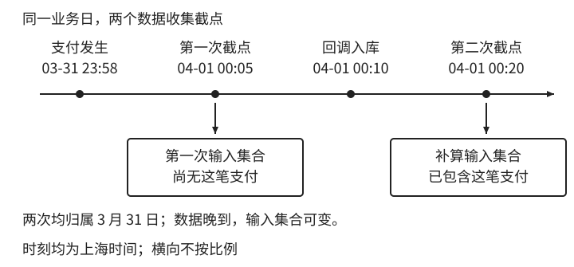
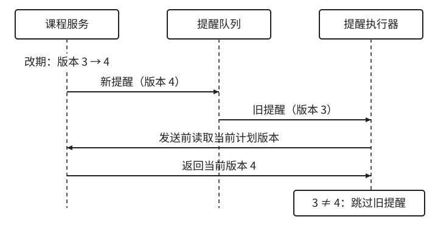

# 时间设计的深入实验与排查

这些材料承接正文中需要更多实现细节的部分。可以先读完会员案例，再按项目需要选择实验；数据库显示的预期结果仍需在实际驱动与连接配置下验证。

- [存取链、协议与精度](#storage-roundtrip)
- [预约解析与日历测试](#local-time-resolution)
- [历史时间数据修复](#historical-time-repair)
- [日报与计划执行](#business-day-jobs)
- [权限、时钟与测试](#validity-and-clock-tests)

返回 [第一章](../../manuscript/part-01-values/01-time.md)；可运行计算见 [示例说明](README.md)。

<a id="storage-roundtrip"></a>

## E1 一个时间值如何走完存取链

### E1.1 数字的单位、范围与精度

会员的失效边界也可以作为数字传给另一个服务。接收者不用解析当地日期，却仍需要知道这个数字从哪里起算、单位是什么。

常见 Unix/POSIX 时间以 `1970-01-01T00:00:00Z` 为起点，用计数表示时间点。秒和毫秒都很常见，接口若只写“timestamp”，接收者仍然要猜。[GNU 对 Epoch 时间的说明](https://www.gnu.org/software/coreutils/manual/html_node/Seconds-since-the-Epoch.html)

```text
1700000000 秒
1700000000000 毫秒

二者都表示：2023-11-14T22:13:20Z
```

接收方把毫秒当成秒，通常会得到一个遥远的日期；把秒当成毫秒，则会掉回 1970 年附近。依靠位数自动判断在普通业务中可能暂时管用，却不是稳定的协议。历史数据、测试值和零值都会让这种猜法变得难堪。

因此，数字字段可以叫 `occurred_at_epoch_ms`，并在协议里固定起点和单位。单位确定之后，还要检查接收者能否保留这些数字。

把时间写到纳秒也不会让一台慢了两秒的机器变准。精度说的是能表示多细，准确度说的是离真实值多远。数值的小数位和产生它的时钟能力，是两件事。

数据类型的范围还会穿过语言边界。服务端的 64 位整数能保存一个纳秒 epoch 计数，不代表 JavaScript 的 `Number` 能逐个精确区分它。`Number.MAX_SAFE_INTEGER` 是 `2^53 - 1`；超过安全整数范围后，相邻整数可能映射到同一个值。现代日期的 epoch 纳秒计数已经远超这个范围，而普通 epoch 毫秒在常用业务日期范围内通常没有这个问题。[ECMAScript 数字与日期定义](https://tc39.es/ecma262/2025/multipage/numbers-and-dates.html)

要传更高精度的整数，可以使用十进制字符串并约定解析方式，或拆成秒与小数部分。接收方若转回 `Number` 再转成大整数，精度仍然已经丢了。协议的每一层都必须保留约定，不能只保证发送方内存里的值正确。

范围也属于协议。服务端能表示的日期，数据库或旧客户端未必支持；把一个变量改成 64 位，不能自动扩大整条链路的范围。

测试应包括历史日期、零值、允许的未来上限和刚越界的值，确认非法输入被明确拒绝。不要把转换失败悄悄变成零或当前时间，否则后续结算会把它当成正常数据。

零值尤其不能同时承担多种意思。Unix epoch 的零本来是一个有效时间点；如果系统还把它用作“未知”“永久有效”和“尚未支付”，查询者就必须依赖另外的状态才能解释。是否允许缺失、是否允许无限期，是业务状态问题，通常应显式表示，而不是在时间轴上随便挑一个点来代替。

这里使用通常的 Unix/POSIX 计数，它不额外累计闰秒，不能无条件当作自起点以来实际经过的全部秒数。普通业务先明确 epoch 和单位；高精度计量还需另行约定时间尺度。[POSIX 关于 Epoch 秒数的说明](https://pubs.opengroup.org/onlinepubs/007904975/xrat/xbd_chap04.html)

### E1.2 协议解析与往返

正文已分别说明时间点接口和预约输入。这里继续检查交换过程。

接口文档应分别约定字段含义、来源、格式、允许精度和缺失值。`expires_at` 定位失效瞬间，`local_start` 保存预约输入，二者不能共用“string，日期时间”这一句说明。

解析策略需要保持一致。界面可以接受本地化输入，正式协议应选择固定格式。`03/04/2027` 可能是 3 月 4 日，也可能是 4 月 3 日；这不是解析器聪不聪明的问题，而是字符串缺少信息。输入阶段就应消除歧义，不要在服务间传输时继续保留一个需要猜测的形式。

无效日期也不要悄悄修正。某些宽松解析会把超出月末的日期顺延到下个月，适合特定日历运算，却不适合用户填写生日或预约日期。严格解析和日历加法是不同操作。Java 的 `DateTimeFormatter` 提供解析策略设置；即便使用预定义格式，也应按所选解析器测试无效输入，而不是认为所有库都默认拒绝。[Java 日期时间解析规则](https://docs.oracle.com/en/java/javase/25/docs/api/java.base/java/time/format/DateTimeFormatter.html)

一个特别容易误写的格式是末尾的 `Z`。给普通本地日期时间追加字符 `Z`，并没有做 UTC 转换，只是宣称它已经是 UTC。原本北京时间九点，追加之后就成了 UTC 九点，差八小时。只有先定位并转换到 UTC，才能使用这种表示。格式模板里的字面量和转换规则不是一回事。

接收时间点时，缺少偏移量的输入通常应拒绝，除非协议明确指定了一个固定解释规则。所谓“兼容一下，缺省按服务器时间”会让协议跟着部署位置变化。若历史客户端已经只能传本地时间，需要为它们安排明确的兼容解释和迁移路径，不要把模糊性直接留给所有新客户端。

序列化的往返测试应比较语义。一个时间点以 `+08:00` 输入，以 `Z` 输出，只要解析后定位同一瞬间，就可以算正确往返；若业务还需要原始当地时区或用户输入，则要另行验证那些信息也被保留。字符串不完全相等，不一定是错误；字符串完全相等，也不证明它被正确解释。

反过来，字符串排序不总等于时间排序。`2027-04-01T00:30:00+08:00` 的实际瞬间早于 `2027-03-31T23:30:00Z`，但看日期文本会得到相反顺序。只有格式、时区表示和精度满足一致的约定时，才可以依赖字典序排序。普通业务更稳妥的方式仍是解析后比较时间点，不让每个调用者各自证明字符串比较的前提。

往返还要覆盖编辑操作。数据库保留微秒，表单只展示到秒，原样提交也可能丢失精度。展示格式不应决定保存格式；如果还用时间戳检测并发修改，这种损失的影响留到版本章节讨论。

CSV 导出同样要声明时区，例如将列标为 `created_at_utc`。文件能打开，只说明格式可读，还需要让导入方沿用同一解释。

### E1.3 数据库类型与会话实验

时间语义确定后，才轮到数据库类型。到这一步也不能只看名字，因为不同数据库对相似名字的解释并不相同。

PostgreSQL 的 `timestamp without time zone` 保存不带时区的日期时间；`timestamp with time zone`，也就是 `timestamptz`，会把输入转换为 UTC，输出时按会话时区展示。它不会保存原始的地区时区名称。如果没有显式给出输入时区，会话配置会参与解释。[PostgreSQL 日期时间类型](https://www.postgresql.org/docs/current/datatype-datetime.html)

MySQL 8.4 的 `TIMESTAMP` 也会在会话时区和 UTC 之间转换，`DATETIME` 则没有这种自动时区转换行为。两者支持的日期范围还不同，不能仅凭“时间戳”三个字就认为 `TIMESTAMP` 适合保存所有历史和未来日期。[MySQL 8.4 日期时间类型](https://dev.mysql.com/doc/refman/8.4/en/datetime.html)

所以，“字段类型带 time zone”不等于“保存了用户原来的时区”，而“字段类型不带 time zone”也不等于“里面一定是当地时间”。后者可以按应用约定保存 UTC，但数据库不会替我们检查这个约定。一个脚本、一条导入语句，或一个配置不同的新连接，就可能绕过它。

我倾向于让类型尽量贴合语义：日期使用日期类型，已确定的时间点使用能明确表达时间点的类型，未来的本地规则另外保留时区。若已有系统只能使用 `DATETIME` 保存 UTC，就把约定落实到驱动、连接设置、序列化和测试中，不要只在文档里写一句“统一 UTC”。

可以用一个小实验看清数据库究竟保留了什么。下面只适用于 PostgreSQL，在事务里创建临时表，最后回滚；它用于观察类型与会话时区，不是生产迁移脚本。

```sql
BEGIN;
CREATE TEMP TABLE time_demo (
    fixed_at TIMESTAMPTZ,
    local_at TIMESTAMP WITHOUT TIME ZONE
);

SET LOCAL TIME ZONE 'Asia/Shanghai';
INSERT INTO time_demo VALUES (
    TIMESTAMPTZ '2027-04-01T00:00:00+08:00',
    TIMESTAMP '2027-04-01 00:00:00'
);
SELECT fixed_at, local_at FROM time_demo;

SET LOCAL TIME ZONE 'UTC';
SELECT fixed_at, local_at FROM time_demo;
ROLLBACK;
```

第一次查询中，`fixed_at` 按北京时间显示为 4 月 1 日零点；第二次按 UTC 显示为 3 月 31 日十六点。它定位的瞬间没有变。`local_at` 则仍然显示 4 月 1 日零点，因为那组本地日期时间字段并没有被绑定成同一个绝对瞬间。这个实验比在应用里加八小时更能说明问题在哪一层。

### E1.4 驱动、连接池与精度

进一步测试时，应把驱动也放进去。一个数据库客户端显示正确，只能证明那个客户端的连接和显示方式符合预期。应用使用的驱动可能把无时区列映射成另一种类型，连接池也可能有不同会话设置。测试应从应用的写入对象出发，经过实际参数绑定、存储、读取和序列化，再回到相同语义的对象。


图 E-1：往返测试要跨过实际使用的转换链。这是一条示例测试路径，沿箭头从左上绕到左下；列类型、驱动映射、会话设置和序列化精度都可能影响结果。验收时比较时间语义与约定精度，不能只凭某个数据库客户端的显示。

连接池会让“我执行过一次设置”变得尤其不可靠。设置会话时区属于某个物理连接，不是整个进程的永久开关。归还连接之后，下一次借出的未必是同一个。初始化、连接复用与重连都要遵守同一约定，临时切换会话设置的诊断代码也应恢复原值。否则错误只在少数请求上出现，像是时间随机漂移。

精度也要跨过这条链路。MySQL 的小数秒精度需要显式选择，未指定时有自己的默认行为；把高精度值写入低精度列可能发生舍入，特定 SQL 模式又可能改用截断。不能统一假设数据库总是“把后面的数字去掉”。边界附近的值如果被进位到下一秒，资格判断或分日报表都可能改变。[MySQL 小数秒精度与舍入](https://dev.mysql.com/doc/refman/8.4/en/fractional-seconds.html)

若系统只需要毫秒，可以在明确定义的边界统一精度，并让接口与存储共同遵守它。若需要微秒，就测试实际驱动能否保留。统一精度不是越低越好，也不是越高越好，而是避免同一个值在不同层经历不同的隐式损失。

<a id="local-time-resolution"></a>

## E2 从当地输入得到唯一瞬间

### E2.1 缺口、重叠与完整解析函数

现在为预约选定一种明确策略：缺口拒绝，重叠让用户选择。实现时先查询候选偏移量，再决定能否形成唯一时间点。下面的流程图给出判断顺序，Java 代码展示它如何落到类型和调用上。


图 E-2：这套预约策略有三条路径。缺口拒绝，唯一候选直接采用，重叠要求选择；若提交了偏移量，两条可继续的路径都必须校验它确实属于候选集合。

```java
static Instant resolveAppointment(
        LocalDateTime local,
        ZoneId zone,
        ZoneOffset selectedOffset) {
    List<ZoneOffset> valid = zone.getRules().getValidOffsets(local);
    if (valid.isEmpty()) {
        throw new IllegalArgumentException("当地时间不存在");
    }
    if (valid.size() > 1 && selectedOffset == null) {
        throw new IllegalArgumentException("当地时间重复，需要选择偏移量");
    }
    ZoneOffset chosen = selectedOffset == null ? valid.get(0) : selectedOffset;
    if (!valid.contains(chosen)) {
        throw new IllegalArgumentException("偏移量与该日期的时区规则不符");
    }
    return ZonedDateTime.ofStrict(local, chosen, zone).toInstant();
}
```

实现中的 `ZoneId` 是地区时区，`ZoneOffset` 是一次解析采用的偏移量。用户不必记住 `-04:00` 和 `-05:00`：界面可以展示“第一次凌晨一点半”和“第二次凌晨一点半”，服务端返回对应候选值。若业务固定选择第一次，也应将这个策略写明并测试。

同时提交时区和偏移量时，还要验证它们是否相容。纽约的一个夏季时间配上冬季偏移量，在数学上可以解析成一个瞬间，却未必属于该地区那一天的真实规则。直接信任偏移量，会让“当地九点”的承诺失去意义；直接忽略偏移量，又可能把用户明确选择的第二次一点半改成第一次。

预约发生改期时，这个解析过程需要再执行。不能只改本地日期、沿用上一次的偏移量。日期变了，适用的规则也可能变。被保存的偏移量用于解释某一次解析结果，不应充当这个地区永久的属性。

若接口只接收带偏移量的时间点，没有地区时区，那么它承诺的就只是一个瞬间。这种接口适合许多场景，也更简单；只是不能再声称自己保留了当地日程。减少字段是合理取舍，前提是同时减少对应的承诺。

### E2.2 日历性质与时区测试

日历计算适合验证性质。对按原始锚点计算的月度订阅，可以生成连续几十期，检查每期都来自同一个锚点，目标月不足原始日期时取月末，足够时恢复原始日期。这样能够抓住 1 月 31 日经过 2 月后永久漂到 28 日的问题。每个月边界严格递增，也是一项值得验证的性质。

自然日报表可以检查相邻区间无重叠、无空洞，某条边界上的事件恰好属于一天。不要固定断言每个区间都是 86,400 秒。应选择普通日、纽约春季跳时日和秋季回拨日，验证日期覆盖正确，允许区间长度随规则变化。

预约解析要分别验证一个有效偏移量、没有有效偏移量和两个有效偏移量。正常时间无需用户消歧，缺口按所选策略拒绝或调整，重叠按选择定位到正确瞬间。再故意提交一个与地区不相容的偏移量，确认不是“只要能解析就接受”。

时区测试还可以验证不变性。把测试进程默认时区从北京改成 UTC，同一时间点的授权结果不应变化；把用户展示时区改成纽约，显示可以变化，底层瞬间必须相同。这里全局时区修改只适合独立测试进程，不能在并行运行的整套测试中随意修改共享环境。显式参数越多，需要改全局设置的测试越少。

<a id="day-boundaries"></a>

### E2.3 日界未必是午夜

时区调整可能让午夜落入缺口。Java 的 `LocalDate.atStartOfDay(zone)` 按地区规则选择该日期最早的有效时刻：午夜有效时返回午夜，午夜位于缺口时移到缺口之后，重叠时选择较早的偏移量。它不是简单地给日期补上 `00:00`。[Java 日界计算](https://docs.oracle.com/en/java/javase/25/docs/api/java.base/java/time/LocalDate.html#atStartOfDay(java.time.ZoneId))

查询当地一天时，分别求目标日期与下一日期的日界，再转换成时间点。除了普通日和纽约的切换日，服务涉及其他地区时，还应覆盖业务日期范围内的特殊规则。如果某次历史调整跳过了一整个当地日期，两个相邻日期的日界甚至可能重合；是否接收这种业务日期，应由业务范围与输入校验决定。

<a id="historical-time-repair"></a>

## E3 旧时间数据如何查证和修复

如果已有数据差八小时，先选一条能与独立流水核对的记录，沿写入、存储、驱动读取和展示检查。错误发生在显示时，就不能平移数据库里的值。

还要确认数据是否来自同一种写入约定。老表里两个相同的 `2027-03-31 16:00:00`，一条按北京时间写入，另一条按 UTC 写入，正确时间点相差八小时。单看这一列无法恢复原意，只能借助写入版本、导入批次或关联流水划分来源。夏令时重叠中的旧值，也可能因缺少偏移量而无法唯一恢复。

因此，修复要保留原值与解释依据，区分证据确认和按假设推定，并检查所有仍在运行的写入入口。数据迁移的分批校验与读写切换，留到数据结构演进章节展开。这里先守住一个边界：来源信息已经丢失时，转换函数不能把它算回来。

<a id="business-day-jobs"></a>

## E4 日报迟到、重算与计划执行

这里采用正文的业务日区间作为查询范围，再检查输入变化和执行可靠性。

### E4.1 事件归属、晚到数据与重算

[正文业务日查询](../../manuscript/part-01-values/01-time.md#sec-1-5-3)选择了支付时间，回答的是“这一天支付的订单金额”。如果运营要的是“这一天创建的订单金额”，就应换用创建事件。日期边界相同，选取的事实仍可能不同。

接着会遇到一个更隐蔽的问题：同一天的报表，第二次运行得到不同结果。边界没有变，数据变了。支付发生在 31 日晚上，回调在 4 月 1 日才写入数据库。第一次日报没有看见这笔钱，补算时看见了。把任务固定到业务日期，只能保证统计范围不变，不能保证输入集合不变。



图 E-3：第一次收集时回调尚未入库，补算时才包含这笔支付。按发生日归属，业务日虽固定，两次输入仍不同。时刻均为 2027 年上海时间，横向不按比例。

因此报表要同时说明“按哪个事件时间归属”与“数据截至什么时候收集”。若按支付发生时间归属，晚到事件可以修订原来的业务日；若按本系统入账时间归属，则进入后一天。财务正式结账后还可能采用调整记录，而不修改已发布账单。我们不能仅靠把时间字段改名为 `paid_at` 来决定这些事。

可以把日报参数写成 `business_date`、`business_zone`、`data_cutoff` 和 `report_version`，记录统计范围与收集口径。但仅存这些参数仍不保证可重现：同一行的金额或状态后来被改写，按原截止时间重查，也可能得到不同结果。要求重现旧报告时，还需保留当时使用的数据版本、输入快照或不可变事件，以及对应的计算规则。普通运营看板可以允许历史数字修订，已发布的结算报告则需要能解释每一次差额。

### E4.2 查询方式与派生业务日期

查询方式也会影响后续维护。`DATE(paid_at) = :date` 看起来贴近业务语言，但这个日期转换由哪个时区执行，需要额外说明。对列执行函数后的条件，也不能默认与普通时间列索引拥有相同的访问方式；可以设计表达式索引，也可以预计算业务日期，但都需要检查数据库实际执行计划。把当地日先化成两个时间点，再查询原始列的范围，通常更容易同时看清口径与索引条件。[PostgreSQL 表达式索引](https://www.postgresql.org/docs/current/indexes-expressional.html)

如果为了性能存一份 `business_date`，它就是派生数据。应记录派生时使用的时区或固定规则，并约定时区改变后是否重算历史。不能今天按账户时区生成，明天按门店时区查询，再认为字段类型是 `DATE` 就足够可靠。一个没有时区的日期值，仍然可能来源于一次有时区的业务判断。

跨地区的汇总也不应随手把各地“3 月 31 日”相加，当作同一个 UTC 区间的收入。按各地营业日合并，与按平台统一时间轴合并，是两张不同的报表。两者都可以有价值，但表头和统计口径应让使用者知道自己在看哪一个。

### E4.3 固定速率、固定延迟与日历计划

报表的统计口径确定后，接下来要让它按计划运行。“每天生成一次”还不够明确：是每隔 24 小时，还是业务时区的每天九点？两种计划会在夏令时切换时分开。

先区分三种容易混用的计划：固定速率、固定延迟和日历计划。固定速率以初始计划为锚点，目标是每隔一段长度启动一次；固定延迟从上一轮结束后再等待；日历计划则指定某个业务日里的当地时刻。前两种讨论经过的长度，后一种讨论日历上的位置。

表 E-1：固定速率、固定延迟与日历计划，锚定的是不同的东西。

| 计划 | 假设每次运行耗时 7 分钟 | 需要额外决定的事 |
| --- | --- | --- |
| 每 5 分钟固定速率 | 名义启动点仍是 0、5、10 分钟 | 延迟后如何追赶、是否允许重叠 |
| 完成后再等 5 分钟 | 第一轮从 0 到 7，下一轮在 12 分钟启动 | 失败是否也算完成、何时开始下一次等待 |
| 每天当地 9 点 | 日期和时区决定下一次计划时刻 | 夏令时、错过计划、时区规则更新 |

具体调度器可能限制同一周期任务不重叠。Java 的 `ScheduledExecutorService` 就区分固定速率与固定延迟，并说明任务执行过长时的后续行为。不能看到“每五分钟”就断定会同时启动多个实例，也不能把它当作多实例部署时的全局互斥保证。[Java 周期调度接口](https://docs.oracle.com/en/java/javase/25/docs/api/java.base/java/util/concurrent/ScheduledExecutorService.html)

### E4.4 工作身份、漏执行与规则变化

对日报而言，更合理的任务输入通常是“结算 2027 年 3 月 31 日”，而不是“执行时顺手算一下昨天”。调度器负责产生待处理日期，执行器负责处理这个明确日期。即使任务晚到两小时，或者人工重跑，处理的仍然是原计划那份工作。

日志里也值得分别记录 `scheduled_for`、`started_at` 和 `finished_at`。前者是应该启动的时刻，中间是实际开始，最后是执行结束。只记一个“任务时间”，就无法分辨任务晚启动还是执行慢。一个每天都成功、却每天晚两小时的结算任务，成功率可以非常漂亮，业务仍然在等。

错过计划时需要补偿策略。日报可以补齐尚未完成的业务日期，过期清理可以扫描当前应清理的集合，昨晚九点的推送则未必值得今天中午补发。机械地“把错过的任务全执行一遍”会在恢复后制造一波陈旧通知，或者让数据库承受积压工作。恢复过程可以有批次与预算，但不能在省略工作时不留下决定。

需要补齐日报时，应记录哪些业务日期已经完成。重启或人工补跑可能再次触发同一天，执行器要认出它仍是同一份工作。怎样领取、重试与去重，在后续章节展开。

如果计划规则本身变化，还要决定旧工作如何归属。账户把统计时区从北京时间改成纽约时间，会改变业务日的边界。可以从下一个完整账期生效，也可以切出一段明确的过渡区间。直接用新时区重算所有“昨天”，可能把已经统计的订单再次归入一份新日报。时区配置的修改也是业务演进，不只是换一个显示设置。

有些系统把每个计划实例先物化成一条记录，保存业务身份、计划时刻和规则版本，再由执行器领取。这样更容易解释改期与漏执行，但增加了状态管理和存储。简单任务未必值得采用。是否需要这一层，取决于漏掉一次工作能否靠扫描恢复，以及是否需要解释每一次计划的去向。

### E4.5 课程改期后的旧提醒

以下接续正文的跨时区课程案例，展开已发布计划的执行版本。为识别旧提醒，另给计划保存一个 `schedule_revision`，每次改期递增；排队的提醒也保存所属版本。

假设运营把课程从 7 月 10 日改到 7 月 11 日。新的开课瞬间、报名截止和提醒都顺延一天，`schedule_revision` 从 3 增至 4；已经成功受理的报名保留。旧提醒即使留在队列中，执行器也能通过版本不符识别它。版本检查如何与发送协调，留到版本和消息章节。



图 E-4：改期完成后，执行器识别并跳过旧版本提醒。时间从上向下，虚线表示参与者生命线。

若改期与发送并发，读取版本后仍可能发生变化。图中的先后关系只覆盖“先改期、后检查”，单次版本检查不能保证整个发送过程的原子性。

对当前版本的提醒，再检查是否仍有意义：本例允许迟到补发，但到开课时刻就跳过并记录原因。版本有效与时间合适都满足，才进入发送流程。

<a id="offline-event-exercise"></a>

### E4.6 练习：事件晚到了，昨天已经结账

一个离线设备上传一批昨天发生的事件，其中一条设备时间在未来。日报按事件发生日归属，但今天已正式结账。写出你的处理规则：哪些数据需要暂存，哪些可以进入报告，已发布结果能否修改，凭什么作出这些判断？

<details>
<summary>参考路径：先判断来源，再决定归属和修订</summary>

先保留原始设备时间与服务端接收时间。未来时间说明这条记录需要检查，但单靠它还不能判断是设备钟错了、数据错误还是允许范围内的偏差。本例选择：超出业务允许偏差的记录进入待核对状态，暂不进入正式统计，并保存原因。不要直接覆盖成接收时间，也不要无痕丢弃。

对来源可信的晚到事件，按约定的业务时区确定原事件日期。假设本例要求正式结账后的报告不可修改，就保留原报告，并在当前允许的期间产生带原事件日期、关联事件和调整原因的记录；更正关系应能追溯。这是本例的数据处理选择，实际结账约定仍由业务确定。

若产品允许历史看板修订，也可以重算原来的业务日，但应说明发布了新版本以及差额来自哪里。若改用接收日归属，则意味着采用另一种报表口径，不能在处理异常时临时切换，却仍把数字称为发生日统计。

自查：原始时间与修正依据是否保留？待核对记录能否继续处理？重跑同一批数据会不会重复计入？能否解释旧报告与新结果之间的差额？这些答案决定模型是否完整，单独换一种 SQL 时间类型解决不了它们。

</details>

<a id="validity-and-clock-tests"></a>

## E5 时间范围的实现与验证边界

### E5.1 缓存、撤销与不可逆失效

正文已经区分新操作与已有操作的继续规则。实现采用短期凭证或权限缓存后，还需要检查规则的变化多久才能传到执行方。

暂停、撤销和时间到期也应分开。缓存里保存 `expires_at` 后，本地可以判断自然到期，却不会自动发现用户刚刚被封禁。短期凭证、实时查询和缓存失效各有成本，选择时先确定允许多长的撤销延迟；不能因为能算出到期，就以为已经处理了撤销。

有时团队为了减少查询，会缓存 `is_valid = true` 五分钟。缓存是在到期前一分钟创建的，这个结果就可能继续有效四分钟。相比缓存一个判断结果，缓存判断需要的边界值可以让读者重新计算自然到期。但如果边界值本身因续费而改变，仍然需要处理更新传播。时间计算正确和数据版本正确，是两项独立条件。

对于“到期后永远不再恢复”的业务，还要考虑系统钟表回拨。纯粹用当前钟表与截止值比较，回拨后可能暂时重新满足有效条件。如果业务要求失效是不可逆的状态变化，可以另外保存已经形成的终态，并说明如何与时间判断组合。这种终态还要明确何时形成、由谁持久化；它只能阻止已记录的失效被回拨推翻，不能替代可靠的判定时钟。是否需要付出这项状态管理成本，取决于业务是否承诺不可恢复。

### E5.2 固定时钟与边界测试

时间代码很容易得到一套全部通过却没有什么证明力的测试。测试创建一个“明天到期”的对象，调用接口，发现仍然有效；再创建一个“昨天到期”的对象，发现已经失效。只要日期离边界很远，许多错误都不会出现。

另一种测试靠等待。创建三秒有效期，睡四秒，断言失效。这会拖慢执行；如果还依赖异步清理，调度延迟也可能让测试不稳定。即便成功，睡眠也只验证了几秒之后的结果，很难准确停在截止边界，更不便覆盖跨月、夏令时和时钟回拨。

最好让业务函数接受可控制的时间来源。它可以接受本次受理的 `Instant`，也可以依赖一个注入的 `Clock`。下面的函数只处理有效区间，不包含撤销与缓存；读钟一次，保证本次判断使用同一个现在：

```java
static boolean isWithinValidityWindow(Clock clock, Instant startsAt, Instant expiresAt) {
    Instant now = clock.instant();
    return !now.isBefore(startsAt) && now.isBefore(expiresAt);
}
```

Java 的 `Clock.fixed()` 能固定现在，`Clock.offset()` 可以改变测试视图。不需要真的调整操作系统日期。这个抽象并不会使生产时钟更准，它只是让测试能够稳定地控制业务所看到的现在。[Java 可替换时钟](https://docs.oracle.com/en/java/javase/25/docs/api/java.base/java/time/Clock.html)

对排他截止值，至少验证截止前、恰好截止与截止后。若领域规定按毫秒判断，就使用领域允许的相邻毫秒；若函数保持纳秒精度，就使用相邻纳秒。不要在单元测试中精确到纳秒，实际数据库却只有秒，然后认为两者已经一起验证。

```java
Instant start = Instant.parse("2027-02-28T16:00:00Z");
Instant end = Instant.parse("2027-03-31T16:00:00Z");

boolean before = isWithinValidityWindow(
    Clock.fixed(end.minusNanos(1), ZoneOffset.UTC), start, end);
boolean at = isWithinValidityWindow(
    Clock.fixed(end, ZoneOffset.UTC), start, end);
boolean after = isWithinValidityWindow(
    Clock.fixed(end.plusNanos(1), ZoneOffset.UTC), start, end);

// before 应为 true，at 与 after 应为 false。
```

开始边界也别漏掉。恰好开始应有效，开始前应无效，零长度区间是否允许则应由模型决定。若不允许 `expires_at <= starts_at`，在创建时拒绝，比运行时让所有判断都返回无效更容易解释。时间条件不是只有“有没有过期”一个方向。

### E5.3 客户端倒计时与设备校正

用户把手机日期调回去年，不应该获得更长的会员。业务权限由服务端控制时，客户端提交的 `now` 就不能参与最终授权。

倒计时仍可以在客户端运行。服务端返回截止时间和自己的当前时间，客户端估算两者的间隔，再用本地单调计时推进；恢复前台或重新联网后重新校准。这里有处理和传输误差，即使用往返耗时估计，也不能在未确认链路对称时，把一半耗时当作精确的单程延迟。界面通常只需足够接近，真正提交操作时仍由服务端判断。

离线设备则提出了另一种需要。设备昨天采样、今天联网，若一律用接收时间替换采样时间，历史曲线会挤在联网的那一分钟。可以同时保存设备提供的 `occurred_at` 和服务端记录的 `received_at`。二者的差值可能来自离线等待，也可能来自设备时钟错误，不能直接当作网络延迟。

是否进一步保存同步状态、误差估计和校正依据，取决于这些记录要用来做什么。普通埋点可以接受较粗的时间；需要重新校正的采样数据，应保留原始值和校正依据。覆盖原始设备时间后，一旦发现校正算法有误，就失去了重算的起点。

### E5.4 接口、数据库与调度测试

接口往返和数据库往返是不同测试。前者验证格式与解析，后者还需要实际字段类型、驱动和会话配置。先定义语义上应该保留什么，再判断结果。日期需要原样保持日期；时间点允许换偏移量表示，但不能换瞬间；未来日程还要保持原始地区规则与意图。

需要集成数据库时，可以专门选择一个带微秒的边界值，经过写入读取后比较它与截止值的关系。即便允许精度损失，也应验证损失策略符合规定。只比较格式化到秒的文本，永远看不出微秒被截断还是舍入。

调度测试则不要等待午夜。把计划生成函数与任务执行分开，给定目标日期、业务时区和已完成集合，直接检查它产生哪些计划。再给执行器一个迟到实例，验证补跑、跳过或重试的策略。这样可以覆盖机器关机三天与时钟回拨，不需要让测试真的运行三天。

本章附有不依赖第三方库的 [Java 示例与断言](README.md)，可以运行月末锚点、夏令时解析、日界计算和截止边界等例子。这份代码验证的是这些确定性计算，不是数据库驱动或多机时钟保证。后两者仍需要项目自己的集成与运行环境测试。
