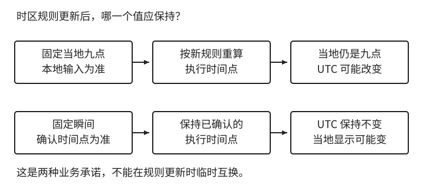

# 第 1 章：时间不是一个 `datetime`

会员页面上写着：“有效期至 3 月 31 日。”

用户在 31 日晚上打开应用，发现会员已经不能用了。客服查了一下，数据库里的到期时间确实是 `2027-03-31 00:00:00`。程序判断当前时间已经超过到期时间，拒绝访问，整个过程没有报错。

工程师说，到期时间就是这个值。用户说，写着 31 日到期，怎么 31 日刚开始就到期了？

如果只把它归结为少测了一个边界条件，修完代码之后，原来的分歧仍然在。那句话从需求文档走到数据库时，少了一半意思。用户把 31 日理解为仍然有效的最后一天，程序把它理解为开始失效的那一刻。两者差了一整天，最后只剩下一个字段，很难再看出当初是哪一种约定。

如果用户和服务器还不在同一个时区，这件事就更难解释。客服说“零点”，用户问“哪里的零点”，此时再打开代码，往往已经找不到答案。

这次故障先缺的是一条约定：3 月 31 日究竟是最后有效日期，还是开始失效的日期。补上约定之后，还要让接口、数据库和授权代码始终保留它的含义。我们就沿着这条路径，看看一个时间值怎样在系统里走完一圈。

本章目录

- [1.1 先把时间的含义说清楚](#sec-1-1)
  - [1.1.1 时间点、持续时间与日历值](#sec-1-1-1)
  - [1.1.2 到期日与有效区间](#sec-1-1-2)
  - [1.1.3 受理边界、宽限期与时钟容忍](#sec-1-1-3)
- [1.2 时区与日历计算](#sec-1-2)
  - [1.2.1 UTC、偏移量与地区时区](#sec-1-2-1)
  - [1.2.2 展示时区不是服务器时区](#sec-1-2-2)
  - [1.2.3 未来日程：固定瞬间还是当地时刻](#sec-1-2-3)
  - [1.2.4 不存在与重复的当地时间](#sec-1-2-4)
  - [1.2.5 预约时间的解析与消歧](#sec-1-2-5)
  - [1.2.6 月度账期与日历锚点](#sec-1-2-6)
- [1.3 时间跨越接口与存储](#sec-1-3)
  - [1.3.1 Unix 时间戳、单位与数值精度](#sec-1-3-1)
  - [1.3.2 时间接口的协议约定](#sec-1-3-2)
  - [1.3.3 数据库类型与会话时区](#sec-1-3-3)
  - [1.3.4 驱动、连接池与精度往返](#sec-1-3-4)
  - [1.3.5 历史时间数据的修复](#sec-1-3-5)
- [1.4 时钟、计时与可信度](#sec-1-4)
  - [1.4.1 钟表时间与单调计时](#sec-1-4-1)
  - [1.4.2 等待预算与截止时间的生命周期](#sec-1-4-2)
  - [1.4.3 客户端与设备时间](#sec-1-4-3)
  - [1.4.4 多机时钟与判定权威](#sec-1-4-4)
- [1.5 自然日与业务统计](#sec-1-5)
  - [1.5.1 业务日、日界与查询范围](#sec-1-5-1)
  - [1.5.2 事件归属、晚到数据与重算](#sec-1-5-2)
  - [1.5.3 查询方式与派生业务日期](#sec-1-5-3)
- [1.6 到期判断与定时任务](#sec-1-6)
  - [1.6.1 权限失效与后台清理](#sec-1-6-1)
  - [1.6.2 持续操作、撤销与多种期限](#sec-1-6-2)
  - [1.6.3 固定速率、固定延迟与日历计划](#sec-1-6-3)
  - [1.6.4 工作身份、漏执行与规则变化](#sec-1-6-4)
- [1.7 综合案例：跨时区课程](#sec-1-7)
  - [1.7.1 输入意图与业务时间约定](#sec-1-7-1)
  - [1.7.2 数据模型与接口协议](#sec-1-7-2)
  - [1.7.3 改期、任务执行与权限验证](#sec-1-7-3)
- [1.8 验证时间设计](#sec-1-8)
  - [1.8.1 固定时钟与边界测试](#sec-1-8-1)
  - [1.8.2 日历性质、时区与消歧测试](#sec-1-8-2)
  - [1.8.3 接口、数据库与调度测试](#sec-1-8-3)
  - [1.8.4 设计练习](#sec-1-8-4)
- [1.9 本章回顾](#sec-1-9)

<a id="sec-1-1"></a>

## 1.1 先把时间的含义说清楚

<a id="sec-1-1-1"></a>

### 1.1.1 时间点、持续时间与日历值

会员在什么时候到期，接口等待多久超时，是两种问题。

前者需要在时间轴上定位一个瞬间，通常称为时间点（instant）。后者需要一段长度，通常称为持续时间（duration）。`2027-03-31T16:00:00Z` 是一个时间点，`30 秒` 是一段长度。只有确定起点之后，长度才能算出另一个时间点。

还有一些东西既不是时间点，也不是固定长度。生日是日期，营业开始时间可能是每天的上午九点，“每月续费”是一条日历规则。把它们全部放进 `datetime`，只是存储形式统一了，并不意味着它们能够使用同一种算法。

表 1-1：相似的时间说法，需要不同的数据。

| 业务说法 | 需要表达的东西 | 还缺什么才能定位一个瞬间 |
| --- | --- | --- |
| 支付在某时刻完成 | 时间点 | 已经可以定位，前提是来源与表示明确 |
| 用户生日是 6 月 12 日 | 日期或月日 | 通常不应强行定位成瞬间 |
| 上传最多等待 30 秒 | 持续时间 | 起点与计时所用的时钟 |
| 门店每天 9 点开门 | 本地时间与日历规则 | 日期、门店时区、异常日期规则 |

例如用户生日是 `1995-06-12`，保存日期就够了。如果先补成午夜再转为 UTC，展示层换一个时区，生日可能变成前一天。这里多加的时间信息反而制造了错误。

“一个月”尤其值得小心。它不是统一长度的 30 天。开始日期、月末处理和续期锚点都会改变结果，我们会在 1.2.6 节把这笔账单独算一遍。

因此，“加 24 小时”“加一个自然日”“加一个日历月”最好在代码中保持区别。需求说的是其中一种，实现不能未经讨论就换成另一种。

在代码里，这个区别应尽量早一点显现。一个接受 `long` 的函数，参数可能是 epoch 毫秒，也可能是等待毫秒，调用方传错之后，编译器通常不会反对。改成 `Instant` 和 `Duration`，至少能挡住“把截止时间当等待长度”这一类错误。日期、当地日期时间也应有自己的类型，而不是先转成字符串再到处传递。

本章用 Java 的类型把区别写具体：`LocalDate` 表示日期，`LocalTime` 表示一天中的本地时刻，`LocalDateTime` 组合二者，`Instant` 定位时间点。`OffsetDateTime` 带偏移量，`ZonedDateTime` 还关联地区时区规则。阅读后面的代码时，关注这些类型保留了什么信息即可；换一种语言，同样需要作出这些区分。[Java 本地日期时间类型](https://docs.oracle.com/en/java/javase/25/docs/api/java.base/java/time/LocalDateTime.html)

也不要误读 `Local`。它不是“已经绑定当前电脑所在地”，而是“这个值本身没有携带地区时区或偏移量”。`2027-04-01T09:00` 可以用来表达某家门店九点开门，但不提供门店时区时，无法把它发送给另一台机器，要求对方在一个唯一瞬间执行。

因此，“每个工作日上午九点”需要本地时刻、工作日规则与门店时区；“今天上午九点发生了一次故障”则要补齐日期和偏移量，记录已经发生的瞬间。

类型的作用到这里为止。它可以帮助表达类别，不能自动识别来源。两个 `Instant` 都可以比较，其中一个来自支付平台，另一个来自设备乱设的钟表，类型系统仍然看不出谁更可信。我们稍后还会回到这个问题。

<a id="sec-1-1-2"></a>

### 1.1.2 到期日与有效区间

“有效期至 3 月 31 日”可以是一条合理的产品文案，但不能原样充当程序规则。至少在实现之前，需要把它补完整。

假设这项业务约定：会员按 `Asia/Shanghai` 的自然日计算，3 月 31 日当天仍然有效，那么开始失效的时间应当是这个时区的 4 月 1 日零点。可以保留“最后有效日期”为业务数据，也可以根据约定计算一个精确的失效时间；两种建模方式都行，只是不能让日期和时间点冒充彼此。

我更愿意把精确截止值命名为 `expires_at`，并约定它是一个不包含在有效期内的边界：

```text
有效范围：[starts_at, expires_at)
有效条件：starts_at <= now && now < expires_at

最后有效日期：2027-03-31
业务时区：Asia/Shanghai
expires_at：2027-04-01T00:00:00+08:00
          = 2027-03-31T16:00:00Z
```

这里没有必要寻找“当天最后一瞬间”。有人把截止时间写成 `23:59:59`，后来数据库支持了毫秒，再补成 `23:59:59.999`。如果下一层保留微秒，这个补丁又少了一截。使用下一天的开始作为排他边界，不需要猜系统究竟有多细的时间精度。

另一个好处是续期。前一段有效期在某个时间点结束，后一段从同一个时间点开始，边界可以直接相接，不必多加一毫秒，也不必担心两段都包含同一时刻。


图 1-1：两段有效期可以共用一个边界。上海时间 4 月 1 日零点不属于前一段，却可以属于续期后的第二段；图中的实心点表示包含，空心点表示不包含，横向不按比例。

不过，半开区间只是表达工具，不能替业务作决定。有的合同把截止日算在内，有的报名活动到某个精确瞬间截止。应该先确定承诺，再选择表示；不能因为半开区间写起来舒服，就悄悄改了用户的有效期。

<a id="sec-1-1-3"></a>

### 1.1.3 受理边界、宽限期与时钟容忍

还要留意“截止之前”指的是哪个动作。用户在截止前点击按钮，请求在截止后才到达服务器，算不算有效？服务器在截止前受理，数据库在截止后才提交，又算不算有效？对一个低风险活动，可以明确以服务端受理时刻为准。对一份已经形成的订单，则可能需要把资格检查结果随订单保存，后续处理沿用这次受理的结论。反过来，如果每一个处理阶段都重新检查当前时间，同一请求就可能在入口获准，在出口被拒绝。

这不是要把客户端点击时间拿来作证。它通常不可信，而且服务端无法证明请求在网络中等待了多久。我们能做的是选定本系统可以负责的受理边界，然后把它写进规则。用户可见的文案也应尽量对应这个边界。把“截止前点击即可”写在页面上，代码却只认服务端到达时间，相当于先作了一个系统无法兑现的承诺。


图 1-2：同样跨过截止瞬间，结果取决于哪个动作是受理边界。这里约定以服务端受理为准，并保存受理资格供后续处理沿用；客户端点击不充当授权证据。虚线对齐同一截止边界，横向不按比例。

宽限期也应该作为单独规则出现。比如正式到期时间是零点，允许已有下载继续十分钟，但不允许启动新下载。这时存在“可启动新操作的截止时间”和“既有操作可继续的截止时间”，不应一律在 `expires_at` 上偷偷加十分钟。否则客服看到的到期时间、合同里的时间与实际权限就对不上了。以后产品要取消宽限期，工程师甚至不知道哪十分钟是赠送，哪十分钟是用户真正购买的。

如果服务端担心边界附近的时间误差，也需要说明容忍方式。误差是技术不确定性，宽限是业务承诺，二者不能共用一个没有名字的常量。一个叫 `CLOCK_TOLERANCE` 的值，被顺手用于延长会员、提前发送消息和放宽签名有效期，看起来减少了代码，实际上让三种风险绑在了一起。

设计文档不必为一个字段写长篇论文，但最好能够回答一个具体例子：在 4 月 1 日零点整，用户新发起的请求会怎样，已经受理的请求会怎样，判断依据保存在何处。能把这个例子说明白，比只写“到期自动失效”有用得多。

<a id="sec-1-2"></a>

## 1.2 时区与日历计算

开篇的会员已经约定在上海时间 4 月 1 日零点失效。用户到了纽约，应该换一种方式显示这个边界，还是重新算一次有效期？要回答它，得先分清同一瞬间的不同表示，以及按当地日历生成瞬间的规则。

<a id="sec-1-2-1"></a>

### 1.2.1 UTC、偏移量与地区时区

处理时间时，最常听到的建议是“统一存 UTC”。对于已经确定的时间点，这是一个很好的起点。它使跨地区的程序能够比较同一条时间轴上的值，不需要先猜某个字符串来自哪个地方。

下面两种写法指向同一个瞬间：

```text
2027-04-01T00:00:00+08:00
2027-03-31T16:00:00Z
```

`Z` 表示 UTC，`+08:00` 是相对于 UTC 的偏移量。二者日期不同，不是数据差了一天，而是同一瞬间在不同地方的表达不同。RFC 3339 给出了这种带偏移量的互联网时间戳表示方式；它解决的是交换格式，不负责确定业务含义。[RFC 3339](https://www.rfc-editor.org/rfc/rfc3339.html)

有些“差八小时”的问题，出在转换做了两次。服务端已经把本地时间换成 UTC，客户端又把字符串当作本地时间重新解释。也有相反的情况：一个没有偏移量的 `2027-04-01 00:00:00`，在开发机上被当作北京时间，在容器里被当作 UTC。两边解析都成功，得到的却不是同一个时间点。

所以接口传递时间点时，不要让接收者猜时区。采用带 `Z` 或明确偏移量的格式，或者使用单位已约定的数值时间戳。解析完成之后也不要再用手工加减八小时来“修正显示”，那通常会把表示和转换混在一起。

但 UTC 不能替我们回答“用户的今天是哪一天”，也不能完整保存“这家店以后每天上午九点营业”的规则。

这里要区分偏移量与时区。`-05:00` 是一个固定的数值，`America/New_York` 是一组随日期变化的规则。某地冬天和夏天可能使用不同偏移量，规则本身也可能改变。IANA 时区数据库记录这些历史与规则，并随各地政策变化更新。时区不是地理位置换算出的一个永久常数。[IANA 时区数据库说明](https://data.iana.org/time-zones/tz-link.html)

<a id="sec-1-2-2"></a>

### 1.2.2 展示时区不是服务器时区

一个实际系统里，经常同时需要两种视图。审计日志希望看到同一条 UTC 时间轴，用户希望看到自己的当地时间，门店希望营业计划永远按门店时间运行。三者并不冲突。可以把已确定的时间点放在存储与交换层，把展示时区作为明确的转换参数，把尚未确定的当地日程作为规则另外保存。

麻烦通常发生在转换参数没有名字的时候。一个公共方法叫 `formatTime()`，里面偷偷使用操作系统默认时区。应用迁到 UTC 容器后，用户界面的时间变了；后台导出与接口响应又可能走不同方法，于是同一订单在 CSV 和页面上显示两个日期。此时去排查数据库，反而会越查越乱，因为数据库里确实只有一个正确时间点。

更容易检查的调用方式是 `formatInstant(instant, displayZone)`。展示时区来自账户设置、用户显式选择或某个产品约定。默认值可以存在，但应该能指出它来自哪条规则，而不是来自“这台服务器碰巧怎么配置”。测试也可以让应用默认时区和用户展示时区故意不同，看看有没有代码绕过显式参数。

语言和地区格式也不要与时区捆绑。一个使用中文界面的纽约用户，不必按北京时间生活。日期顺序、月份名称、十二或二十四小时制属于格式偏好，UTC 偏移量属于时间解释。我们可以同时展示中文和纽约当地时间，也可以用英文展示北京时间。用语言推导时区，只是在两个独立维度之间制造了一个不稳定的关联。

国家同样不是可靠的时区字段。一个国家可能有多个时区，用户设置为某个国家并不能唯一确定当地九点对应的时间点。工程接口适合传明确的地区时区标识，界面可以帮助用户选择，不应让服务端根据国家名称自行猜一个偏移量。

<a id="sec-1-2-3"></a>

### 1.2.3 未来日程：固定瞬间还是当地时刻

已发生的支付，通常保存时间点就能明确表示发生时刻。未来的当地预约则不一定。用户预约“明年 7 月 10 日，纽约当地上午九点”，他可能关心的是当地钟表上的九点，而不是今天换算出来的某个 UTC 值。如果当地规则在预约前改变，两种承诺就会分开。这样的业务应保留本地日期时间与时区，把计算出的执行时间视为可重新计算的结果；如果业务承诺的是固定瞬间，则应反过来以时间点为准。

“全部存 UTC”没有错，它只是省略了前提：你存的确实是时间点。

对未来日程，还要决定时区规则更新时发生什么。保存“纽约当地九点”的意图，意味着运行环境取得新规则后，可能需要重算执行时间。已经发送的日历邀请、提醒计划和用户页面也必须跟着更新。保存 UTC 的绝对瞬间，则意味着当地钟表上的显示可能改变。二者都能成立，最糟的是存了一套数据，却在更新时临时选择另一种承诺。



图 1-3：时区规则更新，会检验我们究竟承诺了哪个值。上路保持当地时刻，下路保持已确认的瞬间；两条路径都合理，但不能在更新时临时互换。图中是假设规则更新，不是在预测某地将修改规则。

重要的预约可以同时保存原始本地输入、地区时区、解析出的时间点以及本次计算依据。这里不是要求每条记录都携带整份时区数据库。普通已发生事件通常不需要这样做；但涉及未来改期、合同争议或历史重算时，保留规则版本或当时偏移量能帮助解释“为什么当时算出了这个时刻”。依据被覆盖之后，审计就只能相信当前规则，而当前规则不一定等于当时的规则。

本地输入与 UTC 结果如果都保存，应说明哪一个是事实来源。不能让两个字段分别被不同接口修改。对当地日程，本地输入通常是意图，UTC 是解析结果；对已经发生的事件，时间点通常是事实，本地文本是展示或原始证据。存两份值并不危险，存两份都可独立改写的“真相”才危险。

<a id="sec-1-2-4"></a>

### 1.2.4 不存在与重复的当地时间

在不实行夏令时的地区生活久了，很容易觉得一天就是 24 小时。直到程序开始服务别的地区，这个经验才失效。

以纽约 2025 年的时钟调整为例。3 月 9 日，时钟从凌晨 2 点拨到 3 点，那一天没有当地时间 `02:30`。11 月 2 日，时钟从凌晨 2 点拨回 1 点，`01:30` 出现两次，两次对应不同的 UTC 时间点。美国实行这一规则的地区在春季跳过一小时，秋季重复一小时；纽约当年对应的两个自然日分别长 23 小时和 25 小时。[NIST 夏令时规则](https://www.nist.gov/pml/time-and-frequency-division/popular-links/daylight-saving-time-dst)


图 1-4：缺口与重叠是两种不同的情况。春季的 `02:30` 找不到瞬间；秋季的两个 `01:30` 则都存在，只是偏移量不同。这里沿用纽约 2025 年的例子，箭头表示先后，横向不按比例。

这意味着，本地日期时间加一个地区时区，仍然可能没有唯一答案。正常情况下有一个有效偏移量，跳时的缺口里没有，回拨的重叠里有两个。

一些库会替我们作选择。例如 Java 的 `ZonedDateTime` 常用构造方法会将落在缺口内的时间向后移动；对重叠时间也有默认的偏移量选择。默认行为让程序容易继续运行，但预约被移到另一个时间，并不一定符合业务约定。[Java `ZonedDateTime` 文档](https://docs.oracle.com/en/java/javase/25/docs/api/java.base/java/time/ZonedDateTime.html)

对于用户预约，可以拒绝不存在的时间，请用户重新选择；对于重叠时间，可以要求选择第一次还是第二次，或在界面上展示偏移量。后台报表未必需要这么麻烦，但也要明确是跳过、顺延，还是只执行一次。没有选定规则时，库的默认行为实际上就成了业务规则，只是产品和测试可能都不知道。

这也解释了为什么“明天同一时间”不能总用“现在加 86,400 秒”实现。跨越夏令时变化时，加固定长度得到的当地时刻可能偏一小时。若需求确实是等待 24 小时，就加持续时间；若需求是下一个自然日的同一当地时刻，就按日历和时区计算，并处理可能的缺口或重叠。

<a id="sec-1-2-5"></a>

### 1.2.5 预约时间的解析与消歧

处理用户预约时，可以把“找有效偏移量”作为显式步骤。这样代码审查能直接看见，我们是否真的考虑过缺口和重叠，而不是在一行转换中接受库的默认答案。下面是一种较严格的解析方式：缺口一律拒绝，重叠必须由调用方选择有效偏移量。


图 1-5：这套预约策略有三条路径。缺口拒绝，唯一候选直接采用，重叠要求选择；若提交了偏移量，两条可继续的路径都必须校验它确实属于候选集合。

```java
static Instant resolveAppointment(
        LocalDateTime local,
        ZoneId zone,
        ZoneOffset selectedOffset) {
    List<ZoneOffset> valid = zone.getRules().getValidOffsets(local);
    if (valid.isEmpty()) {
        throw new IllegalArgumentException("当地时间不存在");
    }
    if (valid.size() > 1 && selectedOffset == null) {
        throw new IllegalArgumentException("当地时间重复，需要选择偏移量");
    }
    ZoneOffset chosen = selectedOffset == null ? valid.get(0) : selectedOffset;
    if (!valid.contains(chosen)) {
        throw new IllegalArgumentException("偏移量与该日期的时区规则不符");
    }
    return ZonedDateTime.ofStrict(local, chosen, zone).toInstant();
}
```

这里不是让用户自己背出 `-04:00` 和 `-05:00`。界面可以展示“第一次凌晨一点半”和“第二次凌晨一点半”，服务端返回候选值，用户作选择。偏移量是协议里的消歧信息，不必是界面里的专业术语。若业务选择始终采用第一次，也可以取消用户选择，但应保留这个固定策略以及相应测试。

同时提交时区和偏移量时，还要验证它们是否相容。纽约的一个夏季时间配上冬季偏移量，在数学上可以解析成一个瞬间，却未必属于该地区那一天的真实规则。直接信任偏移量，会让“当地九点”的承诺失去意义；直接忽略偏移量，又可能把用户明确选择的第二次一点半改成第一次。

预约发生改期时，这个解析过程需要再执行。不能只改本地日期、沿用上一次的偏移量。日期变了，适用的规则也可能变。被保存的偏移量用于解释某一次解析结果，不应充当这个地区永久的属性。

若接口只接收带偏移量的时间点，没有地区时区，那么它承诺的就只是一个瞬间。这种接口适合许多场景，也更简单；只是不能再声称自己保留了当地日程。减少字段是合理取舍，前提是同时减少对应的承诺。

<a id="sec-1-2-6"></a>

### 1.2.6 月度账期与日历锚点

日历计算最容易在订阅、租赁和合同中出现。产品人员说“购买一个月”，工程师问是多少秒，讨论往往在这里拐错方向。不是所有业务时长都能在开始之前化成一个固定秒数。

假设订阅在 2027 年 1 月 31 日上午十点生效，按同一个业务时区每月续期，月底没有对应日期时使用月末。第二个边界落在 2 月 28 日上午十点。第三个边界应落在哪里，取决于我们保存了什么。

如果只保存上一次截止值，然后不断 `plusMonths(1)`，路径就是 1 月 31 日、2 月 28 日、3 月 28 日。最初的 31 日已经消失，后面再也没有信息把账期拉回去。如果保留初始锚点，每一期从初始日期独立推算，第三个边界会回到 3 月 31 日。这不是对月末做了特殊照顾，而是选择了另一种账期模型。

表 1-2：相同的起点，连续计算后会走向不同的收费边界。以下日期均在 2027 年、同一业务时区，边界时刻均为上午十点。

| 期索引 n | 从上次结果继续加月 | 从原始 1 月 31 日锚点推算 |
| --- | --- | --- |
| 0 | 01-31 | 01-31 |
| 1 | 02-28 | 02-28 |
| 2 | 03-28 | 03-31 |
| 3 | 04-28 | 04-30 |

对应的算法可以只差一行。下面的函数讨论的是日期锚点，不包括当地时刻的夏令时解析，也没有替业务处理退款或暂停：

```java
static LocalDate boundaryFromAnchor(LocalDate anchor, long periodIndex) {
    YearMonth target = YearMonth.from(anchor).plusMonths(periodIndex);
    int day = Math.min(anchor.getDayOfMonth(), target.lengthOfMonth());
    return target.atDay(day);
}
```

`periodIndex` 为 0 时得到初始边界，为 1 时得到第二个边界。每次计算都使用原始 `anchor`，不会把短月份截断后的结果当成新的锚点。这一点应当成为测试中的性质，而不是只测试“1 月 31 日加一个月”。单次计算正确，不代表连续十二期仍然符合原始收费约定。

“始终按月末收费”又是另一个模型。用户在 4 月 30 日购买，既可以理解为锚定 30 日，也可以理解为月末。到了 5 月，前者是 30 日，后者是 31 日。用日期本身推测用户意图没有可靠依据，模型里可能需要一个显式的 `END_OF_MONTH` 规则。一个看似多余的枚举，往往比之后连续添加“如果当月没有这一天”更容易维护。

年也一样。2 月 29 日形成的周年约定，在平年使用 2 月 28 日还是 3 月 1 日，要由业务决定。别把这类问题交给“某个库一般都会这么处理”。库需要默认答案，业务需要的是对用户负责的答案，它们不一定相同。

Java 区分 `Duration` 与 `Period` 就是这个原因。前者按秒等时间单位表达长度，后者按年、月、日表达日历量。对带时区的日期时间加一个 `Period` 日，会尝试保持当地时刻；加 24 小时的 `Duration` 则保持固定的秒数。在跨越一小时夏令时跳变时，两者可以差一小时。[Java 日历量 `Period`](https://docs.oracle.com/en/java/javase/25/docs/api/java.base/java/time/Period.html)

在纽约，2025 年 3 月 8 日中午十二点，加一个日历日得到 3 月 9 日中午十二点；加 24 小时得到 3 月 9 日下午一点。中间的夜晚少了一小时。同样是“明天”，一个保持当地日程，一个保持等待长度。测试如果永远使用北京和一个普通月份，这个区别就一直不会露面。

至于续费，应从旧截止时间继续，还是从这次付款时间开始，也不能只看一个 `plusMonths`。会员仍有效时，从旧截止时间继续通常更符合“不损失已经购买的剩余时间”的承诺；已经失效时，可能从新生效时刻开始。还可能存在暂停、赠送和人工调整。这些操作最好保留原因和计算依据，否则一串相同的到期值并不能解释用户到底获得了什么。

我们不需要在时间章节实现完整的订阅账务。需要记住的是，开始值、日历规则和账期锚点都是业务数据。只保存最后一个计算结果，会让下一次计算失去依据。

<a id="sec-1-3"></a>

## 1.3 时间跨越接口与存储

现在已经能算出会员的失效瞬间。但如果接口省略偏移量，或数据库连接按另一种时区解释输入，刚刚算对的结果仍会变。接下来要检查这个值离开计算代码以后，含义是否还能保住。

<a id="sec-1-3-1"></a>

### 1.3.1 Unix 时间戳、单位与数值精度

为了避开字符串和时区，一些接口使用 Unix Timestamp。这样确实能简化时间点交换，但数字并不是没有语义的。

常见 Unix/POSIX 时间以 `1970-01-01T00:00:00Z` 为起点，用计数表示时间点。秒和毫秒都很常见，接口若只写“timestamp”，接收者仍然要猜。[GNU 对 Epoch 时间的说明](https://www.gnu.org/software/coreutils/manual/html_node/Seconds-since-the-Epoch.html)

```text
1700000000 秒
1700000000000 毫秒

二者都表示：2023-11-14T22:13:20Z
```

接收方把毫秒当成秒，通常会得到一个遥远的日期；把秒当成毫秒，则会掉回 1970 年附近。依靠位数自动判断在普通业务中可能暂时管用，却不是稳定的协议。历史数据、测试值和零值都会让这种猜法变得难堪。

字段可以叫 `occurred_at_epoch_ms`，协议也可以明确规定 epoch 与单位。关键是把约定写死，而不是每一层各猜一次。若使用字符串，就规定偏移量、允许的精度以及是否接受没有时区的输入。精度超过接收方能力时，要明确截断、舍入还是拒绝，不能悄悄丢失信息后继续拿它做精确比较。

还有一个较少出现在普通 CRUD 里的区别：POSIX 计数不把闰秒作为额外秒计入。因此它不能被无条件理解为“自起点以来实际经过的全部 SI 秒”。UTC 时间表示与持续时间测量也不能就此合并。涉及高精度计量时，需要进一步确定时间尺度与平台处理方式；一般业务不必自行实现闰秒逻辑，但不要对数字作超出其定义的承诺。[POSIX 关于 Epoch 秒数的说明](https://pubs.opengroup.org/onlinepubs/007904975/xrat/xbd_chap04.html)

把时间写到纳秒也不会让一台慢了两秒的机器变准。精度说的是能表示多细，准确度说的是离真实值多远。数值的小数位和产生它的时钟能力，是两件事。

数据类型的范围还会穿过语言边界。服务端的 64 位整数能保存一个纳秒 epoch 计数，不代表 JavaScript 的 `Number` 能逐个精确区分它。`Number.MAX_SAFE_INTEGER` 是 `2^53 - 1`；超过安全整数范围后，相邻整数可能映射到同一个值。现代日期的 epoch 纳秒计数已经远超这个范围，而普通 epoch 毫秒在常用业务日期范围内通常没有这个问题。[ECMAScript 数字与日期定义](https://tc39.es/ecma262/2025/multipage/numbers-and-dates.html)

要传更高精度的整数，可以使用十进制字符串并约定解析方式，或拆成秒与小数部分。接收方若转回 `Number` 再转成大整数，精度仍然已经丢了。协议的每一层都必须保留约定，不能只保证发送方内存里的值正确。

也不要把所有“2038 问题”混为一谈。有符号 32 位 epoch 秒计数在 2038 年达到上限，是一种表示范围问题。某个语言的 64 位类型、数据库的 `TIMESTAMP` 范围与前端日期对象的范围，分别有自己的限制。改了服务端变量类型，不会自动扩大数据库字段支持的日期范围，也不会改变旧客户端的解析行为。

测试范围时，除了今天附近的值，还应放入历史日期、零值、允许的未来上限和刚刚超出上限的值。非法值应该得到明确的失败结果，而不是被转换成零、当前时间或一个貌似正常的默认日期。默认值掩盖了失败之后，数据还可能参与结算和到期判断，后续修复会困难得多。

零值尤其不能同时承担多种意思。Unix epoch 的零本来是一个有效时间点；如果系统还把它用作“未知”“永久有效”和“尚未支付”，查询者就必须依赖另外的状态才能解释。是否允许缺失、是否允许无限期，是业务状态问题，通常应显式表示，而不是在时间轴上随便挑一个点来代替。

<a id="sec-1-3-2"></a>

### 1.3.2 时间接口的协议约定

序列化之后，`Instant` 可能只剩下一串字符。接收者需要靠协议识别它，而不能靠发送方内存里的类型。

假设我们要接收一份预约。用户选择的是当地日期时间，服务端负责解析，创建响应返回解析结果。协议可以把输入与结果分开，而不是让客户端提交两个彼此可能冲突的真相：

```json
{
  "local_start": "2027-07-10T09:00:00",
  "time_zone": "America/New_York",
  "selected_offset": null
}
```

这个接口固定采用 1.2.5 节的策略：缺口拒绝，重叠要求选择。普通时刻可省略 `selected_offset` 或传 `null`；遇到重复时刻，服务端返回候选偏移量，客户端让用户选择后重新提交。例如纽约 2025 年 11 月 2 日的 `01:30`，选择第二次就提交 `"selected_offset": "-05:00"`，服务端仍要校验它属于该日期的候选集合。这样，协议才真正接得上前面的解析函数。创建成功后返回带 `Z` 的 `starts_at`，并保留原始选择供编辑。

这类差异最好写在字段定义里。`starts_at`、`local_start`、`birth_date` 和 `timeout_ms` 能提示四种不同含义。命名不能替代文档，但比四个都叫 `time` 更有帮助。接口描述还应说明来源、允许的精度、空值含义以及谁负责生成。只给出“string，日期时间”通常不够。

解析策略需要保持一致。界面可以接受本地化输入，正式协议应选择固定格式。`03/04/2027` 可能是 3 月 4 日，也可能是 4 月 3 日；这不是解析器聪不聪明的问题，而是字符串缺少信息。输入阶段就应消除歧义，不要在服务间传输时继续保留一个需要猜测的形式。

无效日期也不要悄悄修正。某些宽松解析会把超出月末的日期顺延到下个月，适合特定日历运算，却不适合用户填写生日或预约日期。严格解析和日历加法是不同操作。Java 的 `DateTimeFormatter` 提供解析策略设置；即便使用预定义格式，也应按所选解析器测试无效输入，而不是认为所有库都默认拒绝。[Java 日期时间解析规则](https://docs.oracle.com/en/java/javase/25/docs/api/java.base/java/time/format/DateTimeFormatter.html)

一个特别容易误写的格式是末尾的 `Z`。给普通本地日期时间追加字符 `Z`，并没有做 UTC 转换，只是宣称它已经是 UTC。原本北京时间九点，追加之后就成了 UTC 九点，差八小时。只有先定位并转换到 UTC，才能使用这种表示。格式模板里的字面量和转换规则不是一回事。

接收时间点时，缺少偏移量的输入通常应拒绝，除非协议明确指定了一个固定解释规则。所谓“兼容一下，缺省按服务器时间”会让协议跟着部署位置变化。若历史客户端已经只能传本地时间，需要为它们安排明确的兼容解释和迁移路径，不要把模糊性直接留给所有新客户端。

序列化的往返测试应比较语义。一个时间点以 `+08:00` 输入，以 `Z` 输出，只要解析后定位同一瞬间，就可以算正确往返；若业务还需要原始当地时区或用户输入，则要另行验证那些信息也被保留。字符串不完全相等，不一定是错误；字符串完全相等，也不证明它被正确解释。

反过来，字符串排序不总等于时间排序。`2027-04-01T00:30:00+08:00` 的实际瞬间早于 `2027-03-31T23:30:00Z`，但看日期文本会得到相反顺序。只有格式、时区表示和精度满足一致的约定时，才可以依赖字典序排序。普通业务更稳妥的方式仍是解析后比较时间点，不让每个调用者各自证明字符串比较的前提。

JSON 中的日期没有通用的内建类型，前后端还可能使用不同精度。数据库保留微秒，浏览器组件只展示到秒，编辑表单提交时就把微秒丢了。若接口把“保存前后值相等”当作并发检测，这种丢失会产生额外冲突。时间戳是否适合充当版本，我们在版本与并发章节继续讨论；这里至少要避免让展示格式决定存储精度。

导出文件也属于接口。CSV 表头写“创建时间”，没有说明时区，接收者导入表格软件后可能再按本机设置解释一次。给列标明 `created_at_utc`，或在文件元数据中声明固定时区，会减少许多“本地打开正确、别人打开不对”的争议。能够打开文件，不意味着双方理解了同一个值。

<a id="sec-1-3-3"></a>

### 1.3.3 数据库类型与会话时区

时间语义确定后，才轮到数据库类型。到这一步也不能只看名字，因为不同数据库对相似名字的解释并不相同。

PostgreSQL 的 `timestamp without time zone` 保存不带时区的日期时间；`timestamp with time zone`，也就是 `timestamptz`，会把输入转换为 UTC，输出时按会话时区展示。它不会保存原始的地区时区名称。如果没有显式给出输入时区，会话配置会参与解释。[PostgreSQL 日期时间类型](https://www.postgresql.org/docs/current/datatype-datetime.html)

MySQL 8.4 的 `TIMESTAMP` 也会在会话时区和 UTC 之间转换，`DATETIME` 则没有这种自动时区转换行为。两者支持的日期范围还不同，不能仅凭“时间戳”三个字就认为 `TIMESTAMP` 适合保存所有历史和未来日期。[MySQL 8.4 日期时间类型](https://dev.mysql.com/doc/refman/8.4/en/datetime.html)

所以，“字段类型带 time zone”不等于“保存了用户原来的时区”，而“字段类型不带 time zone”也不等于“里面一定是当地时间”。后者可以按应用约定保存 UTC，但数据库不会替我们检查这个约定。一个脚本、一条导入语句，或一个配置不同的新连接，就可能绕过它。

我倾向于让类型尽量贴合语义：日期使用日期类型，已确定的时间点使用能明确表达时间点的类型，未来的本地规则另外保留时区。若已有系统只能使用 `DATETIME` 保存 UTC，就把约定落实到驱动、连接设置、序列化和测试中，不要只在文档里写一句“统一 UTC”。

写入来源也值得检查。`created_at` 由应用生成，还是由数据库生成，代表的时机可能不同。像 PostgreSQL 的 `CURRENT_TIMESTAMP` 表示事务开始时间，而不是每次求值时的实时钟表值。事务运行了一会儿之后再写入，用它记录的并不是准确的提交时刻。[PostgreSQL 当前日期时间函数](https://www.postgresql.org/docs/current/functions-datetime.html#FUNCTIONS-DATETIME-CURRENT)

这并不意味着不能用默认创建时间。只要接受它所代表的记录时机，它很方便。但不要拿这个值去证明“支付平台在这一毫秒完成了扣款”。外部事件时间和本地记录时间最好分开保存，名字也分开。

排查“读出来差几个小时”时，先看字段语义、写入偏移量、连接时区以及驱动映射，不要第一步就更新全部数据。错误可能发生在展示层。把数据库中的值整体平移，只会把一种错误改成两种。

可以用一个小实验看清数据库究竟保留了什么。下面只适用于 PostgreSQL，在事务里创建临时表，最后回滚；它用于观察类型与会话时区，不是生产迁移脚本。

```sql
BEGIN;
CREATE TEMP TABLE time_demo (
    fixed_at TIMESTAMPTZ,
    local_at TIMESTAMP WITHOUT TIME ZONE
);

SET LOCAL TIME ZONE 'Asia/Shanghai';
INSERT INTO time_demo VALUES (
    TIMESTAMPTZ '2027-04-01T00:00:00+08:00',
    TIMESTAMP '2027-04-01 00:00:00'
);
SELECT fixed_at, local_at FROM time_demo;

SET LOCAL TIME ZONE 'UTC';
SELECT fixed_at, local_at FROM time_demo;
ROLLBACK;
```

第一次查询中，`fixed_at` 按北京时间显示为 4 月 1 日零点；第二次按 UTC 显示为 3 月 31 日十六点。它定位的瞬间没有变。`local_at` 则仍然显示 4 月 1 日零点，因为那组本地日期时间字段并没有被绑定成同一个绝对瞬间。这个实验比在应用里加八小时更能说明问题在哪一层。

<a id="sec-1-3-4"></a>

### 1.3.4 驱动、连接池与精度往返

进一步测试时，应把驱动也放进去。一个数据库客户端显示正确，只能证明那个客户端的连接和显示方式符合预期。应用使用的驱动可能把无时区列映射成另一种类型，连接池也可能有不同会话设置。测试应从应用的写入对象出发，经过实际参数绑定、存储、读取和序列化，再回到相同语义的对象。


图 1-6：往返测试要跨过实际使用的转换链。这是一条示例测试路径，沿箭头从左上绕到左下；列类型、驱动映射、会话设置和序列化精度都可能影响结果。验收时比较时间语义与约定精度，不能只凭某个数据库客户端的显示。

连接池会让“我执行过一次设置”变得尤其不可靠。设置会话时区属于某个物理连接，不是整个进程的永久开关。归还连接之后，下一次借出的未必是同一个。初始化、连接复用与重连都要遵守同一约定，临时切换会话设置的诊断代码也应恢复原值。否则错误只在少数请求上出现，像是时间随机漂移。

精度也要跨过这条链路。MySQL 的小数秒精度需要显式选择，未指定时有自己的默认行为；把高精度值写入低精度列可能发生舍入，特定 SQL 模式又可能改用截断。不能统一假设数据库总是“把后面的数字去掉”。边界附近的值如果被进位到下一秒，资格判断或分日报表都可能改变。[MySQL 小数秒精度与舍入](https://dev.mysql.com/doc/refman/8.4/en/fractional-seconds.html)

若系统只需要毫秒，可以在明确定义的边界统一精度，并让接口与存储共同遵守它。若需要微秒，就测试实际驱动能否保留。统一精度不是越低越好，也不是越高越好，而是避免同一个值在不同层经历不同的隐式损失。

还要区分业务事件时间与行更新时间。数据库自动更新 `updated_at` 可以记录这行最后一次被本地修改的时间，不能记录业务状态最后一次真正发生变化的时刻。修复一个备注，也可能改变行更新时间；迟到的支付通知，也可能在今天写入昨天发生的事件。需要两种记录时就保留两种，不要从一列里推断全部历史。

<a id="sec-1-3-5"></a>

### 1.3.5 历史时间数据的修复

如果已有系统的一部分时间差八小时，先不要批量平移。应选一条有独立证据的记录，例如能与支付流水核对的订单，沿写入、存储、驱动读取和展示逐层检查。只有证明错误发生在存储值上，才谈得上修数据。

更难的是混合来源。老表里两个完全相同的 `2027-03-31 16:00:00`，一条由老应用按北京时间写入，另一条由新应用按 UTC 写入，正确时间点相差八小时。单看这一列，无法恢复各自意图。需要借助写入版本、导入批次或关联流水，划分能够使用同一种解释的数据范围。

确认范围后，可以新增语义明确的列，保留旧值，按来源迁移并记录依据。无法确定的记录进入待审核集合；按假设推定的记录要标明假设，不能与证据充分的修复结果混为一谈。落在夏令时重叠里的旧值，如果没有偏移量或独立证据，也可能永远无法恢复到唯一瞬间。

迁移脚本同样要检查转换方向。例如 PostgreSQL 的 `AT TIME ZONE` 对无时区值是赋予地区解释，对已有时间点则是转换为当地显示。应分别验证输入类型、解释规则与输出类型。[PostgreSQL 时区转换函数](https://www.postgresql.org/docs/current/functions-datetime.html#FUNCTIONS-DATETIME-ZONECONVERT)

验收不能只数行数。要核对已知样本、业务日期分布和独立流水差值，还要覆盖所有新写入入口。否则老数据刚修完，后台脚本又按旧约定写入，新列仍会变成混合数据。迁移期间如何兼容旧写入、何时切换读取，在数据结构演进章节继续讨论。

<a id="sec-1-4"></a>

## 1.4 时钟、计时与可信度

即使 xpires_at 在接口和数据库之间往返无误，授权还需要另一个输入：
ow。这个现在由谁提供，能不能拿来测量经过了多久，是存储类型没有回答的问题。

<a id="sec-1-4-1"></a>

### 1.4.1 钟表时间与单调计时

记录“请求在几点开始”，需要钟表时间。测量“请求用了多久”，最好不要使用同一把尺子。

系统钟表可能被人工调整，也可能被校时机制修正。如果在请求开始和结束各取一次日期时间再相减，期间发生时钟跳变，结果可能偏大，甚至为负数。这个接口并没有倒着运行，是计时的基准变了。

表 1-3：一次系统钟表回拨，就足以让两种计时结果分开。以下为示意读数：请求实际耗时 2 秒，期间系统钟表向后调整 5 秒；单调读数的起点没有日历含义。

| 读数或差值 | 系统钟表 | 同一本地单调时钟 |
| --- | --- | --- |
| 请求开始 | 10:00:00 | 100 秒 |
| 请求结束 | 09:59:57 | 102 秒 |
| 结束减开始 | −3 秒 | 2 秒 |

单调时钟（monotonic clock）就是为这类差值准备的。以 Python 的 `time.monotonic()` 为例，它不受系统钟表更新影响，不会向后走，返回值的起点没有日历含义；有效的是两次读取之间的差值。[Python 单调时钟文档](https://docs.python.org/3/library/time.html#time.monotonic)

```text
started_at = wall_clock.now()       // 留给记录与展示
begin      = monotonic_clock.now()  // 留给本地计时

执行请求

elapsed = monotonic_clock.now() - begin
```

同样的原则适用于进程内的超时和等待预算。一个操作总共只允许等待三秒，就在同一单调时钟上计算截止值，每次读取剩余预算。若每一步都重新获得三秒，整个操作可能等得远远超过三秒。

但单调时钟值不是另一种可持久化时间戳。不要把它发给另一台机器，也不要写进数据库后等重启再解释，它没有跨这些边界的通用日历含义。不同平台对休眠期间是否计时也可能不同，应按实际运行环境选择计时 API。

会员到期时间要在重启后仍然有效，因此仍应持久化成一个时间点。进程内等待网络响应则适合用单调时钟。二者都叫“截止时间”，却面对不同的生命周期，不能只因为名字相似就共用一种存法。

<a id="sec-1-4-2"></a>

### 1.4.2 等待预算与截止时间的生命周期

等待预算可以独立成为一个很小的对象。创建时记住起点与最大持续时间，读取时返回剩余值。下面是伪代码，只表达使用同一单调时钟的原则；实现时还需按计时 API 的约定处理单位、数值范围和溢出：

```text
budget = 3 秒
begin = monotonic.now()

remaining():
    spent = monotonic.now() - begin
    return max(0, budget - spent)

对每个待执行步骤（查数据库、调用远端）：
    left = remaining()
    如果 left <= 0：返回超时，不启动这一步
    执行这一步，最多等待 left
```


图 1-7：每一步消耗同一份预算，而不是每一步重新获得三秒。示例忽略其他开销，横向按本例秒数绘制；右段是远端允许等待的剩余预算，不代表远端实际耗时，也不保证截止后远端停止工作。

预算检查要放在调用之前，传给库的超时参数还要核对单位与零值含义。例如 Java `Socket.setSoTimeout(0)` 表示无限等待，把耗尽的预算直接传进去会得到相反结果。[Java Socket 超时参数](https://docs.oracle.com/en/java/javase/25/docs/api/java.base/java/net/Socket.html#setSoTimeout(int))

这个对象限制的是调用方的等待计划，不保证远端在三秒之后停止工作。数据库和网络库是否支持取消、已经发出的请求是否仍会执行，都属于另一层语义。把剩余预算算准确，是处理超时的基础，不是处理超时的全部答案。

跨机器传播预算时，也不能把本机单调时钟的截止数值原样发过去。接收者不知道这个数值的参考点。可以传播剩余持续时间，也可以使用明确的绝对截止时间并承担时钟偏差的影响。前者要考虑传输与排队消耗，后者要考虑两台机器如何理解同一个“现在”。在没有说明这些代价之前，任何一种都不能宣称是精确的端到端截止保证。

对于长时间等待，还需留意休眠和重启。某种单调时钟在机器休眠期间不累计时间，另一种会累计。一个“用户确认后十分钟失效”的授权链接，若要跨越休眠、进程重启和服务迁移，不能只保存在进程内计时器里。持久化时间点负责这种生命周期，本地计时器可以作为触发提示，真正处理时仍检查持久化规则。

这也解释了受理判断为什么通常读钟一次，而等待预算要反复读钟。前者保留同一次受理的判断依据，后者计算持续减少的剩余时间。是否重新获取“现在”，取决于这一步到底要回答哪个问题。

<a id="sec-1-4-3"></a>

### 1.4.3 客户端与设备时间

用户把手机日期调回去年，不应该获得更长的会员。业务权限由服务端控制时，客户端提交的 `now` 就不能参与最终授权。

倒计时仍可以在客户端运行。服务端返回截止时间和自己的当前时间，客户端估算两者的间隔，再用本地单调计时推进；恢复前台或重新联网后重新校准。这里有处理和传输误差，即使用往返耗时估计，也不能在未确认链路对称时，把一半耗时当作精确的单程延迟。界面通常只需足够接近，真正提交操作时仍由服务端判断。

离线设备则提出了另一种需要。设备昨天采样、今天联网，若一律用接收时间替换采样时间，历史曲线会挤在联网的那一分钟。可以同时保存设备提供的 `occurred_at` 和服务端记录的 `received_at`。二者的差值可能来自离线等待，也可能来自设备时钟错误，不能直接当作网络延迟。

是否进一步保存同步状态、误差估计和校正依据，取决于这些记录要用来做什么。普通埋点可以接受较粗的时间；需要重新校正的采样数据，应保留原始值和校正依据。覆盖原始设备时间后，一旦发现校正算法有误，就失去了重算的起点。

<a id="sec-1-4-4"></a>

### 1.4.4 多机时钟与判定权威

“服务端时间”也不是绝对可靠的同义词。它只是把信任边界放到了我们控制的一侧。多台服务的时钟仍可能有偏差。一次事件在 A 上记录，稍后被 B 接收，如果 B 的钟慢一些，日志中就可能出现接收早于发生的现象。

校时与时钟偏差监控是基础工作，但不能把“部署了校时”理解为“所有机器同时拥有完全相同的现在”。涉及扣费、截止边界或跨系统争议时，需要指定事实来源和判定方：以支付平台的确认时间为准，还是以本系统受理时间为准，应由规则决定。普通跨机时间戳也不能单独证明两个事件的因果顺序，这个问题会在第 21 章重新出现。

例如 A 的时钟快 200 毫秒，B 慢 200 毫秒，消息实际传输了 50 毫秒，接收时间减发送时间却得到 −350 毫秒。把负数改成零会掩盖偏差，也会扭曲延迟分布。测量时应计入同步误差，或先测量同一台机器上的链路段。

有时只能把某个时刻理解为一个误差区间。例如设备报告一个值，并已知可能偏差几十毫秒。两个事件区间重叠时，物理时间不足以证明先后。这里不要求所有系统实现精密时钟协议，而是不要在数据没有提供证据时，凭更多小数位补出一个确定顺序。

对边界特别敏感的业务，可以集中由一个明确的判定方确认有效性。集中判断会带来延迟、容量和可用性成本，也不能把时钟变成绝对真理，但至少避免每台机器按自己略有偏差的现在独立给出冲突答案。是否值得付出这个成本，应该由允许的误差和失败后果决定，而不是由“服务器时间比较可信”一句话决定。

<a id="sec-1-5"></a>

## 1.5 自然日与业务统计

<a id="sec-1-5-1"></a>

### 1.5.1 业务日、日界与查询范围

现在来看一个很常见的需求：“统计昨天的订单金额。”

服务运行在 UTC 环境，运营团队按北京时间看日报，海外用户又有自己的自然日。需求只有一句“昨天”，代码却必须选一个。默认使用服务器日期，意味着搬一次部署环境就可能改变统计口径，这很难算作可靠的业务规则。

假设报表按 `Asia/Shanghai` 的自然日统计，目标日期是 2027 年 3 月 31 日。应当先在业务时区中找到这一天的开始和下一天的开始，再分别转换成数据库里使用的时间点：

```text
业务日期：2027-03-31
业务时区：Asia/Shanghai

start = 2027-03-31T00:00:00+08:00
      = 2027-03-30T16:00:00Z
end   = 2027-04-01T00:00:00+08:00
      = 2027-03-31T16:00:00Z
```


图 1-8：一个业务日，映射到一段 UTC 区间。上下对应的是同两个瞬间，日期文字不同不代表时间点不同。图中日期均在 2027 年，横向不按比例；两个日界分别求出，不能据此推广出“所有自然日都长 24 小时”。

数据库查询使用两个已经确定的边界。下面的参数都表示时间点，具体绑定方式由数据库驱动决定：

```sql
SELECT SUM(amount)
FROM orders
WHERE paid_at >= :start
  AND paid_at <  :end;
```

这里再次采用半开区间，下一天的零点只属于下一天。不要用包含两个端点的 `BETWEEN` 来表达相邻自然日，也不要把上限补成一串 9。

对于实行夏令时的业务时区，`end` 应根据下一天的日期单独求出，而不是从 `start` 加 86,400 秒。否则那张日报不是少统计一小时，就是多统计一小时。处理一天时，日历决定边界，秒数只是两个边界之间的结果。

日界计算也不要自己拼一个午夜字符串就结束。时区调整可能让午夜落入缺口，日期的开始未必总能直接表示为当地 `00:00`。例如 Java 的 `LocalDate.atStartOfDay(zone)` 会根据时区规则选择日界，结果可能不是午夜。使用这种 API 时仍要了解它如何处理缺口与重叠，而不是把它当作无条件补零。[Java 日界计算文档](https://docs.oracle.com/en/java/javase/25/docs/api/java.base/java/time/LocalDate.html#atStartOfDay(java.time.ZoneId))

同一个逻辑也适用于“用户每日限额”。需要明确限额按平台日、账户固定时区，还是按用户当前所在地重置。若使用当前位置，一个人跨越时区就可能重新获得一次额度，这未必是想要的规则。通常应该固定某个账户或业务时区，而不是让客户端随请求提交一个能改变额度的时区。

<a id="sec-1-5-2"></a>

### 1.5.2 事件归属、晚到数据与重算

上面的 SQL 选择了支付时间，回答的是“这一天支付的订单金额”。如果运营要的是“这一天创建的订单金额”，就应换用创建事件。日期边界相同，选取的事实仍可能不同。

接着会遇到一个更隐蔽的问题：同一天的报表，第二次运行得到不同结果。边界没有变，数据变了。支付发生在 31 日晚上，回调在 4 月 1 日才写入数据库。第一次日报没有看见这笔钱，补算时看见了。把任务固定到业务日期，只能保证统计范围不变，不能保证输入集合不变。


图 1-9：业务日固定，仍不等于报表输入固定。这个例子按支付发生日归属，并以已入库记录为查询输入；第一次收集时回调尚未入库，补算时才包含这笔支付。时刻均为 2027 年的上海时间，横向不按比例；是否允许修订已发布报表，还要另定规则。

因此报表要同时说明“按哪个事件时间归属”与“数据截至什么时候收集”。若按支付发生时间归属，晚到事件可以修订原来的业务日；若按本系统入账时间归属，则进入后一天。财务正式结账后还可能采用调整记录，而不修改已发布账单。我们不能仅靠把时间字段改名为 `paid_at` 来决定这些事。

可以把日报参数写成 `business_date`、`business_zone`、`data_cutoff` 和 `report_version`，记录统计范围与收集口径。但仅存这些参数仍不保证可重现：同一行的金额或状态后来被改写，按原截止时间重查，也可能得到不同结果。要求重现旧报告时，还需保留当时使用的数据版本、输入快照或不可变事件，以及对应的计算规则。普通运营看板可以允许历史数字修订，已发布的结算报告则需要能解释每一次差额。

<a id="sec-1-5-3"></a>

### 1.5.3 查询方式与派生业务日期

查询方式也会影响后续维护。`DATE(paid_at) = :date` 看起来贴近业务语言，但这个日期转换由哪个时区执行，需要额外说明。对列执行函数后的条件，也不能默认与普通时间列索引拥有相同的访问方式；可以设计表达式索引，也可以预计算业务日期，但都需要检查数据库实际执行计划。把当地日先化成两个时间点，再查询原始列的范围，通常更容易同时看清口径与索引条件。[PostgreSQL 表达式索引](https://www.postgresql.org/docs/current/indexes-expressional.html)

如果为了性能存一份 `business_date`，它就是派生数据。应记录派生时使用的时区或固定规则，并约定时区改变后是否重算历史。不能今天按账户时区生成，明天按门店时区查询，再认为字段类型是 `DATE` 就足够可靠。一个没有时区的日期值，仍然可能来源于一次有时区的业务判断。

跨地区的汇总也不应随手把各地“3 月 31 日”相加，当作同一个 UTC 区间的收入。按各地营业日合并，与按平台统一时间轴合并，是两张不同的报表。两者都可以有价值，但表头和统计口径应让使用者知道自己在看哪一个。

<a id="sec-1-6"></a>

## 1.6 到期判断与定时任务

<a id="sec-1-6-1"></a>

### 1.6.1 权限失效与后台清理

把到期时间存对了，接下来常见的实现是：每天零点跑一个任务，把过期会员的 `status` 改成 `EXPIRED`。

这个任务可以做通知、清理或状态整理，但如果授权只检查 `status`，任务就成了真正的到期裁判。任务晚跑十分钟，会员多用十分钟；任务没有跑，会员一直有效。字段里的截止时间反而失去了作用。

若业务承诺是在某个精确时间点失效，授权路径应根据权威侧的当前时间和 `expires_at` 判断，并结合会员是否暂停、是否退款等其他条件。批任务是否已经修改状态，不应决定时间边界是否成立。清理可以滞后，权限不能因此自动延长。


图 1-10：权限截止与后台状态更新可以错开。假设会员未暂停、未退款，其他访问条件满足，授权仍在零点起拒绝新请求；状态晚十分钟更新，不赠送十分钟权限。虚线对齐两个时刻，横向不按比例，已有操作的继续规则不在此图中。

缓存中的“有效”标记也可能过时。它与批任务维护的状态有同一个限制：保存的是上次判断的结果，时间继续流逝之后，结果未必仍然成立。

<a id="sec-1-6-2"></a>

### 1.6.2 持续操作、撤销与多种期限

到期判断还需说明操作持续期间的规则。用户在最后一秒开始下载，下载持续半小时，是继续完成还是中途停止？一个已经签发的短期访问凭证是否可以继续使用？需要频繁复核的直播访问，与只在启动时检查的文件下载，行为并不相同。简单地把到期判断放在接口开头，只能保证入口检查正确，不能自动兑现整个操作期间的权限承诺。

暂停、撤销和时间到期也应分开。缓存里保存 `expires_at` 后，本地可以判断自然到期，却不会自动发现用户刚刚被封禁。短期凭证、实时查询和缓存失效各有成本，选择时先确定允许多长的撤销延迟；不能因为能算出到期，就以为已经处理了撤销。

有时团队为了减少查询，会缓存 `is_valid = true` 五分钟。缓存是在到期前一分钟创建的，这个结果就可能继续有效四分钟。相比缓存一个判断结果，缓存判断需要的边界值可以让读者重新计算自然到期。但如果边界值本身因续费而改变，仍然需要处理更新传播。时间计算正确和数据版本正确，是两项独立条件。

过期后的删除则可以单独制定策略。访问权限在零点失效，记录可能保留三十天供恢复，文件可能保留更久供用户导出。数据库 TTL、清理队列和对象存储生命周期负责释放资源，不应被误当作权限开关。反过来，删除也不应提前毁掉业务承诺仍要保留的数据。一个 `expires_at` 同时承担会员、下载、恢复和删除期限，最后总有人不知道该改哪一个。

如果需要多种期限，就让它们有不同的名字与来源。`access_expires_at` 表示访问截止，`recoverable_until` 表示恢复窗口，`delete_after` 表示允许清理的时刻。名字不能强制执行规则，但能让一次修改所影响的承诺更容易审查。未来需要修改保留期时，也不必偷偷延长会员权限。

对于“到期后永远不再恢复”的业务，还要考虑系统钟表回拨。纯粹用当前钟表与截止值比较，回拨后可能暂时重新满足有效条件。如果业务要求失效是不可逆的状态变化，可以另外保存已经形成的终态，并说明如何与时间判断组合。这种终态还要明确何时形成、由谁持久化；它只能阻止已记录的失效被回拨推翻，不能替代可靠的判定时钟。是否需要付出这项状态管理成本，取决于业务是否承诺不可恢复。

<a id="sec-1-6-3"></a>

### 1.6.3 固定速率、固定延迟与日历计划

把定时任务叫醒只是第一步。真正需要明确的是，叫醒之后要做哪份工作，以及这份工作是否已经做过。

先区分三种容易混用的计划：固定速率、固定延迟和日历计划。固定速率以初始计划为锚点，目标是每隔一段长度启动一次；固定延迟从上一轮结束后再等待；日历计划则指定某个业务日里的当地时刻。前两种讨论经过的长度，后一种讨论日历上的位置。

表 1-4：固定速率、固定延迟与日历计划，锚定的是不同的东西。

| 计划 | 假设每次运行耗时 7 分钟 | 需要额外决定的事 |
| --- | --- | --- |
| 每 5 分钟固定速率 | 名义启动点仍是 0、5、10 分钟 | 延迟后如何追赶、是否允许重叠 |
| 完成后再等 5 分钟 | 第一轮从 0 到 7，下一轮在 12 分钟启动 | 失败是否也算完成、何时开始下一次等待 |
| 每天当地 9 点 | 日期和时区决定下一次计划时刻 | 夏令时、错过计划、时区规则更新 |

具体调度器可能限制同一周期任务不重叠。Java 的 `ScheduledExecutorService` 就区分固定速率与固定延迟，并说明任务执行过长时的后续行为。不能看到“每五分钟”就断定会同时启动多个实例，也不能把它当作多实例部署时的全局互斥保证。[Java 周期调度接口](https://docs.oracle.com/en/java/javase/25/docs/api/java.base/java/util/concurrent/ScheduledExecutorService.html)

<a id="sec-1-6-4"></a>

### 1.6.4 工作身份、漏执行与规则变化

对日报而言，更合理的任务输入通常是“结算 2027 年 3 月 31 日”，而不是“执行时顺手算一下昨天”。调度器负责产生待处理日期，执行器负责处理这个明确日期。即使任务晚到两小时，或者人工重跑，处理的仍然是原计划那份工作。

日志里也值得分别记录 `scheduled_for`、`started_at` 和 `finished_at`。前者是应该启动的时刻，中间是实际开始，最后是执行结束。只记一个“任务时间”，就无法分辨任务晚启动还是执行慢。一个每天都成功、却每天晚两小时的结算任务，成功率可以非常漂亮，业务仍然在等。

错过计划时需要补偿策略。日报可以补齐尚未完成的业务日期，过期清理可以扫描当前应清理的集合，昨晚九点的推送则未必值得今天中午补发。机械地“把错过的任务全执行一遍”会在恢复后制造一波陈旧通知，或者让数据库承受积压工作。恢复过程可以有批次与预算，但不能在省略工作时不留下决定。

一个可靠的日历任务因此常常需要持久化进度，而不只是保存下一次唤醒时间。进度说明哪些业务日期已经完成，失败的日期是否需要重试。具体的并发与去重方法在后文讨论；这里要先认出它们的输入身份。时间戳可以表示计划位置，不能自动成为工作身份。同一份日报可能在不同时间被唤醒，仍然是同一份日报。

时钟回拨也可能再次经过某个计划时刻。调度器重新产生触发，不应自动意味着业务应该执行第二次。夏令时回拨、进程重启和人工补跑虽然原因不同，都会把我们带到“同一份工作可能收到多个触发”这件事上。日历规则和业务执行记录结合起来，才有可能限制重复影响。

如果计划规则本身变化，还要决定旧工作如何归属。账户把统计时区从北京时间改成纽约时间，会改变业务日的边界。可以从下一个完整账期生效，也可以切出一段明确的过渡区间。直接用新时区重算所有“昨天”，可能把已经统计的订单再次归入一份新日报。时区配置的修改也是业务演进，不只是换一个显示设置。

有些系统把每个计划实例先物化成一条记录，保存业务身份、计划时刻和规则版本，再由执行器领取。这样更容易解释改期与漏执行，但增加了状态管理和存储。简单任务未必值得采用。是否需要这一层，取决于漏掉一次工作能否靠扫描恢复，以及是否需要解释每一次计划的去向。

<a id="sec-1-7"></a>

## 1.7 综合案例：跨时区课程

<a id="sec-1-7-1"></a>

### 1.7.1 输入意图与业务时间约定

把前面的区别放到同一个需求里，比较容易看出它们为什么值得单独建模。假设我们要开发一场线上培训：讲师在纽约安排 2027 年 7 月 10 日上午九点开课，学员可以在各地参加；报名在开课前两小时关闭；系统在开课前 24 小时提醒；课程结束后，学员可以观看录播 30 天；运营按北京时间查看每日报名数量。

需求并不大，但这里已经有好几种“时间”。若都叫 `time`，后续代码只能靠上下文猜。先把每项承诺拆开，通常比先建一个包含十个日期字段的表更有效。

讲师选的是纽约当地九点，这份输入包含本地日期时间与讲师时区。界面不应该因为讲师出差到北京，就自动把课程安排到北京时间九点。浏览器当前时区可以作为输入提示，正式保存的应是课程明确选择的时区。

创建课程时，服务端按预约解析规则计算时间点，并把原始输入保留下来。这个日期没有重复时刻，按当年的纽约规则，九点对应 UTC 十三点。学员页面拿时间点转换到各自展示时区，北京学员看到晚上九点，纽约学员看到上午九点。两个界面可以不同，参加的仍是同一场课。

这里的未来解析结果依赖当前已知的时区规则。如果业务坚持当地九点，规则在开课前改变时，就要重新计算时间点并更新关联计划；如果课程发布后承诺固定瞬间，则应明确冻结发布后的时间点。为了把这个例子讲完整，我们选择后一种：发布前按当地输入编辑，发布时确认时间点，发布后任何改变都按显式改期处理，而不是静默调整。

报名截止比较简单：从开课时间点减去两小时持续时间。它与学员在哪里无关，所有人共享同一个截止瞬间。但“报名截止”仍要补一句：以服务端成功受理为准，已经受理的流程可以继续完成。这里的“受理”指报名服务完成资格检查并承担后续处理责任，不能只凭网关收到请求就认定成功。受理时间和资格结论要随报名记录可靠保存；如果保存失败，调用方尚未取得可确认的受理结果。已经成功受理的申请，不在处理末尾因为时间流逝被重新拒绝。

提醒也是固定长度：开课时间点减 24 小时。需求如果改成“开课前一天当地上午九点”，就要换成日历计算。我们不能认为这两句话只是两种表达方式。例子恰好没有跨越夏令时变化，测试却应该换一场跨越变化的课程，确认系统没有把两种承诺绑在同一个算法里。

录播的 30 天最容易再次含糊。是课程结束后精确 720 小时，还是结束日期之后的 30 个业务日历日？我们在这里选择精确持续时间，并以服务端确认的课程结束时间为起点。若课程延期，录播截止跟着实际结束时间计算，而不是沿用最初计划的结束时间。计划与实际记录要分开，否则延课会损失学员的观看窗口。


图 1-11：课程中的时间关系有两个起点。报名、提醒与学员展示围绕已发布的开课瞬间；录播截止则从实际结束事件增加 720 小时。两组箭头表示派生或展示转换，不表示任务执行顺序；日期均在 2027 年，不能拿计划结束替代实际结束。

日报又使用不同口径：按北京时间的受理日期统计报名。用户点击的设备时间不参与归属，实际受理时间点转换成北京时间后确定业务日。系统可以用原始时间点和明确边界查询，也可以派生业务日期。派生时要保留固定口径，不能随着学员时区变化重新归属。

<a id="sec-1-7-2"></a>

### 1.7.2 数据模型与接口协议

这几项数据可以分成输入、已发布计划和已发生事实：

表 1-5：课程输入、发布计划与实际事件，各有自己的事实来源。

| 数据 | 语义 | 是否可以由别的字段直接推导 |
| --- | --- | --- |
| 原始开课本地时间与课程时区 | 讲师的编辑意图 | 不应只从当前展示结果恢复 |
| 发布后的 `starts_at` | 已确认的开课瞬间 | 发布前解析，发布后显式改期 |
| `registration_closes_at` | 不允许再受理报名的边界 | 按已确认开课时间减两小时 |
| `reminder_due_at` | 这次提醒应执行的瞬间 | 按已确认开课时间减 24 小时 |
| `actual_ended_at` | 实际结束事件 | 不能由计划结束时间代替 |
| `recording_expires_at` | 新观看请求的失效边界 | 按实际结束加 30 天持续时间 |
| `registration_received_at` | 服务端受理事件 | 服务端生成，不信任设备 `now` |

表里有几项可以推导，是否全部存储要看业务需要。若希望改期时追踪每个计划的变化，可以物化提醒与报名截止；若只保存核心计划，读取时也可以推导。关键是派生值不能被另一个接口独立改写。数据库里保存得多，不等于事实来源就应该多。

发布响应可以将瞬间与展示依据分开。学员不必拿本地字符串自己猜时区，界面也不必通过减八小时来推算课程所在地：

```json
{
  "starts_at": "2027-07-10T13:00:00Z",
  "course_time_zone": "America/New_York",
  "registration_closes_at": "2027-07-10T11:00:00Z",
  "reminder_due_at": "2027-07-09T13:00:00Z",
  "schedule_revision": 3
}
```

<a id="sec-1-7-3"></a>

### 1.7.3 改期、任务执行与权限验证

课程改期时，`schedule_revision` 增加，提醒执行器处理前确认自己的计划仍属于当前版本。旧提醒可能已经排队，但不能因为它的时间到了就无条件发送。我们将在版本与消息章节研究怎么控制这些并发变化；在本章，先让数据能够表达“这是旧计划”，否则后面的控制没有比较依据。


图 1-12：旧提醒到达，不等于旧计划仍然有效。时间从上向下，虚线表示参与者生命线。图中只展示改期已经完成、执行器随后识别旧版本的情况；若改期与发送并发，读取后仍可能发生变化，单次版本检查不能保证发送过程的原子性。

提醒任务晚执行时，也需要一个可说明的规则。晚了五分钟可能仍有用，晚到开课后就可能没有意义。可以规定过了开课时间不补这次开课前提醒，记录跳过原因。这项判断不能只依靠“任务是否成功”，否则一份已经毫无价值的通知仍会被统计为成功。

录播访问路径则检查实际权限边界，而不是等待每日清理任务。录播文件按独立的保留规则清理，不能把某份访问权限到期直接等同于共享文件可以删除。清理即使滞后，新访问仍在截止时被拒绝。已经开始的播放是否允许继续，需要在服务协议中决定。例子里如果允许已有播放继续，就应把启动检查与会话继续规则分开，不要声称一个入口判断实现了全程撤权。

最后再看部署变化。服务从北京机器迁到 UTC 容器，课程时间点、报名截止和日报边界都不应改变。讲师修改语言设置，日期格式可以变，开课时刻不能变。学员旅行到东京，界面当地时刻可以变，参加的课程瞬间不能变。能够分别说明这些“变”和“不变”，这套设计才有可以验证的含义。

没有哪个库会替我们一次解决这场课的所有问题。日期库负责计算，数据库负责保存，调度器负责唤醒，授权路径负责执行权限，业务模型负责让它们使用同一套承诺。选择组件之前先把这些关系定下来，实施时才不会每到一层就重新解释一遍“开课时间”。

<a id="sec-1-8"></a>

## 1.8 验证时间设计

<a id="sec-1-8-1"></a>

### 1.8.1 固定时钟与边界测试

时间代码很容易得到一套全部通过却没有什么证明力的测试。测试创建一个“明天到期”的对象，调用接口，发现仍然有效；再创建一个“昨天到期”的对象，发现已经失效。只要日期离边界很远，许多错误都不会出现。

另一种测试靠等待。创建三秒有效期，睡四秒，断言失效。这会拖慢执行；如果还依赖异步清理，调度延迟也可能让测试不稳定。即便成功，睡眠也只验证了几秒之后的结果，很难准确停在截止边界，更不便覆盖跨月、夏令时和时钟回拨。

最好让业务函数接受可控制的时间来源。它可以接受本次受理的 `Instant`，也可以依赖一个注入的 `Clock`。下面的函数只处理有效区间，不包含撤销与缓存；读钟一次，保证本次判断使用同一个现在：

```java
static boolean canAccess(Clock clock, Instant startsAt, Instant expiresAt) {
    Instant now = clock.instant();
    return !now.isBefore(startsAt) && now.isBefore(expiresAt);
}
```

Java 的 `Clock.fixed()` 能固定现在，`Clock.offset()` 可以改变测试视图。不需要真的调整操作系统日期。这个抽象并不会使生产时钟更准，它只是让测试能够稳定地控制业务所看到的现在。[Java 可替换时钟](https://docs.oracle.com/en/java/javase/25/docs/api/java.base/java/time/Clock.html)

对排他截止值，至少验证截止前、恰好截止与截止后。若领域规定按毫秒判断，就使用领域允许的相邻毫秒；若函数保持纳秒精度，就使用相邻纳秒。不要在单元测试中精确到纳秒，实际数据库却只有秒，然后认为两者已经一起验证。

```java
Instant start = Instant.parse("2027-03-01T00:00:00Z");
Instant end = Instant.parse("2027-04-01T00:00:00Z");

boolean before = canAccess(
    Clock.fixed(end.minusNanos(1), ZoneOffset.UTC), start, end);
boolean at = canAccess(
    Clock.fixed(end, ZoneOffset.UTC), start, end);
boolean after = canAccess(
    Clock.fixed(end.plusNanos(1), ZoneOffset.UTC), start, end);

// before 应为 true，at 与 after 应为 false。
```

开始边界也别漏掉。恰好开始应有效，开始前应无效，零长度区间是否允许则应由模型决定。若不允许 `expires_at <= starts_at`，在创建时拒绝，比运行时让所有判断都返回无效更容易解释。时间条件不是只有“有没有过期”一个方向。

<a id="sec-1-8-2"></a>

### 1.8.2 日历性质、时区与消歧测试

日历计算适合验证性质。对按原始锚点计算的月度订阅，可以生成连续几十期，检查每期都来自同一个锚点，目标月不足原始日期时取月末，足够时恢复原始日期。这样能够抓住 1 月 31 日经过 2 月后永久漂到 28 日的问题。每个月边界严格递增，也是一项值得验证的性质。

自然日报表可以检查相邻区间无重叠、无空洞，某条边界上的事件恰好属于一天。不要固定断言每个区间都是 86,400 秒。应选择普通日、纽约春季跳时日和秋季回拨日，验证日期覆盖正确，允许区间长度随规则变化。

预约解析要分别验证一个有效偏移量、没有有效偏移量和两个有效偏移量。正常时间无需用户消歧，缺口按所选策略拒绝或调整，重叠按选择定位到正确瞬间。再故意提交一个与地区不相容的偏移量，确认不是“只要能解析就接受”。

时区测试还可以验证不变性。把测试进程默认时区从北京改成 UTC，同一时间点的授权结果不应变化；把用户展示时区改成纽约，显示可以变化，底层瞬间必须相同。这里全局时区修改只适合独立测试进程，不能在并行运行的整套测试中随意修改共享环境。显式参数越多，需要改全局设置的测试越少。

<a id="sec-1-8-3"></a>

### 1.8.3 接口、数据库与调度测试

接口往返和数据库往返是不同测试。前者验证格式与解析，后者还需要实际字段类型、驱动和会话配置。先定义语义上应该保留什么，再判断结果。日期需要原样保持日期；时间点允许换偏移量表示，但不能换瞬间；未来日程还要保持原始地区规则与意图。

需要集成数据库时，可以专门选择一个带微秒的边界值，经过写入读取后比较它与截止值的关系。即便允许精度损失，也应验证损失策略符合规定。只比较格式化到秒的文本，永远看不出微秒被截断还是舍入。

调度测试则不要等待午夜。把计划生成函数与任务执行分开，给定目标日期、业务时区和已完成集合，直接检查它产生哪些计划。再给执行器一个迟到实例，验证补跑、跳过或重试的策略。这样可以覆盖机器关机三天与时钟回拨，不需要让测试真的运行三天。

本章附有不依赖第三方库的 [Java 示例与断言](../../examples/ch01-time/README.md)，可以运行月末锚点、夏令时解析、日界计算和截止边界等例子。它验证的是这些确定性计算，不是数据库驱动或多机时钟保证。后两者仍需要项目自己的集成与运行环境测试。

<a id="sec-1-8-4"></a>

### 1.8.4 设计练习

现在可以尝试三个小需求。先不要查库函数，写出业务选择，再决定表示。

一家门店允许用户“从首次到店起使用七天”。用户第一天晚上十一点到店。第七天晚上仍然能否使用？若门店位于实行夏令时的地区，固定 168 小时与七个当地日期会产生什么区别？门店换时区、用户旅行又分别应该影响哪一个规则？

一份年度订阅从 2 月 29 日生效，产品要求“每年同一天续费”。平年没有这一天。你可以选择提前到 2 月末、推迟到 3 月 1 日，也可以把它规定为某种月末锚点。选定之后，连续八年的收费边界如何推算，原始依据要保留什么？

一个离线设备上传了一批昨天发生的事件，其中一条设备时间在未来。日报按事件发生日归属，但今天已经正式结账。你会拒绝、暂存、按接收时间归属，还是作为调整记录处理？这个答案取决于设备时间可信度与结账规则，不取决于时间字段使用哪一种 SQL 类型。

这些问题没有全书统一的标准答案。练习的目的，是让每一种选择都有对应的数据与后果，不在实现时偷偷替产品作决定。只要能够写出规则，并说明换一种选择会改变什么，就已经比一个笼统的 `datetime` 定义走得更远。

<a id="sec-1-9"></a>

## 1.9 本章回顾

回到开篇，客服需要的答案现在可以落实为一份明确规则：

```text
用户承诺：按 Asia/Shanghai 计算，2027-03-31 当天仍有效
失效边界：2027-04-01T00:00:00+08:00 = 2027-03-31T16:00:00Z
新访问：由授权服务读取当前时间，满足 starts_at <= now < expires_at
         并通过暂停、撤销等其他检查，才允许开始
已有操作：按事先约定的继续规则处理，不随后台清理时机改变
展示：由同一边界按明确时区生成文案
清理：按独立的保留规则执行
```

用户旅行只改变展示，服务迁移不改变边界，清理任务晚跑不延长权限。测试也有了具体目标：恰好开始时允许，恰好到期时拒绝；经过接口和数据库往返，仍然判断同一个瞬间。

并非每个系统都需要保存时区规则版本、报告快照和每次任务的执行记录。只有承诺会随着未来规则变化，才需要安排重算；只有要求重现过去结果，才需要保留当时依据；只有不能漏掉计划，才需要跟踪完成进度。这些额外数据应当能回答一个实际问题，否则先用简单模型就够了。

本章真正要留下的，是选字段之前的判断顺序：先确定它表达的是瞬间、长度还是日历规则，再确定来源与边界，最后检查它经过转换和执行后是否仍兑现原来的承诺。

下一章换一个同样普通的字段：`id`。它能唯一定位一条记录，但那条记录迁走之后，这个 ID 还应不应该跟着它？
