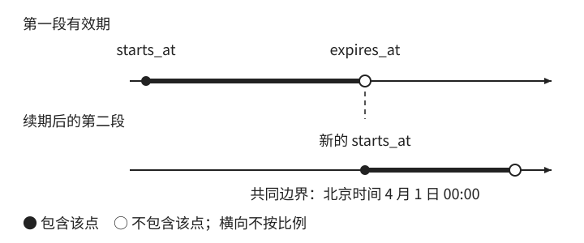

# 日期如何变成截止边界

[第 1 章：时间不是一个 datetime](../01-time.md)

会员页面中的“有效期至 3 月 31 日”是一项业务承诺。要判断一次访问是否符合承诺，系统需要把这句话转换为时间范围。这个过程包含语义解释和数值比较两步；如果一开始就误解了这句话，后面的比较再精确也没有用。

<a id="sec-1-1"></a>

## 1.1 从业务日期到截止瞬间

数据库中的 `2027-03-31 00:00:00` 表示一个日期时间读数，单看这串字符，既不知道它采用哪里的时间，也不知道业务想表达“最后一天”还是“开始失效”。程序把它当作截止值，并不意味着用户也是这样理解的。

先给本例确定一组条件：会员按上海日期计算，2027 年 3 月 31 日是最后有效日期，全天有效；用户旅行和服务器迁移都不改变这项承诺。只有在这些条件下，我们才能把失效边界确定为上海日期 4 月 1 日的开始。若承诺改成“3 月 31 日中午截止”，正确边界也应随之改变。

业务时区回答的是“用哪一套当地日历解释这项承诺”。它不由服务器部署位置决定，也不必跟随用户当前所在地。将它显式记为 `Asia/Shanghai`，程序就不必再根据机器配置猜测该用哪里的日期。

<a id="sec-1-1-1"></a>

### 1.1.1 日期与时间点回答不同的问题

日期表示日历中的某一天，例如 `2027-03-31`。时间点（instant）表示时间轴上的一个瞬间，例如一次请求被检查的时刻。日期可以比较先后，却不能在没有时区等约定时，直接回答某个瞬间是否已经进入这一天。

这个区别可以从生日看出来。生日是 `1995-06-12`，并不意味着“某个时区的 6 月 12 日午夜”。若擅自补上午夜和时区，再把得到的瞬间换到另一个时区，显示日期可能变成前一天。转换过程可以完全正确，错误发生在额外添加了原始事实中没有的含义。

会员同时需要两种信息：最后有效日期用于说明用户买到了哪一天，截止时间点用于参与程序判断。两者之间由明确的业务规则联系起来。若同时保存，应指定最后有效日期、业务时区和规则为计算依据，或者规定截止一经确认便固定；不能让两个字段独立修改，又期待它们始终一致。

本章使用 Java 的 `LocalDate` 和 `Instant` 具体表达这两种对象。类型名称帮助区分职责，真正决定设计的仍然是字段所回答的问题。

<a id="sec-1-2"></a>

## 1.2 用半开区间表达有效期

<a id="sec-1-2-1"></a>

### 1.2.1 从最后有效日期推导截止

既然 3 月 31 日全天有效，失效就发生在它结束之后。求截止时应先在日历上得到下一天，再依据业务时区求那一天的开始。对于本例，计算得到：

```text
最后有效日期：2027-03-31
下一日期：    2027-04-01
业务时区：    Asia/Shanghai
截止瞬间：    2027-04-01T00:00:00+08:00
            = 2027-03-31T16:00:00Z
```

`T` 分隔日期与时刻，`+08:00` 表示当地读数相对 UTC 快八小时，`Z` 表示零偏移的 UTC 表示。上海进入 4 月 1 日时，UTC 日期仍是 3 月 31 日；两行日期不同，定位的瞬间相同。这里的字符串采用 [RFC 3339 时间戳格式](https://www.rfc-editor.org/rfc/rfc3339.html)。

UTC 为瞬间提供共同的表示基准，业务时区则决定当地日期怎样映射到瞬间。两者承担不同职责。把截止输出成 UTC，不会把“按上海日期计算”的业务规则取消。

这一推导也解释了为什么应先计算下一日期：我们要保持的是“最后有效日完整结束”，而不是事先假定这一天一定经过 86,400 秒。上海这个例子两种计算恰好相同，后面的日历运算会展示它们何时分开。

<a id="sec-1-2-2"></a>

### 1.2.2 端点约定与相邻区间

再设会员从上海时间 3 月 1 日零点生效。恰好开始时有效，恰好截止时无效，因此有效条件为：

```text
starts_at <= now && now < expires_at
```

这个范围包含起点、排除终点，称为半开区间，记作 `[starts_at, expires_at)`。端点是否包含是模型的一部分，两个时间值本身不会表达这项约定。这里将 `expires_at` 定义为“从这一瞬间起失效”，比较符号正是定义的直接结果。

半开区间还有一个适合业务分段的性质。设三个边界依次为 `a < b < c`，则 `[a,b)` 和 `[b,c)` 没有重叠，合起来恰好覆盖 `[a,c)`。在边界 `b` 上，前一段排除它，后一段包含它。连续会员、相邻账期和每日统计都可以使用同一种分割规则，不必为交界点额外去重。



图 1-1：上海时间 4 月 1 日零点属于续期后的第二段，不属于第一段。实心点表示包含，空心点表示不包含，横向不按比例。

若把结束写成“当天最后一瞬间”，就必须先确定系统最小能表示的单位。秒精度下写 `23:59:59`，到了毫秒精度就遗漏最后一秒中的其他值；补成 `23:59:59.999`，又依赖存取链没有更细的精度。采用下一天的开始作为排他上限，不需要寻找一个跨系统通用的“最后一刻”。

这不意味着所有时间范围必须半开。业务若明确包含某个终点，可以采用闭区间；但相邻区间的重叠与精度问题就需要另外处理。本例选择半开，是因为它同时符合失效语义和连续分段的要求。

<a id="sec-1-2-3"></a>

### 1.2.3 把定义变成可检查的结果

区间建立时先校验 `expires_at > starts_at`；本例不允许空有效期或反向区间。判断时由服务端读取一次 `now`，作为本次比较的统一输入：

```text
isWithinValidityWindow(now, starts_at, expires_at):
    return starts_at <= now && now < expires_at
```

函数只回答时间范围条件，不保证会员未被暂停、未被撤销，也不处理并发续期。先把这一局部职责限定清楚，后面才知道完整的授权流程还要检查什么。服务端时钟的可信范围在时间来源部分解释。

验证应从定义导出，而非随意挑几个普通日期。起点、终点及它们附近的输入，分别检验两个比较符号是否正确：

表 1-1：本例有效期的边界检查。年份均为 2027 年，时刻均按上海时间表示。

| 检查时刻 | 满足时间范围 | 所检验的条件 |
| --- | --- | --- |
| 2 月 28 日 23:59:59.999 | 否 | 尚未达到起点 |
| 3 月 1 日 00:00:00.000 | 是 | 起点包含 |
| 3 月 31 日 23:59:59.999 | 是 | 尚未达到终点 |
| 4 月 1 日 00:00:00.000 | 否 | 终点排除 |
| 4 月 1 日 00:00:00.001 | 否 | 已越过终点 |

表中的毫秒只用于选择可观察输入，不承诺所有存储层都采用毫秒精度。生产函数从时间源取得输入，测试直接提供固定值，因此无需等待月底或修改电脑时间。

现在可以回答开篇的争议了：用户购买的是上海日期 3 月 31 日全天，系统将下一日期的开始作为排他截止。这个计算先确定日期和时区，再得到截止瞬间，最后判断请求是否落在有效区间内。“七天有效”“每月续费”还会用到哪些时间概念？我们先把它们之间的关系理清。
