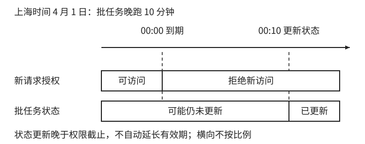
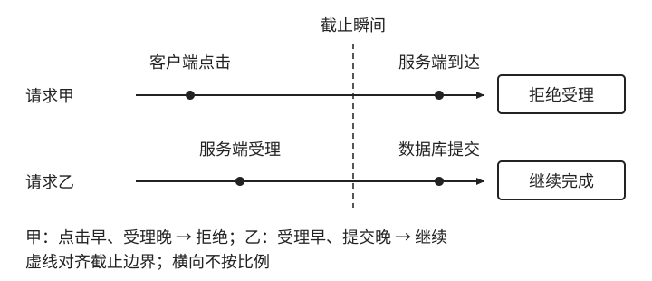

# 时间边界与业务生命周期

[第 1 章：时间不是一个 datetime](../01-time.md)

有效区间规定哪些瞬间满足时间条件，业务系统还要决定在哪个动作上检查，以及检查通过后允许做什么。新请求的受理、已有操作的继续和资源删除属于不同决定，不能仅靠同一个“过期状态”表达。

## 1.8 时间边界与业务生命周期

### 1.8.1 时间条件会变化，记录未必发生写入

设会员起止边界不变。随着 `now` 前进，`starts_at <= now < expires_at` 会从假变真，再从真变假；整个过程不需要修改数据库中的边界。因此，**当前是否处于有效期，是依赖当前时间的计算结果**。持久化的状态字段则只会在某个写入动作发生后改变，两者不能天然保持同步。

如果每天零点由批任务把会员状态改为 `EXPIRED`，授权只检查状态，那么任务晚跑十分钟就会多放行十分钟。系统实际兑现的是“状态更新后失效”，而原承诺是“达到截止便不再受理”。错误来自把批任务执行时刻代替了时间条件。

图 1-6：在其他资格满足的前提下，授权从截止起拒绝新请求，后台状态整理可以稍后进行。虚线表示同一时刻，横向不按比例。

对于本例承诺，授权路径应直接检查时间范围，并结合暂停、撤销等其他条件。批任务仍可用于通知、统计或整理状态，但它的延迟不应决定新请求的资格。这不等于所有业务都能省略状态机：一旦承诺涉及不可逆的关闭或撤销，就还需要相应状态约束，不能只由时间比较替代。

缓存 `is_valid = true` 面临相同问题。截止前一分钟算出的真值缓存五分钟，记录没有变，结果已经过时。缓存截止值可让读取方按自己的当前时间重算自然到期；但续期和撤销改变了业务数据，仍需传播变化。缓存策略与不可逆状态的取舍见[权限与时钟实验](../../../examples/ch01-time/deep-dive.md#validity-and-clock-tests)。

### 1.8.2 哪一步决定请求是否过期

请求经历点击、网络传输、服务端接收、资格检查和结果保存。截止可能落在其中任何两步之间，因此“截止前提交”必须进一步指出哪一步决定资格。不同选择会直接改变网络延迟和排队时间由谁承担。

本例采用服务端执行资格检查时读取的时间。客户端在截止前点击，但检查发生在截止后，仍不受理；客户端时间不能作为延长权限的依据。选择这个规则后，界面应说明以服务端受理检查为准，而不能承诺“点击时仍有效即可”。

若后续处理可以跨越截止，就需要把本次受理结果保存下来，供后续处理使用。本例保存检查时刻、适用资格和获准结果，**保存成功后才返回受理成功**。截止前完成检查、截止后完成保存仍可能按本例获准，因为约定的判定点是检查时刻；如果业务要求截止前完成持久化，则应另行定义和实现更严格的受理边界。

图 1-7：本例按服务端资格检查时刻判断，并可靠保存结果供后续沿用。检查早于截止与客户端点击早于截止是不同条件，横向不按比例。

这样，后续阶段判断的是“是否已有符合规则的受理结果”，不必不断用新的 `now` 重做同一次资格判断。事务、幂等与并发机制还要保证结果可靠保存、续期或撤销的竞争得到处理；一个正确的时间比较函数并不自动提供这些保证。

### 1.8.3 继续权限需要独立定义

**新操作的准入条件和已有操作的继续条件可以不同**。用户在截止前开始下载，若产品允许已获准的下载完成，则到期后只拒绝新发起或重开；已有会话沿用其资格。若要求到期中止，则需要在执行过程中复核并实施终止，单次入口检查无法兑现这项承诺。

还应区分“到期后发出中止决定”和“远端立即停止一切工作”。持续检查有间隔，网络和执行过程也有延迟。产品若要求严格的结束边界，需要明确可控制的执行位置和允许的延迟，而不能仅增加一个比较就声称所有活动在同一瞬间停止。

宽限期是一项业务政策。例如“已有下载可在到期后继续十分钟”，产生的是已有会话的继续上限。把统一的 `expires_at` 加十分钟，会同时延长新请求的资格，改变了另一项承诺。应分别表达新操作截止与已有操作上限，并说明哪些会话有资格使用宽限。

时钟容忍则处理时间来源偏差，它与业务宽限的依据不同。若技术策略允许边界后两秒仍通过，判定范围确实扩大了，不能因其名称叫“误差容忍”就忽略用户获得的结果。下一节讨论时钟来源和误差，说明这种选择为什么需要明确。

### 1.8.4 权限结束与资源回收采用各自期限

会员结束后，数据可能保留三十天供恢复，还可能有独立导出窗口。访问截止、恢复截止和最早允许删除的时刻分别约束不同动作，可以命名为 `access_expires_at`、`recoverable_until` 和 `delete_after`。

延长保留期只应改变回收条件，不应自动恢复访问资格。反过来，提前终止访问也不能擅自缩短仍然承诺的数据保留期。数据库 TTL、清理队列和对象存储生命周期负责执行资源处理；授权使用自己的时间范围与资格规则。

每个清理期限还需要说明是“**此后允许删除”还是“此时必须完成删除**”。前者允许执行器在期限之后处理，后者还要求监测执行延迟并保证完成结果。一个名为 `delete_after` 的字段通常表达前者，不能仅凭它证明后者。

回到会员到期的那一刻：新请求开始被拒绝，已有下载按约定继续或停止，文件则等保留期结束后再清理。它们都与时间有关，却不必在同一时刻发生，也不该由同一个状态字段包办。
