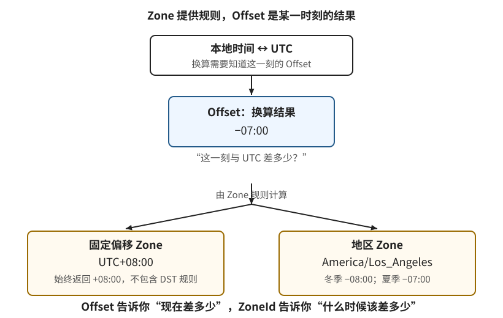
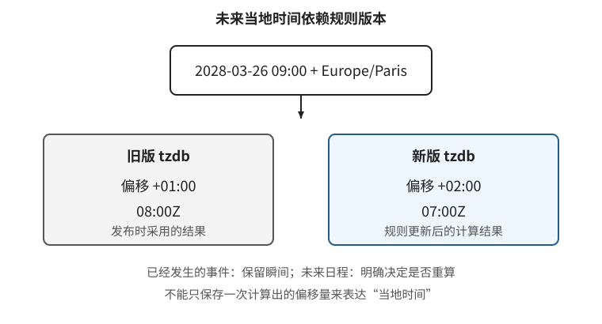
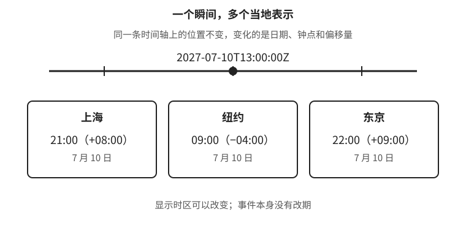

# 时间的语义模型

[第 1 章：时间不是一个 `datetime`](../01-time.md)

设计会员有效期时，我们先确定最后有效日期、业务时区和“全天有效”的规则，再算出截止瞬间。这个过程用到了不同的时间对象。要继续处理“七天有效”“每月续费”，我们需要知道这些对象各自表达什么，又能怎样组合和计算。

## 1.3 时间值、时间量与时间规则

“何时付款”“过了多久”“每月哪天续费”都在问时间，要求的答案却不同。本节从时间轴上的位置与长度开始，再引入日历中的日期、时刻和时间量，最后说明时区如何将日历表示与时间轴连接起来。日历示例采用公历，Java 类型用于具体表达这些区别。

<a id="_1-3-1-先区分对象-再选择类型"></a>

### 1.3.1 时间轴上的位置与长度

用户查看同一笔支付记录，页面按北京时间显示下午三点，改用东京时间显示就成了下午四点。显示不同，支付完成的时刻没有改变。将它标在一条共同的时间轴上，这个位置就是时间点，也称瞬间（instant）。

瞬间回答“何时发生”。两个瞬间可以比较先后，也可以计算它们相隔多远。假设支付开始于 `a`，完成于 `b`，两点相隔三秒，这个长度就是持续时间（duration）：

```text
完成瞬间 b - 开始瞬间 a = 持续时间三秒
开始瞬间 a + 持续时间三秒 = 完成瞬间 b
完成瞬间 b - 持续时间三秒 = 开始瞬间 a
```

**瞬间是位置，持续时间是长度。** 三秒本身没有说明从何时开始；给出起点以后，才能确定终点。持续时间可以相加，瞬间也可以加上持续时间，但两个瞬间相加没有对应的时间模型含义。差值还可以带方向：`b - a` 为三秒，`a - b` 就是负三秒。

程序如何保存时间轴上的位置？一种方法是选定计数起点，再记录相对它的差值。这个起点称为纪元（epoch）。以 `1970-01-01T00:00:00Z` 为纪元、以秒为单位时，0 表示起点，1 表示其后一秒，-1 表示其前一秒；改用毫秒，同一个“其后一秒”就写成 1000。纪元是计数约定，不是时间轴的开端。数字时间戳必须连同纪元、单位和时间尺度一起解释。

Java 用 `Instant` 表达瞬间，用 `Duration` 表达持续时间。`Instant` 内部使用相对纪元的秒数与秒内纳秒部分表示位置；使用类型可以减少手工处理单位的机会，但接口如果要求传递数字，仍需明确传的是秒还是毫秒。[Java `Instant`](https://docs.oracle.com/en/java/javase/25/docs/api/java.base/java/time/Instant.html)

一个瞬间还不能单独回答“当天是几号”。同一笔支付可以在一个地区发生于午夜前，在另一个地区发生于次日凌晨。这就需要引入日期与时刻。

<a id="_1-3-5-本章时间模型的边界"></a>

<details>
<summary>时间轴模型的适用范围</summary>

本章讨论普通业务系统，不展开精密授时。UTC、Unix 时间与语言库对闰秒的处理不能直接视为同一件事；Java 的 `Instant` 和 `Duration` 采用 Java Time-Scale。需要跨闰秒精确计量时，应核对时间源与库的尺度约定。[Java 时间尺度说明](https://docs.oracle.com/en/java/javase/25/docs/api/java.base/java/time/Instant.html)

上面的减法说明同一时间尺度下值之间的关系，不保证两次系统时钟读数之差就是真实耗时。系统时钟可能被校正，测量方法与时钟误差在 [1.9 节](09-clocks.md)展开。

</details>

### 1.3.2 日历中的日期与时刻

上一节用出生日期说明：`1995-06-12` 只记录某一天，没有记录当天几点。日期就是这样的值，它由所采用的日历解释。本章使用公历，年、月、日及闰年规则都按公历理解；如果需求使用农历等其他历法，需要另行指定。选择时区不会自动选择历法。

门店的“九点开门”又少了一层信息。`09:00` 只表达一天中的钟表读数，称为当地时刻。它既没有日期，也没有表达“每天”或“仅工作日”这样的重复规则。日期与当地时刻组合起来，才得到当地日期时间：

```text
日期：          2027-07-10
当地时刻：      09:00
当地日期时间：  2027-07-10T09:00
```

这很像排课表单：讲师先选择日期，再填写几点开始。两个字段合起来说明了“哪天几点”，却仍没有说明按哪个时区解释。北京时间的这一天九点与东京时间的这一天九点，对应的是不同瞬间。当地日期时间可以按年月日、时分秒排序，但缺少时区或偏移量时，这种字段顺序不能用于判断跨地区事件的先后。

这里的“当地”描述日历和钟表上的读数，不代表程序已经知道“哪里”。Java 的 `LocalDate`、`LocalTime` 和 `LocalDateTime` 分别表达上述三种对象；**`Local` 表示值本身不带时区或偏移量，不表示自动采用本机时区。** 从系统时钟取得这些值时可以用到时区，但结果本身不会保留那条时区信息。[Java 日期时间类型](https://docs.oracle.com/en/java/javase/25/docs/api/java.base/java/time/package-summary.html)

这些值无需一律转成瞬间。记录出生日期、比较营业钟点或保存尚未确定时区的排课输入，都有各自的用途。只有当问题要求确定时间轴上的位置时，才需要补齐转换条件。日期还可以直接参与日历计算，例如求一个月后的日期。

<a id="_1-3-3-运算关系决定算法"></a>

### 1.3.3 日历中的“增加一个月”

“再过三小时”指定了固定长度，可以加到某个瞬间上。“再过一个月”则不同：从 2027 年 1 月 10 日到 2 月 10 日，相隔 31 个日历日；从 2 月 10 日到 3 月 10 日，相隔 28 个日历日。这里都推进了一个月，跨过的日数却不同。一个月不能脱离起点换成固定天数，更不能直接换成固定秒数。

这种按年、月、日表达的量称为日历量。它告诉我们要在日历上推进多少单位。Java 的 `Period` 可以表示一个月，也可以表示一年两个月零三天；`Duration` 则表示时间轴上的固定长度。两者的区别体现在如何计算，而不只是使用的单位名称不同。[Java `Period`](https://docs.oracle.com/en/java/javase/25/docs/api/java.base/java/time/Period.html)、[Java `Duration`](https://docs.oracle.com/en/java/javase/25/docs/api/java.base/java/time/Duration.html)

即使知道起点，日历运算仍可能需要调整规则。2027 年 1 月 31 日增加一个月，目标月份是二月，但二月没有 31 日。业务可以规定取二月最后一天，也可以规定改到三月第一天，或者拒绝这样的输入。这些都是需要明确的选择，“一个月”本身没有替我们决定答案。

**日历量指定推进的单位和数量，调整规则处理目标日期不存在的情况。** 在可表示范围内，两类运算可以写成：

```text
瞬间 + 持续时间 → 瞬间
日期 + 日历量   → 日期（按选定的日历与调整规则计算）
```

因此，“从付款起一个月后到期”不能直接把一个月加到付款瞬间上。先要约定按哪个时区理解付款的日期和时刻，再推进一个月、处理月末，最后把结果转换回截止瞬间。如果业务还要求截止在当天结束，则需要再应用“全天有效”的规则。这些步骤分别决定起点、日历计算和截止含义。

一个月的日历量也不等于“每月续费”的完整规则。前者描述一次计算，后者需要反复生成日期，还要决定每次以什么为起点。第一次从 1 月 31 日调整到 2 月 28 日后，下次用 28 日还是恢复 31 日？[1.4 节](04-calendar.md)会据此解释月末策略与原始锚点。

<a id="_1-3-2-时区连接当地表示与时间轴"></a>

### 1.3.4 时区连接时间轴与当地表示

上一节的会员截止有两种写法：`2027-04-01T00:00:00+08:00` 与 `2027-03-31T16:00:00Z`。前者按北京时间表示，`+08:00` 称为 UTC 偏移量。它说明当地读数比 UTC 快八小时，因此用当地日期时间减去八小时，就得到同一瞬间的 UTC 表示。

完整的当地日期时间加上明确的偏移量，就足以确定一个瞬间。但 `+08:00` 只给出了换算所用的差值，没有说明它属于哪个地区，也没有承诺这个地区所有日期都采用相同差值。

地区时区提供的正是随时间确定偏移量的规则。`Asia/Shanghai` 与 `America/New_York` 都是地区时区标识。给定一个瞬间和某一版本的时区规则，就可以查出那时采用的偏移量，再算出当地日期与时刻。纽约在一年中可能使用不同偏移量，因此不能用固定的 `-05:00` 代替纽约的全部规则。不同地区此刻使用相同偏移量，也不意味着其历史和未来规则相同。[IANA 时区数据库说明](https://data.iana.org/time-zones/tz-link.html)

**偏移量是换算用的差值，地区时区是确定差值的规则。** Java 用 `ZoneOffset` 表达偏移量，用 `ZoneId` 标识时区。`OffsetDateTime` 包含当地日期时间和偏移量；`ZonedDateTime` 还保留时区，表示已经解析出偏移量的日期时间。[Java 日期时间类型](https://docs.oracle.com/en/java/javase/25/docs/api/java.base/java/time/package-summary.html)

从瞬间求当地表示时，规则可以确定当时的偏移量。反过来，输入当地日期时间，就得查找时间轴上哪些瞬间会显示这个读数。两种方向并不对称，因为当地钟表的读数可能跳过一段，也可能重复一段。

按纽约 2025 年的夏令时规则，3 月 9 日从凌晨两点跳到三点，11 月 2 日从凌晨两点拨回一点。下面按时间轴向前的顺序，列出跳变前后相邻的秒；括号内是各读数采用的偏移量：[NIST 夏令时规则](https://www.nist.gov/pml/time-and-frequency-division/popular-links/daylight-saving-time-dst)

```text
2025-03-09：01:59:58 (-05:00) → 01:59:59 (-05:00) → 03:00:00 (-04:00)
2025-11-02：01:59:58 (-04:00) → 01:59:59 (-04:00) → 01:00:00 (-05:00)
```

春季跳变时，`2025-03-09T02:30` 这个当地读数没有出现，因此找不到对应瞬间。这种情况称为缺口。秋季则先经过一次一点半，拨回一点以后又经过一次；`2025-11-02T01:30` 因而对应两个瞬间，这种情况称为重叠：

```text
第一次：2025-11-02T01:30-04:00 = 2025-11-02T05:30Z
第二次：2025-11-02T01:30-05:00 = 2025-11-02T06:30Z
```

两次一点半相隔一小时。时区规则能列出候选瞬间，却不能代替业务决定用户要的是哪一次。因此，**当地日期时间加地区时区，并不总能直接确定唯一瞬间。** 普通情况下有一个候选；遇到缺口或重叠，还需明确拒绝、调整时间或选择其中一次的处理策略。Java 的 [`ZoneRules.getValidOffsets`](https://docs.oracle.com/en/java/javase/25/docs/api/java.base/java/time/zone/ZoneRules.html#getValidOffsets(java.time.LocalDateTime)) 可以查询这些候选所对应的偏移量，[1.6 节](06-schedules.md)会进一步讨论如何处理用户输入。

转换时还应分清保留了什么。瞬间转换为某地的日期后，具体时刻就被舍去了，无法只凭日期恢复原来的瞬间；排课输入解析成瞬间后，如果只保存结果，也无法推断用户原先选择了哪个地区。[1.7 节](07-storage.md)将据此讨论哪些原始信息需要保存。

#### 时区规则不只是“夏令时开关”

这里要先分清结果和规则。**偏移量（offset）是某一时刻当地时间与 UTC 的差值**，例如 `+08:00` 或 `-04:00`；它是一次换算得到的结果，不能说明这个结果将来是否改变。**时区（zone）则是一套用来计算偏移量的规则**，由 `ZoneId` 标识。Zone 可以分成两类：固定偏移规则，例如 `UTC+08:00`；地区规则，例如 `America/Los_Angeles`，按日期时间查找对应偏移量。

因此，`+08:00`、`UTC+08:00` 和 `Asia/Shanghai` 不能互换。`+08:00` 只是一个 Offset 值；`UTC+08:00` 声明任何日期都使用同一个固定偏移；`Asia/Shanghai` 则要求按上海的地区规则查询偏移量。当前三者可能都显示为八小时，但它们在历史日期、未来政策变化和当地日期计算上含义不同。若需求只是“服务器永远按 UTC+8 运行”，应使用固定偏移；若需求是“按上海当地时间每天九点”，应保存地区时区。



图 1-11：`Offset` 是某个时刻的换算结果；`ZoneId` 是规则标识符，Zone 可以是始终返回同一差值的固定偏移规则，也可以是根据日期时间查找偏移量的地区规则。地区规则包含历史规则和当前已知的未来规则，并可能随着 tzdb 更新而变化。

IANA 时区数据库（tzdb）是大多数语言运行时使用的地区规则来源。标识通常采用 `区域/地点` 形式，地点表示规则来源而不是用户当前的精确坐标；`Asia/Shanghai` 不会随设备移动而自动变成东京。数据库还包含历史转换、别名和某些特殊标识，应用不应自行拼接或猜测名称。名称是否存在、某个历史日期采用什么偏移量，都应由运行时的时区数据库查询确认。[IANA tz database](https://www.iana.org/time-zones)、[tz-link](https://data.iana.org/time-zones/tz-link.html)

时区数据库不是物理定律，而是会更新的规则数据。政府可能临时取消夏令时、改变偏移量，或在午夜以外的时间切换；新版本发布后，同一个地区和未来日期可能得到不同结果。已经发生的事件通常应保存解析后的瞬间；未来日程若承诺“当地时间不变”，则还应保存当地日期时间、地区时区、解析策略和使用的规则版本（至少能在审计中知道当时采用哪一版）。升级 tzdb 不能静默改写已经发布的计划，是否重算应成为显式的产品策略。



图 1-12：同一个未来当地日期时间在不同 tzdb 版本下可能解析为不同瞬间。已发布计划是否随规则更新重算，必须由业务明确决定。

夏令时只是偏移量变化的一种常见原因，并不是地区时区的同义词。某些地区全年没有夏令时却仍然有历史变更；有些变化是半小时或两小时，也可能在午夜、凌晨或日期变更线附近发生。不要写成“每年三月第二个星期日切到 `-04:00`”这样的全球算法，也不要假设每次变化都是一小时。应让时区规则返回转换前后的偏移量和转换时刻，再处理缺口与重叠。规则转换还可能跨过当地日期：同一条时间轴可能从某天的 `23:59:59` 直接进入后一天的 `00:30`，当地日期并不一定包含每个钟表读数。

UTC、GMT 和偏移量也要分开。UTC 是协调世界时的时间尺度；GMT 是历史和日常用语，在现代程序中通常不应拿来替代具体的 UTC 语义。`Z` 是 ISO 8601 中表示零偏移量的写法，`2027-07-10T13:00:00Z` 与 `2027-07-10T13:00:00+00:00` 表示同一偏移下的当地表示。它们都没有携带 `America/New_York` 这样的地区规则。时间戳中的 `Z` 也不代表“用户在 UTC 地区”，只表示这个字符串采用零偏移量表达。



图 1-13：`2027-07-10T13:00:00Z` 在三个地区显示为不同日期时间。用户切换展示时区时，变化的是表示，不是事件发生的瞬间。

还要注意标识的显示名称和偏移量方向。`UTC+05:30`、`Asia/Kolkata` 和用户界面中的“印度标准时间”可能分别是固定偏移、地区规则和本地化名称；显示名称不能作为稳定的机器键。某些 `Etc/GMT` 标识沿用了 POSIX 的反向符号约定，例如 `Etc/GMT-8` 实际表示 UTC+08:00，容易造成严重误配。面向用户的选择器应展示本地化名称和当前偏移，提交稳定的 IANA 标识；面向协议的字段则直接传输偏移或 UTC 瞬间，并明确其语义。

可以用下面的检查表决定应保存哪一层信息：

| 需求 | 应保存 | 不应单独保存 |
| --- | --- | --- |
| 记录已发生的付款或日志事件 | `Instant`，接口可用 `Z` 表示 | 只有当地日期时间 |
| 永远按 UTC+8 计算的设备协议 | 固定偏移 `+08:00` | 会随地区规则变化的地区时区 |
| 上海当地每天九点执行 | 当地日期时间 + `Asia/Shanghai` + 缺口/重叠策略 | 当时算出的一个 `+08:00` |
| 展示用户所在地区的同一事件 | 瞬间 + 用户选择或设备解析出的 `ZoneId` | 把展示时区写回事件本身 |
| 需要重现历史报表 | 事件瞬间、报表地区时区、报表运行时规则版本 | 只保存报表上显示的日期 |

最后，`ZoneId` 并不等于地理位置、语言或 UTC 偏移量。一个国家可能有多个地区时区，一个地区也可能在历史上采用过多套规则；设备推断出的时区还可能只是操作系统的默认值。用户明确选择的业务时区应优先于浏览器或服务器默认值，并在输入、展示、存储和重算时保持同一来源。这样才能回答“按哪套当地规则”与“这次事件究竟发生在何时”这两个不同问题。

<a id="_1-3-4-从基本对象构成业务规则"></a>

### 1.3.5 用这些对象表达业务

现在可以把本节的对象放在一起看。瞬间、日期、当地时刻和当地日期时间用于定位“哪一刻”“哪一天”或“哪天几点”；持续时间与日历量用于表达计算中增加或减少的量。时区负责连接当地表示与瞬间，但业务还需要决定如何组合它们。

会员有效期由生效瞬间、截止瞬间和端点约定组成。两者之间的持续时间只说明长度，不能单独说明会员在哪一段时间有效：从今天起三小时与从明天起三小时长度相同，覆盖的时间范围却不同。区间必须保留位置，不能用长度替代。

“每个工作日九点”需要的是生成规则。先由业务日历选出工作日，再把每个日期与 `09:00` 组合成当地日期时间，最后按约定时区解析，处理可能出现的缺口或重叠，才得到具体执行瞬间。节假日与调休安排属于业务日历，不能从时区名称推导出来。这里每种对象只负责一部分信息，完整规则由它们组合而成。

表 1-2 汇总这些基本对象，供后续回查。它不是字段设计的替代品：使用哪种类型，仍要从字段需要回答的问题出发。

表 1-2：基本时间对象及其 Java 类型。日期示例采用公历，区间与日程由这些对象及业务规则组合表达。

| 对象 | 回答的问题 | 示例与类型 |
| --- | --- | --- |
| 时间点（瞬间） | 时间轴上的哪一刻？ | 支付完成瞬间，`Instant` |
| 持续时间 | 时间轴上的长度是多少？ | 连续三小时，`Duration` |
| 日期 | 日历上的哪一天？ | `2027-03-31`，`LocalDate` |
| 当地时刻 | 钟表上几点？ | `09:00`，`LocalTime` |
| 当地日期时间 | 日历中的哪天几点？ | `2027-07-10T09:00`，`LocalDateTime` |
| 日历量 | 推进多少年、月、日？ | 一个月，`Period` |
| UTC 偏移量 | 当地读数与 UTC 相差多少？ | `+08:00`，`ZoneOffset` |
| 地区时区 | 用哪套规则连接瞬间与当地表示？ | `America/New_York`，`ZoneId` |

类型之外，还需要明确字段记录的是计划还是事实。课程的计划结束和实际结束都可以用 `Instant` 表示，但实际晚结束半小时后，原定结束时间仍有用途。**类型说明值能怎样计算，业务名称说明它记录什么。** 分别保存计划结束与实际结束，才能继续判断是否超时；用一个含糊的 `end_time` 反复覆盖，会丢掉这种区别。后面的[课程设计](10-course.md)将具体展开。

### 1.3.6 时区从哪里来，由谁决定

前面说明了时区如何参与换算，但还有一个实际问题：程序该从哪里取得时区，又该采用谁的选择？用一个在线直播课程的场景来说明。

假设平台面向各地学员。讲师在纽约，安排一节“2027 年 7 月 10 日纽约时间上午九点”开始的课；平台发布课程时，已经把这个安排转换成确定的开课瞬间。无论学员在哪里，大家都在同一瞬间上课。课程页面要做的，是把这个瞬间换算成学员方便阅读的当地日期与时刻。

先看一位平时住在上海的学员。在上海时，他希望页面显示北京时间；到东京旅行后，为了知道当地几点上课，他希望页面改为显示东京时间。这里变化的是页面上的表示，课程本身没有改期。要实现这种“跟随设备”的展示方式，浏览器可以读取运行环境的默认时区：

```javascript
const detectedTimeZone = new Intl.DateTimeFormat().resolvedOptions().timeZone;
```

未显式指定 `timeZone` 时，`Intl.DateTimeFormat` 使用宿主环境的时区设置，`resolvedOptions()` 返回实际采用的配置。这段代码应在用户的浏览器中运行；放到服务端运行，得到的是服务端环境的设置。[ECMAScript 时区选择](https://tc39.es/ecma402/#sec-createdatetimeformat)、[`resolvedOptions`](https://tc39.es/ecma402/#sec-intl.datetimeformat.prototype.resolvedoptions)

设备设置提供了一个默认值，但用户未必希望展示跟着设备变化。例如，这位学员旅行期间仍要按北京时间与家人协调安排，他可以在平台中固定选择北京时间。此时即使设备已经切换为东京时区，课程页面也应保留他的明确选择。**设备检测结果是展示时区的候选值，用户偏好决定是否采用它。**

本例因此约定：用户明确选择的展示时区优先；尚未选择时，用浏览器检测结果作为默认值。页面显示所用时区，并允许修改；无法取得或识别时区时，明确标注并按课程采用的纽约时区显示。保存偏好时，要区分“固定使用北京时间”和“跟随设备”这两种意图。重新进入页面后检测到设备时区变化，也只对选择了“跟随设备”的用户更新展示。

再看讲师的排课表单。讲师输入的“上午九点”原本就是指纽约的九点，因此表单必须显示并提交 `America/New_York`，由服务端校验并用于解析。这是课程安排的依据。如果讲师带着电脑去东京，表单却悄悄改用设备时区，同样填写九点就会安排成另一个瞬间。讲师需要修改课程时区时，应当明确操作，不能把设备设置变化当成改期指令。

平台的运营人员还有第三种需求。假设平台约定每日报名数量按北京时间统计，那么“7 月 10 日的报名”就是按上海日期划分的一组记录。这个统计约定不随讲师或学员的位置变化。运营即使在东京出差，也仍应得到同一份日报；否则仅仅换个地方打开报表，统计范围就变了。

在这个例子中，纽约时区用于解释讲师的排课输入，学员选择的时区用于展示，上海时区用于划分报名日报。它们分别服务于不同功能，不能合并成一个全局“用户时区”。后面的[跨时区课程设计](10-course.md)会继续讨论报名截止和提醒，这里先明确时区的来源与用途。

检测结果只说明运行环境使用什么设置，不能证明用户身处哪里。语言偏好不能唯一确定时区，一个国家也可能跨越多个时区；IP 推测还会受代理和网络出口影响。即使获得地理位置，也仍需将位置映射到地区时区，并确认该地区是否就是业务要使用的地区。当前偏移量同样不能反推出唯一时区，前面已经看到多个地区可能暂时采用同一偏移量。

时区设置与设备校时也要分开。选择 `Asia/Shanghai` 决定如何解释或显示时间，并不能修复快了五分钟的系统时钟；把时钟校准也不会自动选对课程时区。设备如何取得当前时间、为什么仍有误差，在 [1.9 节](09-clocks.md)展开。

接下来把这套模型用于“过一天”。如果当地钟表在这一天发生跳变，增加连续 24 小时与把日期推进一天，会分别得到什么结果？
