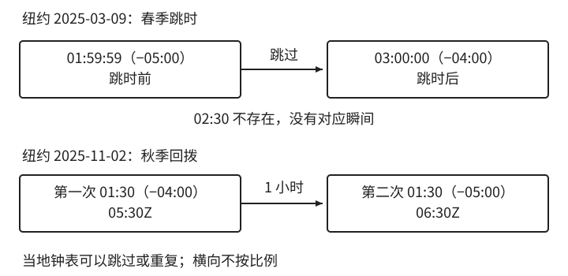

# 持续时间与日历运算

[第 1 章：时间不是一个 datetime](../01-time.md)

持续时间保持时间轴上的长度，日历运算保持日期字段之间的关系。两种计算在普通日期可能碰巧相同，但算法的依据不同。本节分别改变时区偏移和月份长度，看看它们怎样改变最后算出的日期和时刻。

<a id="sec-1-5"></a>

## 1.4 持续时间与日历运算

“七天会员”至少有三种合理解释：从生效起连续 168 小时；到店当天算第一天，覆盖七个当地日期；到七个日历日后的同一当地时刻。第一种从时间点加固定长度，第二种先求截止日期的日界，第三种先推进当地日期再解析。即使没有夏令时，如果会员在晚上十一点生效，前两种结果也可能相差 23 小时。

上一节区分了 `Duration` 与 `Period`，这里要把这种区别落实到“七天”的三种承诺上。选择 `plusDays` 或 `plusHours` 之前，应先明确需要保持的量。Java 的 `Duration` 将一天固定按 24 小时处理；日历中的一天则要结合日期和地区规则确定边界。[Java `Duration`](https://docs.oracle.com/en/java/javase/25/docs/api/java.base/java/time/Duration.html)、[Java `Period`](https://docs.oracle.com/en/java/javase/25/docs/api/java.base/java/time/Period.html)

<a id="sec-1-5-1"></a>

### 1.4.1 从日界推导一天的长度

自然日的范围由当地一个日期的开始，到下一日期的开始决定。先将两个日界各自解析为时间点，再相减，才得到这个自然日经过的长度。如果两端采用的 UTC 偏移量不同，**日历上相隔一天，并不意味着时间轴上相隔 24 小时**。

纽约 2025 年 3 月 9 日开始时使用 `-05:00`，次日开始时已经使用 `-04:00`。将两端换成 UTC：

```text
2025-03-09T00:00-05:00 = 2025-03-09T05:00Z
2025-03-10T00:00-04:00 = 2025-03-10T04:00Z
两个边界相差 23 小时
```

春季时钟从凌晨两点跳到三点，当地钟表上少了两点到三点这一小时。秋季则相反：纽约 2025 年 11 月 2 日从凌晨两点拨回一点，这一天的起点是 UTC 四点，下一天的起点是 UTC 五点，自然日长 25 小时。这里使用纽约当年的规则，不能把“一小时调整”推广到所有地区和历史时期。[NIST 夏令时规则](https://www.nist.gov/pml/time-and-frequency-division/popular-links/daylight-saving-time-dst)



图 1-2：春季跳过的读数没有对应瞬间，秋季重复的读数对应不同瞬间。图中使用纽约 2025 年的两次调整，横向不按比例。

同一种机制也影响“明天同一时刻”。从纽约 3 月 8 日中午十二点出发，推进一个日历日得到 3 月 9 日中午十二点，两者之间只经过 23 小时；增加连续 24 小时则得到下午一点。前者保持当地钟表读数，后者保持时间轴长度。若目标当地时刻恰好不存在或重复，还需要明确如何处理。这会在 1.6 节的日程解析中展开；“加一天”本身并不能保证得到唯一结果。

选择算法时，可以据此判断：租用设备连续 24 小时，可以用持续时间；门店某日营业结束、按当地日期计费，则应先求日历边界。测试需要同时覆盖正常日期与规则变化日期，才能确认实现保持的是哪一种量。

<a id="sec-1-5-2"></a>

### 1.4.2 月末截断为什么会丢失锚点

月没有固定天数。假设订阅在 2027 年 1 月 31 日上午十点生效，约定每月同一日号续费，目标月没有该日号时使用月末。2 月的边界是 28 日，但“使用月末”只解释了这一次退让，还没有说明后续账期应以哪个日期为依据。

如果从上一次结果继续加月，2 月 28 日会成为新的输入，3 月得到 28 日。如果每一期都从最初的 31 日推算，3 月则恢复为 31 日。截断把 31、30、29 等不同原始日号都可能映射成 28，单凭结果无法知道原先是哪一个，因此不能期望后续运算自动恢复它。

表 1-3：两种递推方式的不同结果。年份均为 2027 年，各边界采用同一业务时区的上午十点。

| 期索引 n | 从上次结果继续加月 | 从原始 1 月 31 日锚点推算 |
| --- | --- | --- |
| 0 | 01-31 | 01-31 |
| 1 | 02-28 | 02-28 |
| 2 | 03-28 | 03-31 |
| 3 | 04-28 | 04-30 |

Java 的 `LocalDate.plusMonths` 在目标月份缺少原日号时取最后有效日。因此，1 月 31 日连续两次加一个月，与一次加两个月，可能得到不同结果。库完成了它承诺的日期调整，是否符合账期规则则取决于调用方式。[Java 月份运算](https://docs.oracle.com/en/java/javase/25/docs/api/java.base/java/time/LocalDate.html#plusMonths(long))

对于本例“保持原日号”的承诺，**每一期应使用原始锚点和期索引独立生成**：

```java
static LocalDate boundaryFromAnchor(LocalDate anchor, long periodIndex) {
    YearMonth target = YearMonth.from(anchor).plusMonths(periodIndex);
    int day = Math.min(anchor.getDayOfMonth(), target.lengthOfMonth());
    return target.atDay(day);
}
```

函数先确定目标月份，再比较原始日号与该月长度。期索引为零时返回初始日期，后续各期都不依赖上次截断的结果。它只生成日期；真正的执行瞬间还要结合当地时刻、时区和解析策略。本例正向生成账期时，调用方应限制期索引为非负并处理日期超出可表示范围的输入。

验证也应针对生成规则：目标月份正确、有原日号的月份恢复原日号、缺日月份采用月末。只验证“1 月 31 日加一个月得到 2 月 28 日”，无法区分表中的两个模型。

### 1.4.3 将日历策略与续期政策分开

“每月同一日号”和“始终月末”仍是不同规则。4 月 30 日生效的订阅，在前一种规则下于 5 月 30 日续费，在后一种规则下于 5 月 31 日续费。初始日期相同，不能代替一个明确的 `END_OF_MONTH` 选择。年度订阅也需要单独约定 2 月 29 日在平年采用 2 月末还是 3 月 1 日，并保留原始月日供闰年恢复。

这些策略决定如何从一个依据计算结果，续期政策则决定使用哪个依据。会员仍有效时，若承诺不损失剩余权益，可以从现有截止继续增加；已经失效时，可以从新的生效时刻开始。固定每月账期的产品还可能保持原始账单日，这时不能把每次付款日当成新锚点。

暂停、赠送和人工调整也要记录原因，并说清改的是起算时间、计算规则，还是直接调整最终截止。否则数据库中的最终截止只能回答何时到期，无法解释为什么算到这一天。并非每个产品都需要复杂账期模型，但计算规则和起算依据总要同时明确。

所以，计算有效期需要回答两个问题：**从哪里开始算，按什么规则算**。只选对日期函数还不够。接下来把日历计算用在日报上：知道了要统计哪一天，怎样选出属于这一天的记录？
