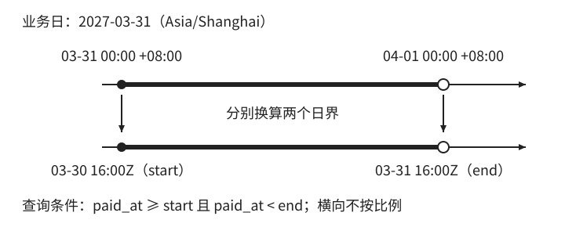

# 业务日与时间区间

[第 1 章：时间不是一个 `datetime`](../01-time.md)

运营在 4 月 1 日早上打开日报，要看 3 月 31 日的支付金额。报表任务已经成功执行，金额却对不上。排查时，光看任务是否运行、SQL 是否报错还不够：程序选的是哪一天，这一天从哪一刻开始，订单又按哪个事件计入？

上一节说明了怎样从日历求出时间边界。日报沿用同一种方法：先确定目标业务日，再用它对应的区间筛选记录。额外需要明确的是“一天”的业务定义和记录的归属规则。

<a id="sec-1-5-3"></a>

## 1.5 业务日与时间区间

### 1.5.1 先确定日期，再生成区间

“昨天”是一个相对说法。假设任务在北京时间 2027 年 4 月 1 日凌晨一点运行，此刻 UTC 仍是 3 月 31 日 17 点。按北京时间取昨天，得到 3 月 31 日；如果程序使用服务器的 UTC 日期再减一天，得到的却是 3 月 30 日。查询可以完全正确地统计出错误的一天。

对于按北京时间统计的自然日日报，应先读取一次参考瞬间，将它转换成北京时间的日期，再减一个日历日。确定目标日期以后，就把日期作为报表任务的输入。例如补跑 3 月 31 日的日报，应明确传入 `2027-03-31`，而不是让重跑时的“昨天”决定统计对象。任务晚一天执行，不应因此换成另一份日报。

得到目标日期 `D` 和业务时区 `Z` 后，分别求当天与次日的开始。记 `B(D, Z)` 为日期 `D` 在时区 `Z` 中按约定确定的开始瞬间，则查询范围为：

```text
start = B(D, Z)
end   = B(D + 1 个日历日, Z)
范围  = [start, end)
```

**两个边界都要从各自的日期计算。** 若先求 `start`，再增加固定 86,400 秒，在夏令时切换的日期就可能多选下一天的数据，或漏掉当天末尾的数据。这里需要的是完整覆盖一个自然日，不是截取任意连续 24 小时。

本例的目标日期为 `2027-03-31`，业务时区使用 `Asia/Shanghai`，得到：

```text
start = 2027-03-31T00:00:00+08:00 = 2027-03-30T16:00:00Z
end   = 2027-04-01T00:00:00+08:00 = 2027-03-31T16:00:00Z
```



图 1-3：北京时间 3 月 31 日对应的 UTC 查询区间。上下两段表示同一范围，均包含起点、排除终点，横向不按比例。

虽然 UTC 表示跨过了 3 月 30 日和 31 日，选取的仍是北京时间 3 月 31 日全天。假设本例每条订单记录保存一次支付的金额，`paid_at` 表示支付完成瞬间，查询参数也按时间点绑定，就可以直接使用这两个边界：

```sql
SELECT SUM(amount)
FROM orders
WHERE paid_at >= :start
  AND paid_at <  :end;
```

恰好在北京时间 3 月 31 日零点支付的订单会被选中，恰好在 4 月 1 日零点支付的订单不会被选中；后者属于下一份日报。下一天的起点就是本次的终点，因此交界瞬间只归入一天。`BETWEEN` 包含两端，若相邻日报共用同一个边界，就会重复选中边界上的记录。[SQL `BETWEEN` 的端点语义](https://www.postgresql.org/docs/current/functions-comparison.html)

验证这段查询时，应同时检查日期选择与边界归属。给定上面的参考瞬间，目标日期应是 3 月 31 日；起点之前、恰好起点、恰好终点的记录应分别排除、包含、排除。只检查普通下午的几笔订单，既发现不了“昨天”选错，也无法验证交界点的处理。

### 1.5.2 日界本身也是一项规则

前面的 `B(D, Z)` 使用自然日的开始。多数日期从当地零点开始，但时钟调整也可能发生在午夜，零点未必存在，或者可能出现两次。Java 的 `LocalDate.atStartOfDay(zone)` 按时区规则求最早有效开始：遇到缺口，使用缺口结束后的时间；遇到重叠，使用较早的那一次。它并不承诺结果一定是 `00:00`。[Java 日界计算](https://docs.oracle.com/en/java/javase/25/docs/api/java.base/java/time/LocalDate.html#atStartOfDay(java.time.ZoneId))

如果某个历史日期被整体跳过，该日期与次日按这种方式算出的开始甚至可能相同，形成空区间。对于按当地自然日期统计的报表，这表示没有瞬间属于被跳过的日期；可以按业务约定保留一份空报表或标明该日期被跳过，不能为了凑足 24 小时而挪用相邻日期的数据。这与会员有效期不允许空区间的约定不同，输入是否合法要由用途决定。具体案例见[日界实验](../../../examples/ch01-time/deep-dive.md#day-boundaries)。

业务还可以规定不同于自然日的分界。假设门店营业到深夜，约定按北京时间凌晨四点换日，并用区间开始那天的日期标记业务日。那么“3 月 31 日业务日”就是：

```text
[2027-03-31 04:00, 2027-04-01 04:00)  北京时间
```

4 月 1 日凌晨两点的订单，日历日期已经是 4 月 1 日，但还属于 3 月 31 日业务日；恰好凌晨四点的订单才进入 4 月 1 日业务日。因此，不能只提取订单时间的年月日作为业务日期。按本例的固定规则，当地时刻早于四点时归前一日期，从四点起归当天。

此时仍然分别生成相邻日期的四点边界，查询依旧使用半开区间。**业务日的变化体现在边界规则，区间的比较方式不变。** 如果采用其他地区的时区，而四点恰好落入缺口或重叠，还要按业务规则解析；不能把本例的正常日期当作所有时区都成立的前提。日报任务也应选择已经结束的业务区间，不能在凌晨一点因为日历翻页，就把尚未到四点的业务日当作完整一天发布。

每日限额也需要同样的日期归属。若额度按账户固定时区的自然日计算，可以用账户和业务日期区分每天的用量；用户旅行后仍归入同一套账户日。若每次请求都能自行指定时区，同一瞬间可能被归入另一个日期，让用户获得另一份额度。对于固定账户日的承诺，时区应来自受控的账户规则，修改时还要约定生效边界，不能直接重新解释已经消耗的额度。日期分组解决的是用量归哪一天，多次请求并发扣减是否超额则需要另外保证。

### 1.5.3 时间范围与事件口径共同决定结果

时间区间只说明哪些瞬间属于这一业务日，订单上却可能有多个时间。假设订单在北京时间 3 月 31 日 23:50 创建，4 月 1 日 00:10 支付完成。按创建日统计，它属于 3 月 31 日；按支付日统计，它属于 4 月 1 日。两份报告可以同时正确，因为它们统计的事件不同。

因此，“订单金额日报”还需要明确统计口径。本例统计支付完成日，就使用 `paid_at`；不能用最后修改时间 `updated_at` 代替，否则客服第二天改了一次备注，订单就可能跑到另一份日报里。改变事件字段等于改变问题，不能把它当作查询写法上的自由选择。

即便一直使用 `paid_at`，同一日期的查询结果也可能变化。再看一笔订单：支付方记录它在北京时间 3 月 31 日 23:58 支付成功，但回调直到 4 月 1 日 00:10 才到达，系统随后才保存了支付记录。假设日报在 00:05 查询，此时看不到这笔支付；00:15 再查同一区间，就能看到它。

这里变化的是数据库中可见的记录。只要本例认可支付方提供的支付完成时间，并按它填写 `paid_at`，这笔支付就始终属于 3 月 31 日。接收回调的时间说明系统何时得知它，不能在处理晚到数据时临时替换支付时间，否则报告就混用了支付日与接收日两种口径。时间来源的可信程度在 1.9 节展开。

**事件发生在哪一天，与查询时能看到哪些事件，是两个问题。** 允许修订的运营看板，可以在晚到数据入库后重算 3 月 31 日，并保留修订版本；要求保留已发布结果的日报，则应保留原报告，通过新的修订或调整记录说明差额。选择哪一种取决于报告承诺，不能让一次重跑无声覆盖已发布数字。

若要求重现某次报告，仅保存目标日期甚至当时的查询时间还不够：原始记录之后可能被补录或修改，查询时间本身无法还原旧值。需要保留能够重建当时输入的数据快照或历史版本；若只要求查阅已发布结果，也可以保存报告结果和发布版本。晚到、重算与补跑的实现细节集中见[日报与计划执行](../../../examples/ch01-time/deep-dive.md#business-day-jobs)。

给查询上限多加几小时不能解决晚到问题。上述订单的支付时间本来就在正确区间内，缺少的是当时尚未收到的记录；延长上限只会把下一天发生的支付也选进来。核对日报时，应分别检查目标日期与日界、采用的事件字段，以及发布时使用的数据。下一节继续使用日期、当地时刻与时区，为未来的营业或课程安排生成执行时间。
