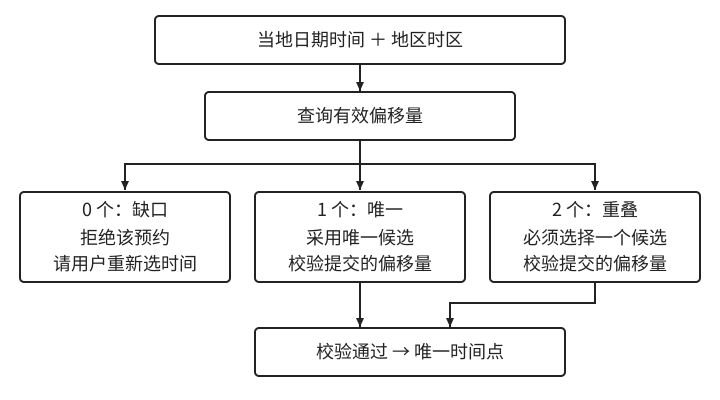

# 日程规则与当地时间解析

[第 1 章：时间不是一个 datetime](../01-time.md)

日报为一个日期生成区间，日程则为选中的日期生成执行瞬间。这个过程分为两层：业务先决定保持什么承诺，解析再根据地区规则寻找对应瞬间。把两层分开，才能判断时区政策、用户改期和库默认行为分别会影响什么。

<a id="sec-1-6"></a>

## 1.6 日程规则与当地时间解析

<a id="sec-1-6-1"></a>

### 1.6.1 固定瞬间与保持当地日程

一场会议已经确认在 `2027-07-10T13:00:00Z` 开始，参与者可以分别看到纽约九点、北京二十一点。若产品承诺保持这个已确认的瞬间，用户旅行只改变显示；修改瞬间就属于会议改期。此时，时间点是执行依据，地区信息可以用于展示和解释输入。

另一场预约明确承诺“某地某日上午九点到店”。若产品承诺保持当地日期和钟表读数，那么真正的依据是当地日期时间与地区时区。系统再据此计算执行瞬间；若赴约前该地区修改了时间规则，就需要重新评估执行瞬间及关联提醒。**未来日程究竟固定哪一层，是业务决定**，不能由数据库列类型替代。

重复日程进一步说明这种差别。门店每天九点开门，需要保存当地时刻、地区时区与日期选择规则；仅保存今天九点的 UTC 值，无法表达下一次如何生成。正确生成过程是先选下一个营业日期，再组合九点，最后解析。若从今天的瞬间不断加 24 小时，跨越偏移变化后，当地开门时间可能变成八点或十点。

工作日也应有明确日历。星期一到星期五与扣除法定节假日、加入调休后的工作日并不相同；时区数据库不会提供业务工作日定义。完整的生成依据包括日期规则、当地时刻、地区规则和解析策略。

这些依据与生成结果应保持关联。门店改为十点营业，已经生成但尚未执行的九点计划需要按变更政策处理；已执行记录则仍描述历史事实。地区政策确实会变化，IANA 的更新记录提供了实际案例，系统是否重算则取决于前面选定的承诺。[IANA 规则更新示例](https://www.iana.org/time-zones/releases/2022e)

<a id="sec-1-6-2"></a>

### 1.6.2 从当地输入寻找候选瞬间

现在给定当地日期时间和地区时区，执行解析。纽约 2025 年 3 月 9 日的 `02:30` 落在向前跳过的区段，没有对应瞬间；11 月 2 日的 `01:30` 落在重复区段，可以分别配上 `-04:00` 和 `-05:00`，得到 UTC `05:30` 与 `06:30`。相同当地读数之间实际上经过了一小时。

这不是字符串格式错误。两个输入的年月日时分都可以合法，困难在于当地表示与时间轴之间的映射。解析器需要查询地区规则的有效偏移量，而不能仅检查字符是否符合日期格式。Java 的 `ZoneRules.getValidOffsets` 为此提供候选查询；常见情形是正常时一个、缺口零个、重叠两个。[Java 地区规则 API](https://docs.oracle.com/en/java/javase/25/docs/api/java.base/java/time/zone/ZoneRules.html#getValidOffsets(java.time.LocalDateTime))

**候选集合是技术事实，如何处理集合则是业务策略**。预约可以拒绝缺口并要求用户选择重叠中的一次；定时巡检可以约定跳过不存在的本地时刻；也可以按明确规则顺延。采用哪一种，都应说明用户看到的结果，而不是只记录“解析成功”。

本例预约采用“缺口拒绝，重叠要求选择”。有一个候选时直接采用；没有候选时返回输入无法兑现的原因；多个候选时展示各自的偏移和先后，让用户选定。提交了偏移量后，仍要验证它属于本次候选集合。



图 1-4：本例策略根据候选集合分支。即使只有一个候选，客户端提交的偏移量也必须与它一致；完整实现见[预约解析实验](../../../examples/ch01-time/deep-dive.md#local-time-resolution)。

校验的理由可以从两个错误中看清。若纽约夏季的九点被配上冬季偏移量，数学上仍能得到一个瞬间，但它转换回纽约后不会是输入的九点。若服务端反过来完全忽略偏移量，又可能把用户选择的第二次凌晨一点半改成第一次。正确结果必须同时满足当地输入、地区规则与用户选择。

Java 的 `ZonedDateTime` 部分构造方法对缺口会按跳变长度向后调整，对重叠也有默认选择。这些行为是库的便利策略，并非所有预约的业务规则。需要严格执行本例承诺时，应显式查询和校验，而不是把默认构造成功当作消歧已经完成。[Java `ZonedDateTime`](https://docs.oracle.com/en/java/javase/25/docs/api/java.base/java/time/ZonedDateTime.html)

<a id="sec-1-6-3"></a>

### 1.6.3 协议保存意图，计划保存结果

接口应能表达解析过程所需的信息。本例接收当地日期时间、地区时区，以及必要时选择的偏移量：

```json
{
  "local_start": "2027-07-10T09:00:00",
  "time_zone": "America/New_York",
  "selected_offset": null
}
```

接口固定采用上一节的策略。正常输入可以不传偏移量；重叠时，服务端返回候选供选择，然后重新提交。例如纽约 2025 年 11 月 2 日的 `01:30` 选择第二次，应提交 `"selected_offset": "-05:00"`。界面可以把它解释为“第二次凌晨一点半”，无需让用户自行记忆偏移数值。

创建成功后返回明确的 `starts_at`，同时保留原始当地输入、时区与选择依据供编辑。**用户改期时重新查询候选，不能沿用原日期的偏移量**；地区规则可能已经不同。对于保持当地意图的计划，规则更新也应触发受影响计划的检查。若要求精确重现过去一次解析，还需要保留当时采用的规则依据；只保存一个会更新的地区名称不足以完成历史重现。

一个只接收带偏移量时间戳的接口也可以正确，但它能够兑现的是一个瞬间。偏移量允许定位本次结果，却没有给出未来日期应使用的地区规则。如果接口不接收地区信息，就应说明它只接受已确定的瞬间，不负责保持未来的当地日程。

### 1.6.4 生成计划与执行计划的边界

**解析完成只证明计划输入明确，不能保证任务准时执行**。生成器负责把规则转成一次次计划，执行器负责处理已经到期的计划及执行结果。任务迟到是否补跑、旧计划改期后是否失效、失败后是否重试，都属于后一个层次。

分开两层之后，测试也有清楚的对象：生成测试验证日期、候选和选定瞬间；执行测试验证到期后的行为。完整的计划身份、补跑与改期处理见[日报与计划执行](../../../examples/ch01-time/deep-dive.md#business-day-jobs)。这些机制不能用“每天加 24 小时再执行一次”同时替代。

日程算清楚之后，系统既可能需要保存用户最初的选择，也可能需要保存生成的执行时刻。下面看看这些信息经过接口和数据库时，怎样避免丢失或被错误解释。
