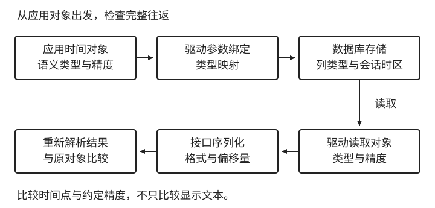

# 时间的表示、存储与往返验证

[第 1 章：时间不是一个 datetime](../01-time.md)

前面建立了语义对象和计算规则。将它们传给接口、写入数据库时，问题变为：哪些信息必须保留，哪些变化只是表示差异？先说清什么不能变，才知道该选什么格式和列类型。

<a id="sec-1-3"></a>

## 1.7 时间的表示与存储

<a id="sec-1-3-1"></a>

### 1.7.1 为不同对象定义不变量

一个已确认的会员截止经过转换后，应仍指向同一瞬间；一个生日经过存取后，应仍是同一日期；一个保持当地九点的未来预约，还需要保留当地输入和地区规则依据。**这些在表示变化中要求保持的性质，称为不变量**。对象不同，检查方式也不同。两个文本即使不同，也可能表达同一瞬间；比较前先确定需要保持的是瞬间、日期，还是原始输入，不能一律比较格式化后的字符串。

因此，“所有时间统一存 UTC”只能处理一部分问题。它适合把已确定的瞬间放到共同基准下，却不能从一个瞬间恢复生日的原始日期，也不能恢复未来日程采用哪个地区、哪种生成规则。日期应保持日期，日程依据应按它包含的信息保存，执行瞬间可以作为另一个派生结果。

这里也要区分计算依据与派生结果。预约原始输入规定当地哪天几点到店，执行瞬间则由输入和地区规则算出。将结果写进数据库，不会让它自动成为独立的业务事实；如果产品承诺保持当地日程，规则更新时仍应检查这个结果是否需要重算。

派生值是否存储取决于用途。能够廉价计算的截止可以在读取时生成；需要交给调度器的提醒时刻可能需要持久化。保存时应保留与原始依据的关联，避免用户改了预约时间，调度器却继续执行旧提醒。计划与实际发生的事件也要分别保存，具体依赖将在课程案例中展开。

展示层同样应服从不变量。用户从上海去纽约，可以换一种当地表示查看会员截止，但不能把购买时约定的上海最后有效日重新按纽约解释。服务器迁移到 UTC，也不应改变业务截止。若页面文案仍表达“3 月 31 日全天有效”，应说明它依据上海日期；若展示精确时刻，则应从同一个截止瞬间生成。

展示函数因此宜显式接收时区，例如 `formatInstant(instant, displayZone)`。语言和日期格式是另一项选择：中文界面可以显示纽约时间，英文界面也可以显示北京时间。把语言、所在地或服务器默认配置当作业务时区，都会引入原模型中没有的解释。

<a id="sec-1-3-2"></a>

### 1.7.2 接口怎样表达字段含义

本例会员接口返回：

```json
{
  "expires_at": "2027-03-31T16:00:00Z"
}
```

协议应同时说明字段是排他的失效时间点，并规定格式、精度、范围与缺失含义。这里采用 RFC 3339 的 UTC 表示；它避免接收方猜测时区，但字符串本身仍不会说明这个时间点用于失效还是开始。[RFC 3339](https://www.rfc-editor.org/rfc/rfc3339.html)

如果输出不带偏移的 `2027-04-01 00:00:00`，又允许接收方按默认时区解释，上海环境和 UTC 环境会得到相差八小时的两个瞬间。两边都解析成功，不变量却已被破坏。给上海读数直接追加 `Z` 也会造成同一种错误：它声明读数属于 UTC，并未把原瞬间转换为 UTC。

数字时间戳是另一种表示选择。采用从 `1970-01-01T00:00:00Z` 起的 epoch 毫秒时，应明确单位，例如命名为 `expires_at_epoch_ms`，并验证所有接收端能够保留所需数值范围和精度。数字减少了格式选择，却没有消除协议约定。零值、缺失值和永久有效也必须分别定义，不能依靠调用方猜测。

接口解析是模型入口，应拒绝不符合契约的值。对于只接收时间点的字段，缺少必要偏移量的当地输入不能默默借用本机配置；对于生日字段，则不应要求补齐一个时区。严格解析应当检查输入是否符合字段约定，不必把所有字段都转换成时间点。

<a id="sec-1-3-3"></a>

### 1.7.3 列类型与驱动共同决定存取结果

数据库列必须与对象语义匹配。以 PostgreSQL 为例，`timestamptz` 保存经归一化的瞬间，输出时按会话时区显示，不保留原始地区名称；`timestamp without time zone` 保存不带时区的日期时间字段。前者适合本例已确认的截止，后者可以承载明确的当地输入，但单独不能表达一个唯一瞬间。[PostgreSQL 日期时间类型](https://www.postgresql.org/docs/current/datatype-datetime.html)

也可以约定使用无时区列保存 UTC 读数，不过这时“读数代表 UTC”是应用契约，列本身不会替我们强制执行。所有写入者、读取者和导出程序都必须遵守同一解释。是否采用这种策略，应比较现有驱动与数据契约的约束，不能只看列名是否含有 `timezone`。

还需要关注隐式转换。PostgreSQL 接收没有时区信息的输入并将其解释为 `timestamptz` 时，会用会话时区补齐解释条件。因此，即使列类型合适，应用若把一个本应明确的瞬间降成无偏移字符串，也可能在写入时改变它。**参数绑定、列类型、驱动读取和序列化构成同一条转换链**。[PostgreSQL 时间戳输入规则](https://www.postgresql.org/docs/current/datatype-datetime.html#DATATYPE-DATETIME-INPUT)

表 1-4：本例采用明确的时间点绑定和读取映射时的往返预期。以下是待实际驱动验证的结果，不代表所有驱动的默认行为。

| 位置 | 值或预期观察 | 要保持的关系 |
| --- | --- | --- |
| 应用准备写入 | `2027-03-31T16:00:00Z` | 定位原截止瞬间 |
| 数据库 `timestamptz` | 保存该瞬间 | 不按另一个地区重新解释 |
| 上海会话查询 | `2027-04-01 00:00:00+08` | 当地表示改变，瞬间不变 |
| UTC 会话查询 | `2027-03-31 16:00:00+00` | 与上一行定位同一瞬间 |
| 驱动读回应用 | 与原时间点相等 | 类型映射保留约定精度 |
| 接口输出并重新解析 | 与原时间点相等 | 完成整个往返 |



图 1-5：写入、存储、读取与接口解析共同组成待验证的转换链。比较对象是时间点及约定精度，不能只看数据库客户端中的显示。

若接口返回 `2027-04-01T00:00:00+08:00`，不变量仍然成立；若返回 `2027-04-01T00:00:00Z`，截止已经变了。读回之后还应重复边界判断，确认同一个截止仍得到相同授权结果。完整 SQL 和不同存储策略的实验见[存取实验](../../../examples/ch01-time/deep-dive.md#storage-roundtrip)。

### 1.7.4 精度、连接环境与历史修复

**精度是契约的一部分**。假设截止包含微秒，某一层却截断到毫秒，读回的瞬间可能提前；即使误差很小，靠近截止的判断仍可能不同。允许降低精度时，应先确定业务接受的规范化规则，再验证所有层使用同一规则。把原值和读回值都格式化到秒，只能证明粗略显示相同。

改变运行环境，可以发现程序是否偷偷依赖了默认配置。测试可以改变服务默认时区、数据库会话时区，并通过连接池使用不同物理连接。如果模型要求这些变化不影响截止，结果就应保持一致；否则需要定位哪一层偷偷加入了解释。对日期和未来日程也应分别检查各自不变量，不能只运行一个时间点用例。

历史数据则是另一类问题。若旧值已经偏移八小时，应先核对独立流水、写入来源和当时的配置，确认改变发生在哪一层。缺少来源时，多个原始解释可能对应同一串值，统一加减八小时无法证明修复正确。查证和迁移步骤集中见[历史数据排查](../../../examples/ch01-time/deep-dive.md#historical-time-repair)。

现在，截止经过存取后仍是同一个瞬间。但把值存对，只解决了输入问题：系统究竟在什么时候检查它，检查通过后又允许用户做什么？这还需要单独约定。
