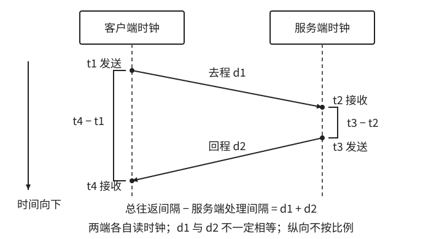
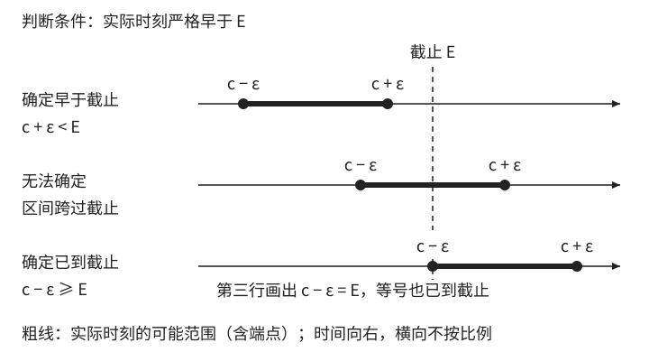

# 时间来源与耗时测量

[第 1 章：时间不是一个 `datetime`](../01-time.md)

上一节约定，由服务端检查请求是否已经过期。但这个判断还有一个前提：服务端读到的“现在”足够准确。以报名为例，如果服务器的时钟快了五分钟，即使比较运算完全正确，报名也会提前五分钟关闭。

选对时间类型、写对比较运算之后，还要检查时间值的来源：它记录的是哪个事件，用的是谁的时钟，时钟误差是否足以改变判断结果。

<a id="sec-1-7"></a>

## 1.9 时间来源与耗时测量

使用时间之前，先回答四个问题：

1. **记录的是哪个事件？** 扣款、收到回调和修改记录，是三个不同的事件。
2. **时间由谁记录？** 客户端、服务端和数据库，可能读到不同的“现在”。
3. **需要比较时刻，还是测量耗时？** “几点发生”与“花了多久”需要不同的时钟。
4. **时钟误差会不会改变业务结果？** 展示倒计时与严格判断截止，对误差的容忍程度不同。

下面先从字段含义和时钟选择讲起，再讨论校时、跨机器误差，以及监控和测试。

<a id="sec-1-7-1"></a>

### 1.9.1 一个时间值到底表示什么

一笔支付可能在扣款后的第二天才送达回调，到了第三天，又有人修改了这笔支付的备注。扣款、收到回调和修改记录发生在不同时间。只保存一个随记录更新而变化的 `updated_at`，以后就无法从这个字段查出钱是哪一天扣的。

因此，定义时间字段时，应同时说明**它对应哪个事件，以及由谁记录**。`occurred_at` 可以保存支付平台报告的扣款时间，`received_at` 保存本服务收到回调时读取的时间。即使更信任自己的时钟，也不能用接收时间替代扣款时间，因为它们记录的是两件事。

例如，支付平台在 10:00:00 完成扣款，过了五秒才发出回调，本服务在 10:00:06 收到。假设两端时钟准确，`received_at - occurred_at` 得到六秒。这是从扣款完成到本服务收到回调的总时长，其中包含平台发送前的五秒等待。要测量回调在网络上传输了多久，还需要知道它何时发出。如果两端时钟的偏差不同，即使知道发送时间，两次读数的差也不等于实际传输时间。

能否采用某个来源的时间，取决于要用它做什么。检查会员是否到期时，不能以客户端提交的 `now` 为准，否则用户调慢手机时钟就能延长访问。对于离线采样，设备报告的采样时间却可能必须保留，否则就无法知道数据是在什么时候采集的。这时应一并保留时间来源和必要的校验信息，并约定设备时间不可靠时如何处理。

#### “现在”是哪一个现在？

即使时间值由自己的数据库生成，也要确认它表示哪一刻。PostgreSQL 的 `CURRENT_TIMESTAMP` 返回当前事务开始时间，`statement_timestamp()` 返回当前语句开始时间，`clock_timestamp()` 则读取调用时的当前时间。这些函数都能返回合法时间值，却不能互换。[PostgreSQL 18 当前时间函数](https://www.postgresql.org/docs/18/functions-datetime.html#FUNCTIONS-DATETIME-CURRENT)

例如，报名在零点截止，一个事务在 23:59:58 开始，直到 00:00:02 才执行资格检查。若规则要求按检查时刻判断，使用 `CURRENT_TIMESTAMP` 就可能错误放行，因为它仍返回截止前的事务开始时间。如果希望事务内的操作使用同一个时间值，事务开始时间很合适；如果需要知道执行检查时是几点，就应读取当时的时间。不过，`clock_timestamp()` 也只能告诉我们调用它时是几点，不能证明稍后的事务提交何时成功。

确定记录什么事件、在哪一步读取时间之后，还要区分两个用途：记录事件发生的时刻，以及测量操作经过的时长。

<a id="sec-1-7-2"></a>
<a id="_1-9-2-钟表读数之差为何不一定是耗时"></a>

### 1.9.2 时刻与耗时是两种不同问题

先记住时钟选择的基本规则：

```text
记录“什么时候发生” → 钟表时间（wall clock）
测量“花了多久”     → 单调时钟（monotonic clock）
```

系统钟表可能因自动校时或人工调整而跳变。用户实际等了两秒，如果期间系统钟表向后调整五秒，用结束读数减去开始读数，就会得到负三秒。

表 1-5：同一请求期间钟表回拨五秒。右列是同一本地单调计时源的示意读数。

| 读数或差值 | 系统钟表 | 本地单调计时 |
| --- | --- | --- |
| 请求开始 | 10:00:00 | 100 秒 |
| 请求结束 | 09:59:57 | 102 秒 |
| 结束减开始 | −3 秒 | 2 秒 |

钟表时间（wall-clock time）表示日历上的某一刻，因此记录事件、展示日期和判断绝对有效期时必须依赖这类时间；但它的准确性取决于系统时钟是否可靠。测量耗时则可以使用单调时钟（monotonic clock）：它不会因为系统钟表被拨回，就跟着回拨。测量时，前后两次读数需要来自同一个单调计时源，再用差值计算耗时。它的计时起点通常没有业务含义，真正有用的是两次读数的差。

例如 Java 的 `System.nanoTime()` 用于测量耗时，同一 JVM 内的调用共享起点；不能假定另一 JVM 或重启后的实例具有相同起点。返回值以纳秒表示，也不意味着每纳秒都会产生不同读数，更不代表测量误差只有一纳秒。[Java 25 `nanoTime`](https://docs.oracle.com/en/java/javase/25/docs/api/java.base/java/lang/System.html#nanoTime())

```text
started_at = wall_clock.now()       // 日志：请求何时开始
begin      = monotonic_clock.now()  // 测量：从这里开始计时

执行请求

elapsed = monotonic_clock.now() - begin
```

这里的两个值各有用途：`started_at` 记录请求何时开始，`elapsed` 记录请求花了多久。**记录事件时刻与测量耗时，应分别选择适合的时钟。** 单调时钟的原始读数不能直接交给另一台机器当作事件时间，也不适合保存为重启后仍需使用的会员到期时间。

超时判断也需要测量经过了多久。进程内一次操作最多允许等待三秒，查库已经用掉一秒，后续就只剩两秒。应用可以用单调时钟计算剩余的等待时间；若改用钟表读数相减，钟表回拨可能延长等待，向前跳变则可能让等待提前结束。如何结束等待、取消工作，以及把剩余时间传给后续操作，在[第 24 章](../../part-03-repetition/09-timeouts.md)继续展开。

单调时钟不会回拨，但走速仍可能有误差。它是否在电脑休眠期间继续计时，也要核对具体平台与 API。如果业务要求电脑休眠十分钟后，原来的三秒等待已经超时，就需要选择会计入休眠时间的计时源。因此，选择 API 时还要明确：休眠时间是否算在等待时间之内。

单调时钟解决了本地耗时测量中的回拨问题。对于仍需依赖钟表时间的业务，接下来要了解：系统时钟为什么会失准，校时又能改善到什么程度。

### 1.9.3 为什么系统时间并不绝对准确

应用调用系统时间接口，通常读取的是操作系统维护的本地时钟，并不会每次都向授时服务器询问。两次校时之间，本地时钟仍会继续走动；校时程序则根据参考时间修正它的读数和走速。

这里要区分偏差（offset）与漂移（drift）。某一刻，本机读数比参考时间快或慢多少，称为偏差。本地时钟走得偏快或偏慢，使偏差逐渐积累，这个过程称为漂移。把快了两秒的钟拨回来，可以消除当时的偏差；但如果它仍然走得偏快，之后还会逐渐失准。

网络时间协议（NTP）通过客户端与时间服务器之间的请求和响应来估计偏差。不过，服务器发出响应后，还要经过一段传输时间，客户端才能收到。客户端若直接把响应中的时间当作此刻的时间，就会把传输延迟也算进时钟偏差。

一次 NTP 交换使用四个读数：客户端发送时的 `t1`、服务端接收时的 `t2`、服务端发送时的 `t3`，以及客户端接收时的 `t4`。`t1`、`t4` 来自客户端时钟，`t2`、`t3` 来自服务端时钟。



图 1-8：客户端与服务端分别读取自己的时钟，竖虚线表示各自随时间推进的过程。时间从上向下，纵向不按比例；箭头的倾斜程度不表示时钟偏差，去程与回程延迟也不一定相等。

NTP 会利用这些读数扣除服务端处理时间，并估算时钟偏差。但网络去程和回程不一定对称，估计仍然存在误差。反复取样、筛选样本并参考多个时间源，可以改善估计，却不能保证两台机器完全同步。应用开发中更重要的结论是：**校时可以减小误差，但不能让跨机器时间戳之差天然等于精确耗时。**

<details>
<summary>深入理解：NTP 为什么不能得到绝对准确的时间</summary>

假设这次交换期间没有时钟跳变，走速差的影响可以忽略，则有：

```text
往返网络延迟估计 = (t4 - t1) - (t3 - t2)
服务端相对客户端的偏差估计 = ((t2 - t1) + (t3 - t4)) / 2
```

第一个公式从总往返时间中扣除服务端处理时间，得到去程与回程延迟之和。要理解第二个公式为什么取平均，可以设服务端时钟比客户端快 `θ`，去程延迟为 `d1`，回程延迟为 `d2`。两组读数之差分别为：

```text
t2 - t1 = θ + d1
t3 - t4 = θ - d2

偏差估计 = θ + (d1 - d2) / 2
```

当去程与回程延迟相等时，网络延迟项抵消；如果去程 80 毫秒、回程 20 毫秒，估计出的偏差就会比实际偏差多 30 毫秒。**仅凭一次交换，无法分清读数差中有多少来自时钟偏差，有多少来自两程延迟不相等。** 以上是理解 NTP 的简化推导，完整协议还包含样本处理和时钟校正算法。[RFC 5905：时间交换与偏差计算](https://www.rfc-editor.org/rfc/rfc5905.html#section-8)

</details>

得到偏差估计后，校时程序可以稍微加快或放慢时钟，让读数逐渐接近参考时间（slew），也可以直接调整读数，造成向前或向后的跳变（step）。具体方式取决于实现、配置和偏差大小。例如 chrony 通常渐进校正，也支持通过 `makestep` 直接跳变。因此，“开启了自动校时”既不表示时钟始终准确，也不表示它绝不会回拨。[chrony 4.4 校时说明](https://chrony-project.org/doc/4.4/chronyc.html#makestep)

同步中断后，本地时钟仍会继续走动，误差也可能继续累积。即使同步正常，上游时间源本身不准确，也会影响校时结果。普通业务应用通常由操作系统或基础设施负责校时，应用再检查时钟误差是否在可接受的范围内。时区配置则只影响时间的当地表示：切换到 `Asia/Shanghai`，不会把快了五分钟的钟校准。

### 1.9.4 跨机器时间为什么尤其危险

测量单机耗时可以用单调时钟避开钟表跳变，但记录跨机器事件、判断会员到期等操作，仍然需要钟表时间。即使两台机器都用 UTC 记录时间，也可能一台偏快、一台偏慢。

在同一参考时间尺度下，把时钟读数写成“实际时刻 + 本机误差”，两台机器的记录相减便得到：

```text
接收读数 - 发送读数
= 实际传输时间 + 接收端误差 - 发送端误差
```

假设 A 发送后经过 100 毫秒，B 才收到；A 的钟快 200 毫秒，B 的钟慢 200 毫秒，读数差就是 `100 - 200 - 200 = -300` 毫秒。消息没有先到后发，负值来自两端的时钟误差。如果能确认两条记录对应同一条消息，就知道一定是先发送、后接收；但单靠这两个时间戳，无法精确算出单向传输耗时。跨机顺序的进一步讨论见[第 31 章](../../part-05-distribution/19-ordering.md)。

**UTC 统一了时间表示，却不会消除机器之间的时钟偏差。** 要测量一次请求的往返耗时，可以在发起端使用同一个单调计时源；要从两端时间戳推算单向延迟，则必须同时考虑两端误差。

<a id="sec-1-7-3"></a>
<a id="_1-9-3-时钟有误差-判断能有多准确"></a>
<a id="_1-9-4-时钟有误差-判断能有多准确"></a>

### 1.9.5 临近截止时间时，判断有多可靠

普通业务通常不会在每次时间比较时显式计算误差区间，而是依赖 NTP/chrony 等基础设施把误差控制在业务可接受的范围内，再执行 `now >= expires_at`。下面的 `ε` 是面向严格截止要求的进阶分析模型，用来说明：**当业务要求的判断精度接近时钟误差时，单个时间戳已经不足以给出确定答案。**

判断是否到达截止时刻，也会受到误差影响。设截止时刻为 `E`，当前时钟读数为 `c`，二者使用同一时间尺度。如果能够保证当前误差不超过 `ε`，就能确定实际时刻位于 `[c - ε, c + ε]`。要判断实际时刻是否严格早于截止，可以分三种情况：

- `c + ε < E`：整个区间都在截止之前，可以确定尚未到达截止。
- `c - ε >= E`：整个区间都在截止时刻或之后，可以确定已经到达截止。
- 其余情况：误差区间跨过截止，仅凭当前读数，无法确定是否已经到达截止。



图 1-9：假设误差确实不超过 ε，粗线表示实际时刻可能落入的范围，实心点表示包含端点，竖虚线标出截止 E。第三行中，区间起点恰好等于截止，因此整个区间都已到达或越过截止；横向不按比例。

例如截止是 12:00:00，读数是 11:59:59.800，误差上界为 500 毫秒，那么实际时刻可能位于 11:59:59.300 到 12:00:00.300 之间。代码执行 `c < E` 会返回真，但这并不能保证实际检查发生在截止前。

**临近截止时，系统可能无法确定请求是否还来得及。** 如果要求资格检查必须发生在实际截止之前，可以只在 `c + ε < E` 时通过检查。这样能避免截止后放行，但也可能拒绝一些实际尚未过期的请求。如果为减少误拒而允许一定的时钟偏差，就可能放行实际已经过期的请求。业务需要在这两种结果之间作出选择；时间戳多保留几位小数，并不能消除时钟本身的误差。

这套判断有一个前提：误差确实不超过 `ε`。监测工具上次报告的偏差，只能说明当时的估计结果，不能保证误差始终不超过这个值。失去同步后，更不能一直沿用旧估计。无法确认当前误差范围时，上面的保证也就不再成立。

### 1.9.6 时钟错误会影响哪些业务

不同场景对时间的依赖不同。先看下表，再以凭证验证和定时任务为例，说明时钟误差如何改变程序行为。

| 场景 | 依赖哪种时间或信息 | 时钟错误可能造成什么 |
| --- | --- | --- |
| TLS / JWT | 钟表时间 | 被误判为尚未生效或已过期，也可能错误接受 |
| 请求耗时 | 单调时钟 | 若误用钟表时间，跳变可能导致负耗时或耗时失真 |
| 定时任务 | 钟表时间 + 执行状态 | 漏执行、提前执行或重复执行 |
| 权限过期 | 钟表时间；不可重新开放的权限还需关闭状态 | 回拨后，单靠时间比较可能让权限重新生效 |
| 日报 | 钟表时间 + 业务时区 | 事件落入错误日期；时钟与时区需分别排查 |
| 跨机延迟 | 两台机器的钟表时间 | 读数差混入两端误差，无法直接得到精确单向耗时 |

#### TLS 与 JWT：检查验证方的时钟

验证 TLS 证书时，验证方会用自己的当前时间检查证书是否在有效期内。客户端时钟过慢，可能把已经生效的服务端证书判为尚未生效；过快则可能把仍有效的证书判为过期。双向 TLS 中，服务端验证客户端证书时也依赖自己的时钟。这里要检查的是验证方的时间，不一定是证书持有方的时间。RFC 5280 规定证书有效期包含 `notBefore` 与 `notAfter` 两端，不能直接套用本章业务示例的半开区间。[RFC 5280：证书有效期](https://www.rfc-editor.org/rfc/rfc5280.html#section-4.1.2.5)

登录令牌也有类似依赖。JWT 的 `exp` 要求当前时间严格早于过期边界，`nbf` 要求当前时间已经到达起始边界；签发方与验证方有偏差时，刚签发的令牌也可能被拒绝。规范允许验证方容忍少量时钟偏差，但这会扩大令牌可以被接受的时间范围。是允许提前使用，还是允许过期后短暂继续使用，以及各自放宽多少，都要查看验证方的具体配置。[RFC 7519：`exp` 与 `nbf`](https://www.rfc-editor.org/rfc/rfc7519.html#section-4.1.4)

#### 定时任务：到期不等于已经执行

定时任务除了检查时间，还需要记录任务是否已经执行。假设一条提醒定在 10:00 发送，钟表却从 09:59 跳到 10:01。如果程序只在“当前恰好是 10:00”时触发，就可能漏发；如果查询“已到期且未执行”的提醒，就能发现这条迟到任务，再按约定补发或跳过。钟表回拨后，要避免重复发送，也需要检查执行记录。**时钟用来判断是否到期，执行记录用来判断是否已经处理。** 仅靠时间比较，无法保证任务只执行一次。

### 1.9.7 如何监控和测试

校时进程仍在运行，不代表时钟就足够准确。还要检查是否有可用的时间源、最近一次成功取样是什么时候，以及当前估计的偏差和误差范围。例如 chrony 的 `tracking` 提供参考时间、系统时间差、频率偏差和根离散度等信息，`sources` 提供来源状态；这些指标的含义不同，需要结合工具说明一起判断，不能只看其中一个数值较小，就认定时钟足够准确。[chrony 4.4 监测接口](https://chrony-project.org/doc/4.4/chronyc.html#tracking)

**除了规定允许多大误差，还要约定误差过大时怎么办。** 课程页面的倒计时只用于展示，时间不可靠时，可以重新向服务端获取当前时间和截止时间，并提示用户。负责最终判断的报名服务则需要更严格的处理：暂停接受新报名，或把判断交给另一个能确认时钟准确程度的服务。暂停会影响用户报名，转交则增加了服务依赖。设计时应说明多大误差会触发处理、哪些操作需要暂停、何时可以恢复；仅仅发出告警，并不能阻止系统继续作出错误判断。

测试时，通过可注入的时钟接口，分别控制钟表时间和单调时钟的读数。例如，让单调读数前进两秒，同时让钟表回拨五秒，测得的耗时仍应为两秒。还可以单独把客户端时间调快十分钟，确认服务端的报名判断不受影响。

普通到期判断应覆盖截止前、恰好截止和截止后；如果业务采用了上述误差区间模型，还要覆盖区间的三种位置：完全早于截止、跨过截止，以及整个区间都已到达或越过截止，分别检查处理结果是否符合约定。还应模拟同步中断、时钟误差超出允许范围的情况，确认应用按约定告警、暂停相关操作，或把判断转交给其他服务。时间注入与相关实验见[权限与时钟实验](../../../examples/ch01-time/deep-dive.md#validity-and-clock-tests)。

定时任务还需要单独验证：让钟表向前跳过计划时刻，检查迟到任务如何处理；执行后再把钟表拨回，检查同一条提醒是否会重复发送。这些检查涉及调度器、执行记录及失败恢复，单独验证时间库不能覆盖它们。

在应用测试中替换时钟，通常不会改变 TLS 库内部读到的时间。要测试证书有效期，可以使用支持指定验证时间的接口，或在隔离环境中调整时间，分别检查尚未生效、正常有效和已经过期的证书。这里列出的是实现时需要完成的测试，本书并未运行真实 NTP 或 TLS 故障实验。

回到报名截止，先说明时间字段记录哪个事件、由谁记录；记录时刻用钟表时间，测量耗时用单调时钟；跨机器的时间戳即使都使用 UTC，也不能直接当作精确时间差。有了这三个约定，才能进一步决定在哪里检查截止，以及时间不可靠时怎么办。下一节用一场跨时区课程，把这些约定与前面的日历计算、存储方式和到期规则结合起来。
