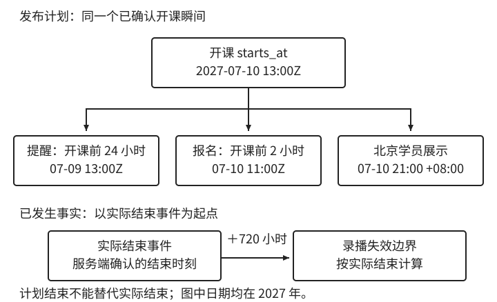

# 综合设计：跨时区课程

[第 1 章：时间不是一个 `datetime`](../01-time.md)

时间模型是否有用，要看它能否把一段新需求变成相互一致的数据、运算与行为。下面的课程设计依次完成语义选择、依赖推导、业务判断和验证，每一步都使用前面已经建立的关系。

<a id="sec-1-8"></a>

## 1.10 综合设计：跨时区课程

<a id="sec-1-8-1"></a>

### 1.10.1 从需求中确定语义与承诺

需求如下：讲师在纽约安排 2027 年 7 月 10 日上午九点开课，学员可以在各地参加；报名在开课前两小时关闭，系统提前 24 小时提醒；课程结束后录播可看 30 天，运营按北京时间查看每日报名数量。

这里包含四种不同的依据。开课输入是当地日期时间；提前两小时和 24 小时是时间量；录播有效期需要一个起算事件；日报采用业务日期。先识别这些对象，才能定位需求缺少的条件。

对于开课，本例选择编辑时保留纽约当地输入，按 [1.6.2 节](06-schedules.md#sec-1-6-2)的策略解析；发布时确认并固定开课瞬间。这样所有参与者共享一个稳定计划，后续修改均视为显式改期。代价是未来地区规则改变时，当地显示可能变化，不能自动假定仍保持纽约九点。

报名采用服务端资格检查时刻作为判定依据，开课前两小时是排他截止。获准结果必须可靠保存才能返回受理成功，之后的处理可以沿用该资格。网关到达时间或客户端点击时间均不替代检查时刻。本例不额外设置报名开始边界，假设发布后即可报名，并另行检查名额等非时间条件。

提醒的 24 小时采用固定长度。录播的“30 天”也在本例明确为从服务端确认的实际结束事件起连续 720 小时，而不从计划结束起算。若选择“结束当天算第一天，覆盖 30 个当地日期”，应求第 31 个日期的日界，算法与所需依据都会不同。

日报只统计已成功持久化的受理记录，按其资格检查时刻归入上海业务日期。这是一项明确的统计口径：保存发生得较晚时，可能出现归属于前一天的新增记录；是否重发日报再按晚到数据规则处理。

<a id="sec-1-8-2"></a>

### 1.10.2 哪些值要保存，哪些可以计算

根据本例采用的地区规则，纽约 2027 年 7 月 10 日九点对应 `2027-07-10T13:00:00Z`。设已发布开课瞬间为 `S`，实际结束瞬间为 `E`，几个派生关系可以直接写出：

```text
报名截止 = S - 连续 2 小时
提醒时刻 = S - 连续 24 小时
录播截止 = E + 连续 720 小时
录播时间范围 = [E, 录播截止)
```

**前两项依赖计划，后一项依赖实际事件**。它们不能统一从一个“课程时间”字段计算。尤其在课程尚未结束时，还不知道 `E`，也就不能按实际结束时间算出录播截止。



图 1-8：箭头表示派生或展示关系。报名与提醒依赖已发布开课瞬间，录播期限依赖实际结束；图中日期均在 2027 年。

表 1-6：依据、派生数据和事件事实在模型中的不同职责。

| 数据 | 语义角色 | 写入或变更依据 |
| --- | --- | --- |
| 开课当地输入、课程时区及消歧选择 | 编辑意图 | 讲师输入与服务端校验 |
| `starts_at` | 已确认计划 | 发布时确定，之后显式改期 |
| `registration_closes_at` | 派生截止 | 由 `starts_at` 减两小时 |
| `reminder_due_at` | 派生执行计划 | 由 `starts_at` 减 24 小时 |
| `actual_ended_at` | 实际结束事实 | 由约定的服务端结束事件产生 |
| `recording_expires_at` | 派生截止 | 由实际结束加 720 小时 |
| `registration_checked_at` 与受理结果 | 资格检查及其获准事实 | 报名服务生成并可靠保存 |

本例保存原始输入、发布计划和实际事件；报名及录播截止可按固定规则计算，接口返回它们但不允许客户端独立编辑。提醒需要排队执行，另存计划并保持与发布计划的关联。提醒时刻虽然存了下来，仍然由开课时间算出；修改它时，也必须遵守这层关系。

发布响应可以采用时间点协议：

```json
{
  "starts_at": "2027-07-10T13:00:00Z",
  "course_time_zone": "America/New_York",
  "registration_closes_at": "2027-07-10T11:00:00Z",
  "reminder_due_at": "2027-07-09T13:00:00Z"
}
```

其中时区供课程展示和输入解释使用，不允许客户端用它重新决定已发布的瞬间。持久化和序列化按 1.7 节的不变量验证；如果以后允许自定义报名提前量或录播长度，就还要把相应规则纳入模型，而不能继续假定它们是全局常量。

<a id="sec-1-8-3"></a>

### 1.10.3 改期、旅行和延迟结束分别影响什么

开课时间改了，报名截止和提醒也要重算；学员换个时区看课程，则不应让课程跟着改期。下面分别改变四个条件，检查哪些值应变、哪些不应变。

表 1-7：本例承诺下的变更结果。

| 改变的条件 | 应当变化 | 应当保持不变 |
| --- | --- | --- |
| 开课改到 7 月 11 日当地九点 | 新开课瞬间、报名截止及待执行提醒 | 已受理报名的资格事实 |
| 学员旅行到东京并切换展示时区 | 该学员看到的当地表示 | 开课瞬间、报名边界和日报口径 |
| 实际结束比计划晚一小时 | 根据真实结束计算录播截止 | 既有开课计划及其报名截止 |
| 服务器迁到 UTC | 无业务时间值需要变化 | 原始输入、已确认计划和实际事实 |

第一种变化得到 `2027-07-11T13:00:00Z`，报名截止为当天 `11:00:00Z`，提醒为前一天 `13:00:00Z`。旧提醒即使已经入队，也不能继续按旧计划执行；识别旧计划和更新执行状态的方法见[课程改期后的执行材料](../../../examples/ch01-time/deep-dive.md#business-day-jobs)。这里只建立依赖，不把字段重新计算等同于调度可靠性已经实现。

**报名截止只限制新受理，既有报名是否取消另有规则**。本例保留已受理结果，不在后续每一步因当前时间变化重新否定资格。实际结束产生后，录播时间范围生效；本例假设资源可用，其他资格另行检查。尚未结束时，缺少截止表示尚不能生成录播时间范围，不能解释为永久有效。

录播到期后拒绝新播放，本例允许已开始的会话完成；重新发起播放需要重新判断。文件保留由独立清理期限控制。因此，修改课程计划、判断报名资格、结束播放和删除文件，都有各自的规则，不能改一个截止就让它们一起变化。

<a id="sec-1-8-4"></a>

### 1.10.4 从模型约束安排验证

验证可以按保证层次组织。计算层先固定输入，检查纽约九点的解析、报名减两小时、提醒减 24 小时和录播加 720 小时；再检查起点包含、终点排除，以及缺少实际结束事实时不开放录播。这里验证的是确定性规则，无需等待真实时间流逝。

依赖层改变源数据后读取完整结果：改期开课时，报名截止和待执行提醒一起更新；让实际结束晚一小时，录播截止随之变化。若系统误用计划结束，后一个用例便会失败。已有受理记录应仍保留自己的判定依据，而不是随课程编辑被重新解释。

存取层让这些值经过实际接口、数据库列和驱动，再重复边界判断。测试精度与协议一致，并改变会话或默认时区，检验运行环境不会改变业务结果。涉及全局时区的测试放在独立进程，避免影响其他测试。

执行层检查保存失败不返回受理成功、旧提醒不会因改期而误发、已有播放与新播放按各自规则处理。这些性质涉及事务、并发和调度，应由实际业务集成测试验证。**单独验证时间库不会证明它们已经成立**。

本章的 [Java 示例](../../../examples/ch01-time/README.md)覆盖确定性边界、日历与解析计算；更多性质检查见[日历实验](../../../examples/ch01-time/deep-dive.md#local-time-resolution)，时间注入见[验证实验](../../../examples/ch01-time/deep-dive.md#validity-and-clock-tests)。课程系统本身没有在本书中实现，以上业务流程检查是实现时需要完成的验证要求。

如果设计中某个字段的用途说不清，或某项测试找不到对应的业务约定，就值得回头检查。下面用两个设计题和一个排错题练习这个方法。
