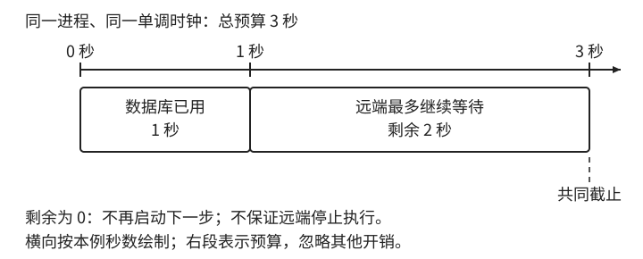

# 第 11 章：超时与等待边界

> 核心命题：超时表示没有及时得到答案，不能据此断定远端没有成功。

## 本章任务

区分连接、读取与业务超时，分析执行前、中、后失去响应的结果；讨论 UNKNOWN、共同等待预算、取消与实际停止之间的边界，以及跨机器预算传播的误差。

## 开篇场景

待写：支付请求超时，银行卡已经扣款，此时应该向谁查询最终结果？

## 验证重点

在执行各阶段丢失响应，分别检查业务事实与调用方观察；预算耗尽不再启动下一步。

## 待编排素材：共同等待预算

> 从第一章移入，供本章后续成稿使用。

等待预算可以独立成为一个很小的对象。创建时记住起点与最大持续时间，读取时返回剩余值。下面是伪代码，只表达使用同一单调时钟的原则；实现时还需按计时 API 的约定处理单位、数值范围和溢出：

```text
budget = 3 秒
begin = monotonic.now()

remaining():
    spent = monotonic.now() - begin
    return max(0, budget - spent)

对每个待执行步骤（查数据库、调用远端）：
    left = remaining()
    如果 left <= 0：返回超时，不启动这一步
    执行这一步，最多等待 left
```



图 11-1：每一步消耗同一份预算，而不是每一步重新获得三秒。示例忽略其他开销，横向按本例秒数绘制；右段是远端允许等待的剩余预算，不代表远端实际耗时，也不保证截止后远端停止工作。

预算检查要放在调用之前，传给库的超时参数还要核对单位与零值含义。例如 Java `Socket.setSoTimeout(0)` 表示无限等待，把耗尽的预算直接传进去会得到相反结果。[Java Socket 超时参数](https://docs.oracle.com/en/java/javase/25/docs/api/java.base/java/net/Socket.html#setSoTimeout(int))

这个对象限制的是调用方的等待计划，不保证远端在三秒之后停止工作。数据库和网络库是否支持取消、已经发出的请求是否仍会执行，都属于另一层语义。把剩余预算算准确，是处理超时的基础，不是处理超时的全部答案。

跨机器时，单调时钟的参考点不能直接共享。传播剩余时长会受到传输与排队的消耗，传播绝对截止时间会受到时钟偏差的影响。上面的对象只负责本地等待；跨机器如何选择和扣减预算，仍需结合调用链讨论。

对于长时间等待，还需留意休眠和重启。某种单调时钟在机器休眠期间不累计时间，另一种会累计。一个“用户确认后十分钟失效”的授权链接，若要跨越休眠、进程重启和服务迁移，不能只保存在进程内计时器里。持久化时间点负责这种生命周期，本地计时器可以作为触发提示，真正处理时仍检查持久化规则。

这也解释了受理判断为什么通常读钟一次，而等待预算要反复读钟。前者保留同一次受理的判断依据，后者计算持续减少的剩余时间。是否重新获取“现在”，取决于这一步到底要回答哪个问题。
